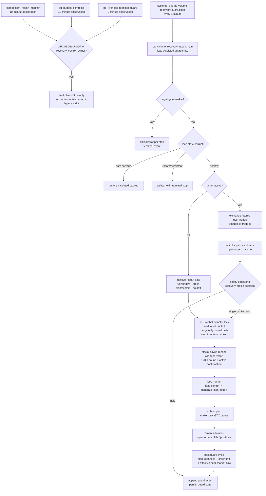

# ARXUSDT / OUSDT recovery control flow

This document describes the production path for the recovery-managed futures
symbols.  `bq_volume_recovery_guard` is the only component allowed to mutate
their runner control or restart their runner.  Health, budget, and liveness
monitors remain useful observers, but are intentionally read-only here.

## Blocking gates

The guard records the blocking condition in its event JSON.  The gates are
ordered; a terminal or integrity gate wins over a pace/recovery action.

1. Terminal ownership gates: target-done marker, run window, explicit runner
   stop reason, and persistent corrupt-state safety stop.
2. Snapshot integrity gates: missing/stale plan or submit report, invalid loop
   state, exchange trade fetch failure, and inactive-runner freshness checks.
3. Ledger and exchange consistency gates: planned-vs-observed open-order
   drift, futures position/ledger drift, frozen-ledger reconciliation, and
   outstanding recovery state validation.
4. Risk gates: long/short hard cap, soft inventory pressure, freeze total and
   side caps, volatility/trend pauses, adverse/unrealized loss constraints,
   target completion cap, and runtime loss stop.
5. Flow gates: near-market maker order count, effective near-market flow,
   no-fill duration, one-sided-entry protection, stale/missing orders, and
   target pace/volume floor.
6. Recovery stability gates: minimum recovery hold, reapply debounce,
   post-restore cooldown, high/confirmed loss-reduce wear, and bounded
   recovery timeout/extension count.

`effective_near_market_flow` is an invariant at the loss-reduce profile
boundary: live near-market maker flow blocks entry into
`allow_loss_reduce_only` / active-pair reduction even when a short volume
window is low.  It therefore cannot be overridden by an adjacent escalation
branch.

## Persistent state and write points

| Artifact | Writer | Purpose |
| --- | --- | --- |
| `<symbol>_loop_runner_control.json` | recovery actuator only | runner configuration, owner marker, timestamped backup |
| `<symbol>_loop_state.json` | loop runner | ledger, freeze, reconciliation state; backed up before recovery restart |
| `<symbol>_loop_latest_plan.json` | loop runner | current desired orders and gate observations |
| `<symbol>_loop_latest_submit.json` | loop runner | submit outcome used for freshness/inactive gates |
| `<symbol>_loop_events.jsonl` | loop runner | execution/plan audit, never the authoritative volume ledger |
| `bq_volume_recovery_guard_state.json` | recovery guard | profile, original controls, cooldown/debounce and verification history |
| `bq_volume_recovery_guard_events.jsonl` | recovery guard | one durable action/hold record per cycle |

The authoritative volume and realized-PnL input remains Binance futures
`userTrades`, deduplicated by trade id.  Local events are evidence for runner
state and order-path diagnosis only.

## Recovery profiles

The guard selects one mutually exclusive profile for a cycle: terminal hold,
integrity recovery, inactive restart, normal maker entry, soft-inventory
recovery, loss-reduce recovery, restoration/cooldown, or observe/hold.  A
successful control action is followed by a fresh runner plan/open-order check
on the next cycle before another escalation is considered.
