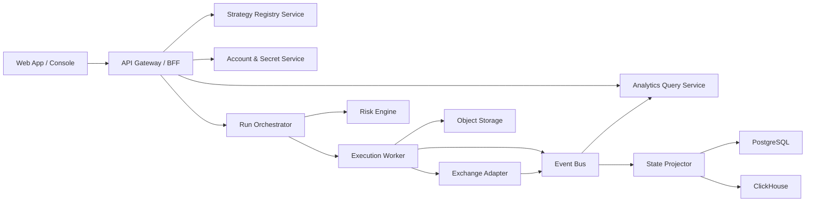

# 合约策略执行站点生产级重设计方案

## 1. 背景

当前仓库已经不是一个“纯回测工具”了，它实际上已经包含了：

- 策略测算页、监控页、策略总览页、现货执行页，全部由 [`web.py`](/Users/tangtang/Documents/tl/work/grid_trading/src/grid_optimizer/web.py) 提供
- 合约循环执行器、现货执行器、提交器、风控保护、策略预设、自定义静态网格
- 事件审计、成交审计、资金费审计、订单/计划审计

但从系统形态上看，它仍然是“单机脚本 + 本地 JSON 配置 + 本地 JSONL 审计 + 直接调用交易所 API”的运维控制台，而不是生产级策略平台。

这份文档的目标不是否定现有系统，而是基于现有能力，重新定义一个可以长期演进的目标形态：

- 支持多账户、多币种、多策略实例
- 同时支持模板策略和自定义策略
- 策略从回测、审批、部署、执行、告警、复盘形成闭环
- 全程可解释、可追踪、可回放、可审计
- 能定位“为什么策略这样下单”“为什么没成交”“为什么停机”“为什么收益偏差”

## 2. 当前系统现状

### 2.1 已有优势

当前系统最有价值的地方，不是 UI，而是底层已经有几块真实能力：

- 有实盘执行器：[`loop_runner.py`](/Users/tangtang/Documents/tl/work/grid_trading/src/grid_optimizer/loop_runner.py)
- 有监控快照聚合：[`build_monitor_snapshot()`](/Users/tangtang/Documents/tl/work/grid_trading/src/grid_optimizer/monitor.py#L1030)
- 有审计落盘：[`audit.py`](/Users/tangtang/Documents/tl/work/grid_trading/src/grid_optimizer/audit.py#L14)
- 有策略说明文档：[`STRATEGY_EXECUTION_GUIDE.md`](/Users/tangtang/Documents/tl/work/grid_trading/docs/STRATEGY_EXECUTION_GUIDE.md)
- 有事故复盘文档，说明团队已经在做真实运行后的根因分析：[`INCIDENT_20260330_ECS114_KAT_BARD.md`](/Users/tangtang/Documents/tl/work/grid_trading/docs/INCIDENT_20260330_ECS114_KAT_BARD.md#L1)

这说明当前项目已经跨过“玩具 demo”阶段，问题不在于有没有能力，而在于这些能力还没有被组织成可运营的平台。

### 2.2 当前产品形态

从页面上看，当前站点已经有：

- 统一入口页，甚至硬编码了三台机器入口：[`web.py`](/Users/tangtang/Documents/tl/work/grid_trading/src/grid_optimizer/web.py#L3292)
- 合约单币监控台，集成刷新、启动停止、参数 JSON 编辑、自定义网格策略创建：[`web.py`](/Users/tangtang/Documents/tl/work/grid_trading/src/grid_optimizer/web.py#L8435)
- 策略总览页，按币种展示当前策略、风险状态和买卖点：[`web.py`](/Users/tangtang/Documents/tl/work/grid_trading/src/grid_optimizer/web.py#L13069)

从监控页真实内容看，它已经把“控制台、策略编辑器、风控面板、订单/成交/循环日志”全部塞在一个页面里。

### 2.3 当前系统的核心问题

#### 问题 A：站点是“单机控制台”，不是“账户和策略平台”

当前页面是按币种驱动，不是按“账户 -> 策略实例 -> 运行实例”驱动。

直接后果：

- 多账户支持几乎不存在
- 同一币种无法优雅区分多个账户、多个策略实例
- 站点里没有“策略实例”这一等公民对象

#### 问题 B：运行配置是文件，不是可审计的配置中心

事故文档已经明确指出，问题来自运行配置漂移，而不是代码漂移：

- 运行控制文件位于 `output/*_loop_runner_control.json`
- 这些文件不受 Git 管理
- 不同机器会产生不同运行行为

这在事故文档里已经被实锤：[`INCIDENT_20260330_ECS114_KAT_BARD.md`](/Users/tangtang/Documents/tl/work/grid_trading/docs/INCIDENT_20260330_ECS114_KAT_BARD.md#L5)

这类设计会带来：

- 线上状态不可控
- 变更不可追踪
- 无法知道“本次运行究竟用了哪一版参数”
- 无法做审批、回滚、diff、灰度

#### 问题 C：站点、执行器、交易所调用强耦合

当前 `web.py` 同时承担了：

- HTML 页面
- API 路由
- 运行配置拼装
- 进程启动停止
- 交易所接口聚合
- 页面数据组装

这意味着：

- 前后端无法独立演进
- 无法做权限边界隔离
- 无法把执行服务单独部署成高可靠进程
- 任何一个页面需求都容易改到执行逻辑

#### 问题 D：审计虽有，但数据层仍然是文件中心

当前审计路径设计是好的，已经区分了：

- `plan_audit`
- `submit_audit`
- `order_audit`
- `trade_audit`
- `income_audit`

见 [`audit.py`](/Users/tangtang/Documents/tl/work/grid_trading/src/grid_optimizer/audit.py#L14)

但目前依然主要依赖本地 JSONL 文件。这个模式适合单机排障，不适合：

- 多账户统一查询
- 全局策略对比
- 复杂筛选分析
- 高并发页面访问
- 长周期数据回放

#### 问题 E：观测层不错，但“因果链”还不完整

[`build_monitor_snapshot()`](/Users/tangtang/Documents/tl/work/grid_trading/src/grid_optimizer/monitor.py#L1030) 已经把：

- 本地事件
- 计划结果
- 提交结果
- 市场盘口
- 持仓
- 挂单
- 成交
- 资金费
- 小时汇总

聚到一个快照里。

这是非常好的基础。

但现在缺少的是“跨对象因果链”：

- 某次参数变更导致了哪次部署
- 某次部署生成了哪批计划
- 某批计划产生了哪些 order intent
- 某些 order intent 为什么被拒绝
- 某些成交为什么和预期不一致
- 某次停机是风控停机、交易所拒单、配置错误，还是进程退出

换句话说，当前系统已经有“信息”，还缺“事件图谱”和“根因视图”。

## 3. 外部参考站点可借鉴什么

这里不直接照搬 UI，而是提炼能力模型。

### 3.1 Gridy 类产品

参考：

- [Gridy Help Center: Configure your first Backpack Gridy Bot](https://help.gridy.ai/?p=287)
- [Gridy Help Center: TradingView FAQ](https://help.gridy.ai/?p=114)

可借鉴点：

- 先连接交易所账户，再创建 bot，账户连接是产品主流程的一部分
- 把“策略模板化”和“快速启动”做成产品入口，不让用户从一堆底层参数开始
- 用图表和 bot 卡片承载 bot 的状态、收益和运行情况，而不是只看表格

### 3.2 TradingView 类产品

参考：

- [TradingView Strategy Tester](https://www.tradingview.com/support/solutions/43000764138/)
- [TradingView Trading Panel](https://www.tradingview.com/trading-panel/)

可借鉴点：

- 把“研究/回测”和“执行/券商连接”明确分层
- 图表是核心上下文，不是附属组件
- 信号、策略、执行账户、订单入口是分离但串联的

### 3.3 对我们最重要的启发

目标站点不应该只是“把策略挂起来”。

它应该同时解决五件事：

1. 策略从哪里来
2. 策略跑在哪个账户上
3. 当前到底执行成什么样
4. 如果执行出问题，问题出在哪一层
5. 后续怎么回放、对比、改进

## 4. 目标站点定义

目标站点应从“单页监控台”升级为“策略执行平台”。

### 4.1 顶层对象模型

建议将领域对象明确为：

- Workspace：团队/环境边界
- Venue Connection：交易所连接，如 Binance Futures 子账户
- Account：逻辑账户或 API key 绑定实体
- Strategy Template：模板策略，参数有默认值和说明
- Strategy Version：模板某一版本，支持 diff、审批、回滚
- Strategy Instance：模板在某账户/某币种/某市场上的实例
- Deployment：某一版策略被部署到某账户实例上的记录
- Run：一次连续运行周期
- Order Intent：系统想下的目标委托
- Exchange Order：交易所真实订单
- Fill / Trade：真实成交
- Position Snapshot：仓位状态快照
- Risk Event：风控触发事件
- Incident：异常事件和处理记录
- Replay Session：复盘分析会话

这会解决当前“只有 symbol 和 runner，没有策略实例”的结构性问题。

### 4.2 用户最常用的页面

建议新站点的信息架构如下：

#### 1. 总览 Dashboard

- 全账户资金、风险敞口、运行中策略数
- 今日 PnL、成交额、异常数
- 关键告警和待处理 incident

#### 2. 账户中心 Accounts

- 交易所连接管理
- API 权限校验
- 账户健康状态
- 余额、保证金模式、持仓模式、风控限制

#### 3. 策略模板库 Templates

- 官方模板策略
- 自定义模板
- 模板版本历史
- 参数说明、风险说明、适用市场说明

#### 4. 策略实例页 Strategy Instance

- 选择账户、市场、币种、模板
- 覆盖模板参数
- 查看部署前校验结果
- 纸上模拟、回测、审批、上线

#### 5. 运行页 Run Detail

- 当前状态
- 当前市场上下文
- 当前目标订单和真实订单 diff
- 风控状态
- 最近事件时间线

#### 6. 执行追踪页 Execution Trace

- 一次 run 的完整事件流
- 参数版本
- 中心价变化
- 计划生成
- 撤单/补单
- 交易所拒单
- 成交归因

#### 7. 分析与回放页 Analytics / Replay

- 历史 run 对比
- PnL 归因
- 成交质量分析
- 风控触发统计
- 回放指定时段、指定版本、指定账户

#### 8. 事故中心 Incidents

- 异常聚合
- 自动分类
- 影响范围
- 根因链
- 处理记录和恢复动作

## 5. 目标交互模型

### 5.1 模板策略

模板策略不只是预设 JSON，而是具备元数据的产品对象：

- 模板名称、类型、适用品类、适用市场
- 默认参数
- 参数约束
- 风险阈值
- 策略说明
- 版本说明
- 推荐资金区间

模板策略应支持：

- 直接启动
- 派生一个自定义实例
- 锁定参数范围
- 标记“实验性”“生产可用”“停用”

### 5.2 自定义策略

自定义策略应分两类：

- 参数型自定义：基于官方模板覆写参数
- 逻辑型自定义：上传脚本、DSL 或策略定义文件

建议一期先只做“参数型自定义”，把稳定性做扎实，再引入脚本化策略。

### 5.3 多账户

多账户不是页面上切换 symbol，而是：

- 同一个模板可以挂到多个账户
- 同一个币种可以在不同账户上跑不同策略
- 一个账户可同时跑多个币种实例
- 一个策略实例必须绑定唯一 `account + market + symbol + strategy_version`

### 5.4 全程可解释

每个策略实例页都要有“为什么”面板，回答以下问题：

- 为什么当前是这个中心价
- 为什么此刻停买/停空
- 为什么撤掉了这些单
- 为什么没有继续挂单
- 为什么收益和理论值偏差这么大
- 为什么该实例进入了降级模式或停机

## 6. 生产级系统架构

建议采用“前台平台 + 后台服务 + 执行工作器”的分层结构。

### 6.1 前端

建议：

- React / Next.js
- 图表使用 Lightweight Charts 或 ECharts
- 实时状态用 WebSocket / SSE

前端职责：

- 管理对象浏览
- 配置编辑
- 审批和发布
- 观测和分析

前端不直接碰交易所，不直接启动本地进程。

### 6.2 API / BFF

建议：

- FastAPI

原因：

- 当前策略逻辑已经是 Python，复用成本最低
- 能快速把现有 `monitor.py`、`loop_runner.py` 周边能力服务化

### 6.3 执行层

执行层应从页面进程中剥离成独立 worker：

- 每个策略实例对应一个逻辑 execution actor
- actor 持有运行状态和 checkpoint
- actor 从 orchestrator 接收部署指令
- actor 只通过统一 adapter 与交易所交互

这里最重要的是：执行器不能由网页按钮直接 `subprocess` 拉起，而应由部署服务统一调度。

### 6.4 风控层

风控要拆成三层：

- Pre-trade：启动前校验、杠杆/保证金/模式校验
- In-trade：仓位、成交额、亏损、频率、市场极端波动校验
- Kill-switch：账户级、实例级、模板级熔断

### 6.5 数据层

建议分层存储：

- PostgreSQL
  - 账户、模板、实例、部署、审批、incident、配置版本
- ClickHouse
  - 高频事件、订单流、成交流、策略运行明细、时间序列分析
- Object Storage
  - 原始交易所响应、快照、回放包、导出文件
- Redis
  - 实时缓存、运行锁、短期状态

如果一期不想上 ClickHouse，也至少要做到：

- PostgreSQL 存配置和业务对象
- 原始事件全部落对象存储或归档库
- 查询层不要继续直接扫本地 JSONL 文件

## 7. 可靠执行模型

这是重设计里最关键的一层。

### 7.1 从“直接下单”改成“目标状态驱动”

每轮执行不应该直接“算完就下单”，而应该经历：

1. 读取市场、仓位、挂单、配置
2. 生成目标订单集 Desired Orders
3. 与交易所当前订单做 diff
4. 形成 Order Intents
5. 风控审核
6. 提交交易所
7. 回写事件

这本质上是一个 reconciliation loop。

当前系统已经有 diff 思想，但还没有把它提升成平台级的一等模型。

### 7.2 每次部署都必须有版本号

每次运行都应明确记录：

- template_version_id
- instance_config_version_id
- deployment_id
- run_id

这样后面看到异常，就能准确回答：

- 这次运行用的是哪版模板
- 相比上一版改了什么
- 哪个审批人允许它上线

### 7.3 每次订单动作都要幂等

核心要求：

- 每个 order intent 有稳定的 `intent_id`
- 每次提交带幂等键
- 提交结果无论成功失败都落事件
- 即使 worker 重启，也能恢复到“已知最后一次 intent 状态”

### 7.4 恢复策略

worker 异常退出后，恢复逻辑必须是：

1. 拉取最新交易所实际状态
2. 读取最后 checkpoint
3. 重建内部状态机
4. 重新生成 desired orders
5. 做状态对账

而不是简单地“继续读旧本地文件再跑”。

## 8. 数据完整性与回溯设计

你提到“数据完整，支持后续的数据回溯、分析”，这部分建议按三层存。

### 8.1 Raw Layer

保留原始数据：

- 原始盘口
- 原始订单响应
- 原始成交
- 原始账户快照
- 原始 funding / income 记录

用途：

- 复盘时可重放真实环境
- 可校验标准化逻辑是否出错

### 8.2 Canonical Layer

标准化后的统一事件：

- market_snapshot
- strategy_decision
- order_intent_created
- order_submitted
- order_rejected
- order_canceled
- fill_received
- position_updated
- risk_triggered
- run_paused
- run_stopped

### 8.3 Analytics Layer

派生分析数据：

- 小时级 PnL 归因
- 滑点
- maker/taker 比例
- 成交质量
- 风控触发频率
- 参数版本收益对比
- 账户利用率

## 9. 问题分析与根因定位能力

目标站点必须支持“问题树”分析，而不是只展示错误字符串。

### 9.1 典型异常分类

- 配置问题
  - 参数缺失
  - 参数冲突
  - 配置版本漂移
- 账户问题
  - 保证金不足
  - 持仓模式错误
  - API 权限缺失
- 交易所问题
  - post-only 被拒
  - rate limit
  - API 波动
- 策略问题
  - 中心迁移过慢
  - 停买阈值过早触发
  - 目标订单与市场状态偏离过大
- 系统问题
  - worker 崩溃
  - checkpoint 损坏
  - 事件总线阻塞

### 9.2 页面上要怎么展示

每个策略运行页应至少有：

- 当前主异常
- 影响等级
- 首次出现时间
- 最近触发次数
- 直接证据
- 推荐处理动作
- 已采取动作

### 9.3 现有事故对新平台的启发

当前事故文档已经暴露了生产平台最怕的三个问题：

- 配置漂移
- 风控触发后解释不够直接
- 保证金不足等错误导致执行器停机

见 [`INCIDENT_20260330_ECS114_KAT_BARD.md`](/Users/tangtang/Documents/tl/work/grid_trading/docs/INCIDENT_20260330_ECS114_KAT_BARD.md#L122)

所以新平台必须先把：

- 配置中心
- 风控事件分类
- 停机恢复机制

做扎实，再谈更复杂的自定义策略。

## 10. 推荐的实施边界

### 10.1 一期必须做

一期建议聚焦“稳定替换当前控制台”：

- 账户中心
- 模板策略库
- 策略实例管理
- 部署与版本记录
- 单账户多币种运行
- 统一监控页
- 执行追踪页
- 配置 diff / 审批 / 回滚
- PostgreSQL 配置与元数据存储
- 事件统一落库

### 10.2 二期再做

- 多用户协作和 RBAC
- 组合级风险和跨账户视图
- 回放引擎
- 参数实验平台
- 自定义 DSL / 策略脚本
- 多交易所接入

### 10.3 暂时不要一开始就做

- 在线策略代码编辑器
- 任意用户脚本执行
- 过度复杂的可视化编排器

这些会显著增加安全面和运维复杂度，不适合在基础设施还不稳定时优先投入。

## 11. 基于当前仓库的演进路径

### Phase 0：把现有系统从“可跑”改成“可控”

直接基于当前仓库做这几件事：

- 把 `output/*_loop_runner_control.json` 升级为数据库里的配置版本
- 页面不再硬编码服务器入口
- 启动/停止改成通过 deployment service 调度
- 审计事件在保留 JSONL 的同时同步入库
- 给每次运行补 `deployment_id`、`run_id`

### Phase 1：拆出平台核心对象

- 抽出 `template / instance / deployment / run`
- 现有预设迁移为模板策略
- 现有自定义网格迁移为实例派生能力

### Phase 2：拆执行服务

- 从 [`web.py`](/Users/tangtang/Documents/tl/work/grid_trading/src/grid_optimizer/web.py) 中拿掉进程管理
- 从 [`loop_runner.py`](/Users/tangtang/Documents/tl/work/grid_trading/src/grid_optimizer/loop_runner.py) 中抽出执行 actor
- 从 [`monitor.py`](/Users/tangtang/Documents/tl/work/grid_trading/src/grid_optimizer/monitor.py) 中抽出状态投影逻辑

### Phase 3：补分析与回放

- 把现有监控快照升级为统一事实表
- 引入运行时间线和根因视图
- 做版本对比和历史 replay

## 12. 推荐技术方案

如果要尽量复用当前代码，我建议：

- 前端：Next.js + TypeScript
- 后端 API / BFF：FastAPI
- 执行器：Python worker
- 元数据数据库：PostgreSQL
- 分析库：ClickHouse
- 缓存与锁：Redis
- 对象存储：S3 / MinIO
- 消息总线：一期 Redis Streams，后续 Kafka / NATS
- 密钥管理：Vault 或云 KMS

理由很简单：

- 现有策略和执行逻辑都是 Python，没必要强行换语言
- 站点层和执行层应该解耦，但不应该把团队带入过高迁移成本

## 13. 最终结论

当前系统的本质是：

- 已经拥有真实执行和审计能力
- 但产品对象、部署模型、配置治理、数据治理都还停留在单机阶段

因此重设计的关键不是“把页面做得更像 SaaS”，而是先完成这三次升级：

1. 从 `symbol + runner` 升级到 `account + strategy instance + deployment + run`
2. 从 `本地 JSON 配置` 升级到 `可审计的版本化配置中心`
3. 从 `文件监控视图` 升级到 `事件驱动的执行追踪与分析平台`

只要这三步做对，后面无论是多账户、多模板、自定义策略、回放分析，都会自然长出来。

## 14. 建议下一步

建议下一轮直接进入产设和拆解，而不是再泛泛讨论。

优先顺序建议：

1. 先画新站点 IA 和核心页面线框图
2. 再定义数据库表和事件模型
3. 最后拆仓库，把当前 Python 单体控制台演进成平台后端 + 执行 worker

如果继续推进，我建议下一步我直接帮你输出两份东西：

- 一份“新站点页面结构和页面级字段清单”
- 一份“数据库 schema + 事件模型草案”
