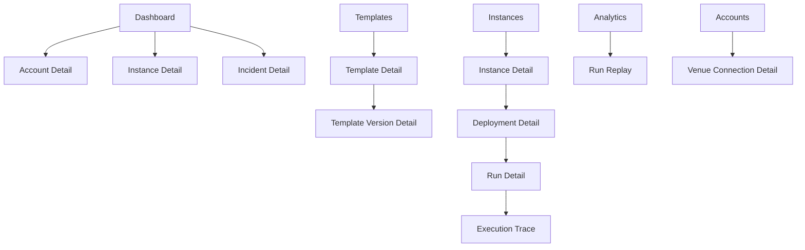
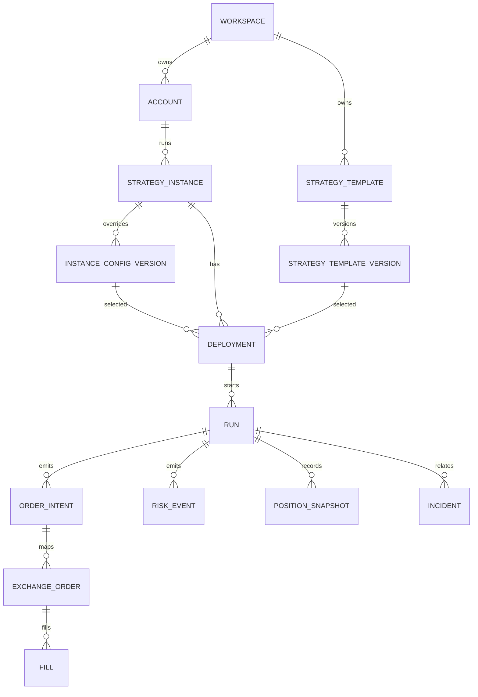

# 策略平台页面结构与数据模型草案

## 1. 文档目的

这份文档承接上一份重设计方案：

- [PRODUCTION_STRATEGY_PLATFORM_REDESIGN.md](/Users/tangtang/Documents/tl/work/grid_trading/docs/PRODUCTION_STRATEGY_PLATFORM_REDESIGN.md)

目标是把“方向”进一步落到可实施层：

- 新平台页面信息架构
- 核心用户流程
- 数据库实体关系
- 统一事件模型
- 关键 API 边界
- 从当前仓库迁移到新平台的映射关系

这份文档默认一期目标是：

- 先把当前合约策略执行站点升级成生产可控平台
- 优先支持 Binance Futures
- 优先支持模板策略和参数型自定义策略
- 不在一期引入任意代码执行型策略

## 2. 页面信息架构

## 2.1 全局导航

建议新平台主导航如下：

1. Dashboard
2. Accounts
3. Templates
4. Instances
5. Deployments
6. Runs
7. Incidents
8. Analytics
9. Settings

建议按用户角色控制显示：

- 交易运营：Dashboard、Instances、Runs、Incidents、Analytics
- 策略研究：Templates、Instances、Analytics
- 管理员：Accounts、Settings、Secrets、Audit

## 2.2 页面树

## 3. 页面定义

## 3.1 Dashboard

### 页面目标

让负责人在 30 秒内回答：

- 哪些账户在运行
- 哪些策略有风险
- 今天赚亏如何
- 哪些实例需要处理

### 核心模块

- 总资金概览
- 今日成交额 / 已实现 / 未实现 / 净收益估算
- 运行中实例数 / 已暂停 / 异常实例数
- 账户健康卡片
- 高优先级 incident 列表
- 最近部署和最近停机事件

### 核心操作

- 一键进入异常实例
- 按账户 / 市场 / 币种过滤
- 快速暂停某实例
- 快速打开最近 run

## 3.2 Accounts

### 页面目标

把“连接了什么账户、账户是否健康、权限是否正确”做成平台基础设施，而不是藏在环境变量里。

### 列表页字段

- 账户名
- 交易所
- 环境
- 子账户标识
- API 状态
- 保证金模式
- 持仓模式
- 钱包余额
- 可用余额
- 风险等级
- 最近同步时间

### 详情页模块

- 连接信息
- 权限校验结果
- 风险限制
- 账户余额与资产结构
- 绑定中的策略实例
- 最近错误

### 核心操作

- 新增连接
- 旋转 API key
- 启停账户级 kill switch
- 验证交易权限

## 3.3 Templates

### 页面目标

把当前散落在 `RUNNER_STRATEGY_PRESETS` 中的预设，升级为可版本管理的策略模板。

### 列表页字段

- 模板名
- 策略类型
- 支持市场
- 支持方向
- 状态
- 当前生产版本
- 最近更新时间

### 模板详情页模块

- 模板说明
- 参数 schema
- 默认参数
- 风险边界
- 适用场景
- 版本历史
- 最近实例使用情况

### 版本详情页模块

- 参数 diff
- 变更说明
- 审批记录
- 回测摘要
- 生产使用范围

### 核心操作

- 创建模板
- 发布新版本
- 将版本标记为生产可用
- 回滚默认版本

## 3.4 Instances

### 页面目标

把“某策略在某账户某币种上的运行对象”做成平台主对象。

### 列表页字段

- 实例名
- 账户
- 市场
- 币种
- 模板名
- 当前部署版本
- 当前状态
- 风险状态
- 今日成交额
- 今日净收益
- 最近告警

### 详情页模块

- 基本信息
- 模板版本与实例参数覆盖
- 当前部署状态
- 当前市场状态
- 当前仓位 / 当前挂单
- 风控解释
- 目标订单与真实订单 diff
- 最近 run 列表
- 最近 incidents

### 核心操作

- 创建实例
- 编辑实例覆盖参数
- 提交部署
- 暂停 / 恢复
- 手动 flatten

## 3.5 Deployments

### 页面目标

把“参数变更”和“实际生效”区分开。

### 列表页字段

- deployment_id
- 实例
- 模板版本
- 覆盖参数版本
- 部署状态
- 审批状态
- 提交人
- 发布时间

### 详情页模块

- 参数快照
- 相比上一版 diff
- 启动前校验
- 审批与审核记录
- 生效 run
- 回滚入口

### 核心操作

- 审批部署
- 执行部署
- 回滚到上一个 deployment

## 3.6 Runs

### 页面目标

把一次连续执行周期变成可查询、可定位、可复盘的对象。

### 列表页字段

- run_id
- 实例
- deployment_id
- 状态
- 启动时间
- 结束时间
- 持续时长
- 成交额
- 净收益估算
- 异常次数

### 详情页模块

- 运行摘要
- 市场上下文
- 当前策略解释
- 小时级收益拆解
- 风控事件
- 最近 orders / fills
- 执行时间线

## 3.7 Execution Trace

### 页面目标

回答“到底发生了什么”。

### 展示结构

- Timeline 视图
- Event list 视图
- Diff 视图
- Raw payload 视图

### 时间线事件示例

- deployment_loaded
- market_snapshot
- center_shifted
- desired_orders_built
- risk_paused_buy_side
- order_intent_created
- order_submit_failed
- fill_received
- pnl_recomputed
- run_stopped

## 3.8 Incidents

### 页面目标

把今天的事故分析能力产品化，不再靠手写 Markdown 才能复盘。

### 列表页字段

- incident_id
- 标题
- 级别
- 类别
- 影响账户 / 实例
- 首次出现时间
- 当前状态
- Owner

### 详情页模块

- 事件摘要
- 时间线
- 根因树
- 证据快照
- 已采取动作
- 恢复结果
- 关联 runs / deployments

## 3.9 Analytics

### 页面目标

把“看当前状态”升级为“持续优化策略”。

### 核心模块

- 参数版本对比
- 账户对比
- 币种对比
- 滑点分析
- maker/taker 占比
- 风控触发频率
- 回放入口

## 4. 核心用户流程

## 4.1 流程 A：创建并上线一个模板策略实例

### 页面动作拆解

1. 在 `Accounts` 中完成账户连接和权限校验
2. 在 `Templates` 中确认使用的模板版本
3. 在 `Instances` 中创建实例
4. 点击“生成部署”
5. 系统运行 pre-flight 校验
6. 审批通过后创建 deployment
7. Orchestrator 拉起 run

## 4.2 流程 B：处理一个异常实例

1. Dashboard 告警卡片进入实例详情
2. 查看当前主告警和风险解释
3. 打开最新 run
4. 查看 execution trace
5. 判断是配置、交易所、账户还是系统问题
6. 执行暂停、flatten、回滚或重启
7. 如需，自动生成 incident

## 4.3 流程 C：复盘一个策略版本

1. 进入 `Analytics`
2. 选择模板、版本、时间区间、账户
3. 查看收益、回撤、成交质量、风控触发
4. 针对某次 run 打开 replay
5. 决定是否派生新版本

## 5. 数据模型

## 5.1 核心 ER 图

## 5.2 建议的核心表

### `workspaces`

- `id`
- `name`
- `env`
- `status`
- `created_at`
- `updated_at`

### `accounts`

- `id`
- `workspace_id`
- `venue`
- `account_name`
- `account_alias`
- `market_type`
- `environment`
- `position_mode`
- `margin_mode`
- `status`
- `metadata_json`
- `created_at`
- `updated_at`

### `account_secrets`

- `id`
- `account_id`
- `secret_ref`
- `key_fingerprint`
- `status`
- `rotated_at`
- `created_at`

这里只保存引用，不把明文 key 放数据库。

### `strategy_templates`

- `id`
- `workspace_id`
- `name`
- `code`
- `strategy_family`
- `market_scope`
- `status`
- `owner_user_id`
- `created_at`
- `updated_at`

### `strategy_template_versions`

- `id`
- `template_id`
- `version_no`
- `status`
- `param_schema_json`
- `default_params_json`
- `risk_policy_json`
- `description_md`
- `changelog_md`
- `created_by`
- `created_at`

### `strategy_instances`

- `id`
- `workspace_id`
- `account_id`
- `template_id`
- `symbol`
- `market_type`
- `instance_name`
- `status`
- `tags_json`
- `created_by`
- `created_at`
- `updated_at`

### `instance_config_versions`

- `id`
- `instance_id`
- `version_no`
- `override_params_json`
- `reason`
- `created_by`
- `created_at`

### `deployments`

- `id`
- `instance_id`
- `template_version_id`
- `instance_config_version_id`
- `requested_by`
- `approved_by`
- `status`
- `preflight_report_json`
- `effective_config_json`
- `created_at`
- `approved_at`
- `activated_at`

### `runs`

- `id`
- `instance_id`
- `deployment_id`
- `status`
- `start_reason`
- `stop_reason`
- `worker_id`
- `checkpoint_ref`
- `started_at`
- `ended_at`
- `last_heartbeat_at`

### `run_checkpoints`

- `id`
- `run_id`
- `checkpoint_seq`
- `state_json`
- `storage_ref`
- `created_at`

### `order_intents`

- `id`
- `run_id`
- `intent_seq`
- `intent_type`
- `side`
- `position_side`
- `symbol`
- `price`
- `qty`
- `notional`
- `reduce_only`
- `idempotency_key`
- `status`
- `reason_code`
- `desired_order_hash`
- `created_at`
- `updated_at`

### `exchange_orders`

- `id`
- `order_intent_id`
- `account_id`
- `venue_order_id`
- `venue_client_order_id`
- `symbol`
- `side`
- `position_side`
- `price`
- `orig_qty`
- `executed_qty`
- `status`
- `venue_status_payload_json`
- `created_at`
- `updated_at`

### `fills`

- `id`
- `exchange_order_id`
- `run_id`
- `venue_trade_id`
- `symbol`
- `side`
- `price`
- `qty`
- `quote_qty`
- `realized_pnl`
- `fee`
- `fee_asset`
- `is_maker`
- `filled_at`
- `raw_payload_json`

### `position_snapshots`

- `id`
- `run_id`
- `account_id`
- `symbol`
- `position_amt`
- `entry_price`
- `break_even_price`
- `unrealized_pnl`
- `wallet_balance`
- `available_balance`
- `captured_at`

### `risk_events`

- `id`
- `run_id`
- `instance_id`
- `severity`
- `risk_type`
- `reason_code`
- `message`
- `details_json`
- `triggered_at`
- `cleared_at`

### `incidents`

- `id`
- `workspace_id`
- `account_id`
- `instance_id`
- `run_id`
- `severity`
- `category`
- `title`
- `status`
- `owner_user_id`
- `root_cause_json`
- `opened_at`
- `closed_at`

## 5.3 分析事实表

建议额外构建派生事实表：

### `run_hourly_facts`

- `run_id`
- `hour_bucket`
- `gross_notional`
- `trade_count`
- `realized_pnl`
- `fee_usdt`
- `funding_fee`
- `net_pnl`
- `maker_ratio`
- `buy_notional`
- `sell_notional`

### `instance_daily_facts`

- `instance_id`
- `biz_date`
- `gross_notional`
- `realized_pnl`
- `unrealized_pnl_close`
- `funding_fee`
- `risk_event_count`
- `incident_count`

## 6. 统一事件模型

## 6.1 事件总线 Envelope

建议所有事件统一使用如下 envelope：

- `event_id`
- `event_type`
- `schema_version`
- `workspace_id`
- `account_id`
- `instance_id`
- `deployment_id`
- `run_id`
- `trace_id`
- `causation_id`
- `idempotency_key`
- `occurred_at`
- `producer`
- `payload`
- `raw_ref`

其中：

- `trace_id` 用于串起一次决策链
- `causation_id` 用于表达“由哪个事件触发”
- `raw_ref` 指向对象存储中的原始响应

## 6.2 事件分类

### 配置类

- `template.version_created`
- `instance.config_version_created`
- `deployment.requested`
- `deployment.approved`
- `deployment.activated`

### 运行类

- `run.started`
- `run.heartbeat`
- `run.paused`
- `run.resumed`
- `run.stopped`
- `run.crashed`

### 市场类

- `market.snapshot_recorded`
- `market.extreme_move_detected`

### 决策类

- `strategy.center_decided`
- `strategy.desired_orders_built`
- `strategy.inventory_tier_changed`
- `strategy.regime_changed`

### 风控类

- `risk.preflight_failed`
- `risk.buy_side_paused`
- `risk.short_side_paused`
- `risk.loss_limit_triggered`
- `risk.kill_switch_activated`

### 订单类

- `order_intent.created`
- `order_intent.reconciled`
- `exchange_order.submitted`
- `exchange_order.rejected`
- `exchange_order.canceled`
- `exchange_order.expired`

### 成交类

- `fill.received`
- `income.funding_recorded`
- `pnl.recomputed`

### 事故类

- `incident.opened`
- `incident.updated`
- `incident.resolved`

## 6.3 MVP 必须保留的字段

为了让回放和归因成立，以下字段必须在事件里保留：

- 策略配置快照摘要
- 当前中心价
- 当前中价
- 当前仓位
- 当前挂单摘要
- 当前 risk flags
- 本轮 desired order hash
- 本轮撤单数 / 补单数
- 交易所错误码

## 7. 关键 API 边界

## 7.1 Accounts API

- `GET /accounts`
- `POST /accounts`
- `GET /accounts/{id}`
- `POST /accounts/{id}/validate`
- `POST /accounts/{id}/kill-switch`

## 7.2 Templates API

- `GET /templates`
- `POST /templates`
- `GET /templates/{id}`
- `POST /templates/{id}/versions`
- `GET /templates/{id}/versions/{version_id}`

## 7.3 Instances API

- `GET /instances`
- `POST /instances`
- `GET /instances/{id}`
- `POST /instances/{id}/config-versions`
- `POST /instances/{id}/pause`
- `POST /instances/{id}/resume`
- `POST /instances/{id}/flatten`

## 7.4 Deployments API

- `GET /deployments`
- `POST /deployments`
- `GET /deployments/{id}`
- `POST /deployments/{id}/approve`
- `POST /deployments/{id}/activate`
- `POST /deployments/{id}/rollback`

## 7.5 Runs API

- `GET /runs`
- `GET /runs/{id}`
- `GET /runs/{id}/trace`
- `GET /runs/{id}/orders`
- `GET /runs/{id}/fills`
- `GET /runs/{id}/risk-events`

## 7.6 Analytics API

- `GET /analytics/pnl`
- `GET /analytics/volume`
- `GET /analytics/slippage`
- `GET /analytics/risk-events`
- `GET /analytics/replay/{run_id}`

## 8. 从当前仓库迁移的映射关系

## 8.1 当前对象到新对象

### 当前 `RUNNER_STRATEGY_PRESETS`

迁移为：

- `strategy_templates`
- `strategy_template_versions`

### 当前 `output/*_loop_runner_control.json`

迁移为：

- `instance_config_versions`
- `deployments.effective_config_json`

### 当前 `output/*_loop_events.jsonl`

迁移为：

- `events` 流
- `runs`
- `run_hourly_facts`

### 当前 `*_plan_audit.jsonl`

迁移为：

- `strategy.desired_orders_built`
- `order_intents`

### 当前 `*_submit_audit.jsonl`

迁移为：

- `exchange_order.submitted`
- `exchange_order.rejected`

### 当前 `*_order_audit.jsonl`

迁移为：

- `exchange_orders`
- `order_state_change` 事件

### 当前 `*_trade_audit.jsonl`

迁移为：

- `fills`
- `fill.received`

### 当前 `*_income_audit.jsonl`

迁移为：

- `income` 事实表
- `income.funding_recorded`

## 8.2 当前 Python 模块可复用部分

### 可以直接复用或轻改

- [`loop_runner.py`](/Users/tangtang/Documents/tl/work/grid_trading/src/grid_optimizer/loop_runner.py)
  - 可复用策略决策和 diff 逻辑
- [`monitor.py`](/Users/tangtang/Documents/tl/work/grid_trading/src/grid_optimizer/monitor.py)
  - 可复用汇总逻辑和部分指标口径
- [`audit.py`](/Users/tangtang/Documents/tl/work/grid_trading/src/grid_optimizer/audit.py)
  - 可复用事件写入和读取工具思想
- [`submit_plan.py`](/Users/tangtang/Documents/tl/work/grid_trading/src/grid_optimizer/submit_plan.py)
  - 可复用交易所下单请求构造与校验逻辑

### 需要拆分重构

- [`web.py`](/Users/tangtang/Documents/tl/work/grid_trading/src/grid_optimizer/web.py)
  - 页面、API、进程管理、交易所调用需要拆层

## 9. 建议的一期最小实现

如果要控制范围，我建议一期页面只做：

1. Dashboard
2. Accounts
3. Templates
4. Instances
5. Run Detail
6. Incident Detail

一期数据库只先做：

- `accounts`
- `strategy_templates`
- `strategy_template_versions`
- `strategy_instances`
- `instance_config_versions`
- `deployments`
- `runs`
- `order_intents`
- `exchange_orders`
- `fills`
- `risk_events`
- `incidents`

一期事件只先做：

- `deployment.*`
- `run.*`
- `strategy.desired_orders_built`
- `risk.*`
- `exchange_order.*`
- `fill.received`

这样就已经能解决当前最痛的问题：

- 配置漂移
- 无法多账户管理
- 无法追踪部署版本
- 无法快速定位停机原因

## 10. 下一步建议

如果继续推进，建议按这个顺序做：

1. 先出前端低保真线框图
2. 再把上述表结构细化成 SQL schema
3. 再定义事件存储表和事件 projector
4. 最后把当前 `loop_runner` 改造成 worker

如果你要我继续，我下一轮可以直接产出：

- 一份“页面线框图说明 + 页面字段级原型稿”
- 或一份“PostgreSQL schema 初稿 + Alembic 迁移脚本骨架”
