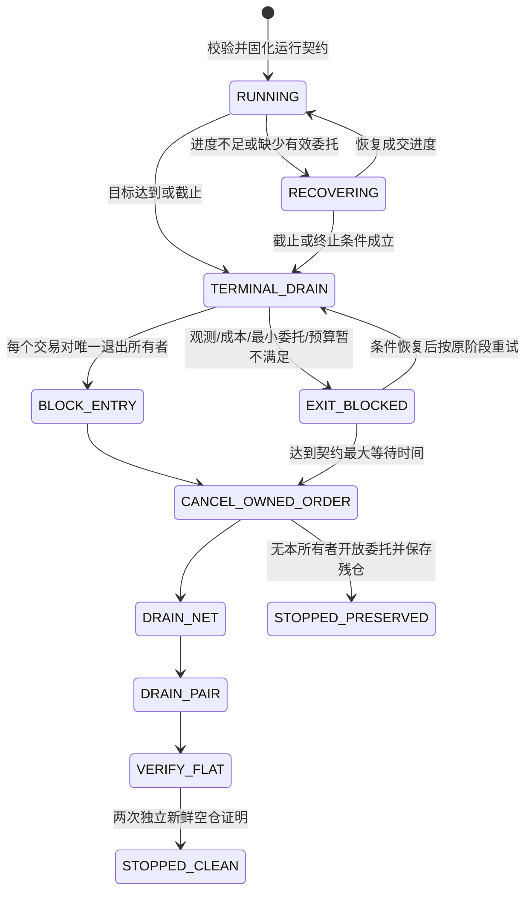
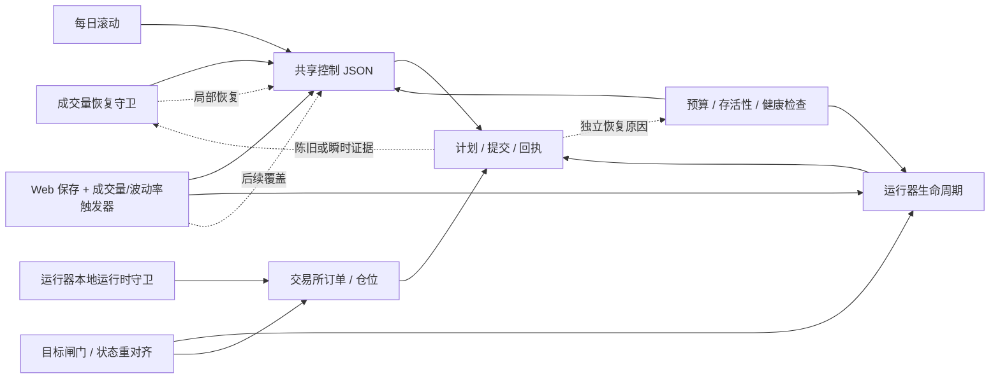
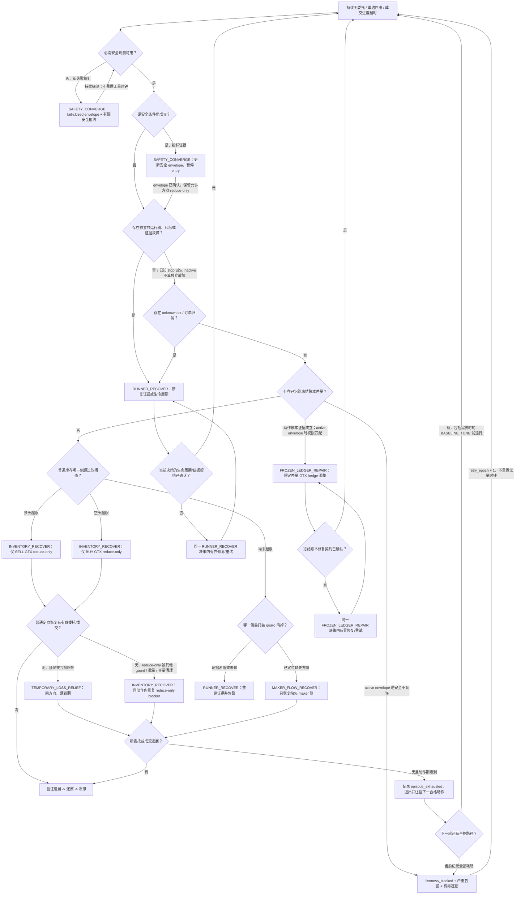
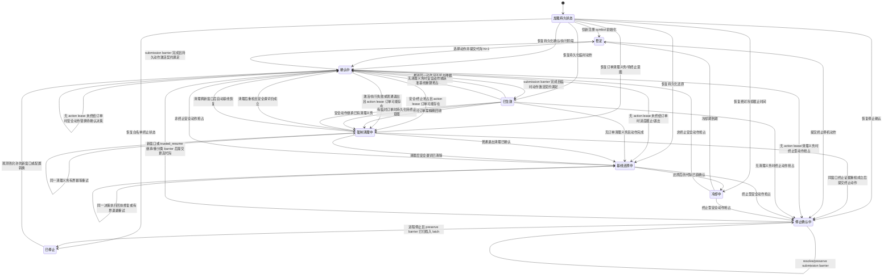

# 合约恢复单动作协调器设计

状态：用户已确认设计；隔离分支已实现显式注册交易对的源码闭环。守卫每轮只采集一份快照并委托协调器，协调器每个 symbol 最多选择一个动作，运行器只消费当前代际、决策、方向和订单角色完全匹配的配置与回执。普通 maker/inventory 恢复具有真实 `LIMIT + GTX` 接受回执、一次 `BASELINE_TUNE` 后继和有界 retry backoff；运行时风控与 Web 成交量触发器只发布带绝对 TTL 的类型化观测，不能成为第二个停止、撤单、平仓或重启执行器。目标/截止时间使用唯一 lifecycle intent 和终止排空所有者，恢复清理未回到完整 `STABLE` 前只允许 `handoff_pending`，零交易所副作用。

严格 `STABLE` 状态下的每日窗口滚动由 `BASELINE_REBASE` 原子更新运行契约/所有者并调度受执行栅栏保护的唯一重启；Web、磨损守卫、状态重对齐、watchdog 和运行器本地风控对已注册 symbol 只能观察、委托、消费当前栅栏或拒绝直写。本分支仍未注册任何生产 symbol、未部署、未修改生产仓位或运行参数。冻结账本专用修复、真实生产迁移、宿主机执行器盘点、协调器心跳/严重告警、`Restart=no` 切换与人工 break-glass 演练仍是发布硬阻塞，因此本分支不得直接部署。

## 术语约定

- `symbol`：正文通常称“交易对”；代码、字段、枚举和需要指明原始字段的语境中保留 `symbol`。
- `generation`：正文通常称“代际”；字段名、代码和需要指明原始字段的语境中保留 `generation`。
- `document_revision`：正文称“文档修订号”。
- `baseline`：正文称“规范基线”；`desired_profile` 称“目标配置”；`desired_runner_state` 称“运行器目标状态”。“目标状态”表示目标配置与运行器目标状态的组合。
- `effect_stage`：正文称“执行阶段”；`effect_epoch` 称“执行纪元”；effect fence 称“执行栅栏”。
- `decision_id`：正文称“决策 ID”；`round_id`：正文称“轮次 ID”。
- runner：正文通常称“运行器”；类名、函数名、字段名和需要指明原始组件的语境中保留 runner。

## 目标

用一个通用恢复模块替换当前分散的合约恢复分支和直接写入方。对于每个交易对（`symbol`）的每个协调轮次，该模块：

- 评估一个不可变快照；
- 最多选择一个动作；
- 物化一份完整的受管目标状态；
- 最多执行一次控制提交，并最多推进一个持久化执行阶段（`effect_stage`）；
- 在允许下一个普通动作前，等待与当前代际（`generation`）匹配的证据；
- 让所有非终止暂停、限流、单边限制、低容量覆盖层和中间恢复阶段都在绝对截止时间内得到推进、还原或持续受控重试；
- 在应当交易但持续无有效报价或无成交进度时，自动触发唯一的活性恢复动作，而不依赖 Web、每日滚动或一次性的“清理状态”事件。

ARX 事件暴露了这个问题，但该模块并非 ARX 专用。它适用于显式注册并由恢复模块管理的合约交易对。现货运行器、人工操作和 AI 调度器不属于本设计范围。

## 可预期运行与结束契约（2026-07-16 补充）

每次有成交额目标或截止时间的策略启动，都必须先形成一份不可变运行契约。运行器、Web 和 saved-runner 必须使用同一个校验器；不能由不同入口偷偷补默认值。契约至少包含：

- 目标成交额、显式的 `runtime_guard_stats_start_time` 与带时区的 `run_end_time`；只设置目标而缺少任一统计边界会被拒绝，避免自然日口径混入本次运行或永远追逐不可达目标。
- 明确的退出策略。有限运行只允许 `drain_then_preserve` 或 `stop_preserve`；不允许可能永久停在 `EXIT_BLOCKED` 的无界 `drain_clean`。
- 显式、有限的本次终止排空损耗预算。它不能从滚动损耗、未实现亏损或仓位上限自动推导。
- `drain_then_preserve` 的最大等待时间。超时后先阻止入场、逐轮撤销本所有者订单，再保存残余仓位和开放委托快照，以 `STOPPED_PRESERVED` 结束。
- `stop_preserve` 的明确原因；它同样必须先阻止入场并清理本所有者订单，不能带着仍会成交的策略订单退出。

目标结果与退出结果分别记录，不能互相覆盖：达到目标记为 `TARGET_REACHED`；截止时未达到目标记为 `TARGET_UNMET_DEADLINE`，并保存实际成交额和缺口；最终退出则单独记为 `STOPPED_CLEAN` 或 `STOPPED_PRESERVED`。因此“没有达到目标”也有确定、可审计的结束方式。

本次运行的目标进度、目标闸门成交额和损耗统计统一使用半开区间 `[runtime_guard_stats_start_time, run_end_time)`；查询时的有效截止点为 `min(当前时间, run_end_time)`。不得再从 UTC/本地自然日零点、当前小时或旧的每日完成标记推导统计窗口，也不得把窗口外成交计入进度或损耗。交易所 `userTrades` 必须按成交 ID 去重；缺失 ID、分页无进展或字段无效时失败关闭，不能拿不完整结果触发终止。

窗口内 `userTrades` 暂时不可用时，运行器保存可见错误但继续正常 maker 循环，不能用旧统计宣称达标；到达 `run_end_time` 后仍不可观测时，只能记录 `TARGET_UNMET_DEADLINE / observation_unavailable_at_deadline` 并进入冻结退出契约，不能继续无限追逐目标，也不能把它伪装成 `TARGET_REACHED`。

磨损退出同样属于不可变运行契约。只有同时固化正数 `lifecycle_wear_stop_per_10k` 与 `lifecycle_wear_stop_min_gross_notional` 才启用；两者缺失时默认关闭。旧 CLI `--wear-stop` / `--first` 只做兼容解析，不能在运行中临时打开、关闭或改写磨损退出权限。intent 消费者必须从冻结快照重新计算 `-realized_pnl / gross_notional * 10000`，并验证最小成交额和阈值。

运行契约通过 `futures_run_contract_snapshot_v3` 规范化。快照包含交易对、策略配置/模式、运行与统计起止时间、目标、退出策略、绝对损耗预算、最大等待时间、保留原因、有效单笔排空上限、损耗租约、重报价时间和空仓确认轮次；`futures-run-contract-v3-<digest>` 对规范 JSON 求摘要，作为一次运行的稳定身份。有效单笔排空上限在未显式设置时固化为本次 `per_order_notional`，之后即使 control 被改写也不能改变旧退出所有者的行为。



排空执行严格使用 `LIMIT + GTX` maker-only；Hedge Mode 通过 `positionSide` 表达只减仓语义，不向 Binance 发送冲突的 `reduceOnly` 参数。损耗权限只存在于单个订单的有限 lease，成交回执结算后立即回收，任何路径都不得打开全局 `allow_loss`。`volatility_entry_pause` 默认保持开启。当前分支已将普通恢复的 `TEMPORARY_LOSS_RELIEF` 签发为类型化动作租约；运行器只接受精确匹配当前代际、决策、方向和订单角色的租约，并使用全部已接受订单清单、交易所成交回执和恢复回执完成到期/失败清理。无租约、原始 `allow_loss` 或不匹配租约均失败关闭。这一闭环的源码接线已完成，但并不表示生产已启用；冻结账本专用权限/修复、真实迁移数据和原子切换仍须独立验证。当前实现还只有 episode 级租约次数门禁，尚未把 `userTrades` 实际损耗、磨损和风险预留累计到不可被 episode/重启清零的运行窗口预算；补齐该账本前，生产注册门禁不得启用 TLR。

终止 intent、运行器本地状态和外部 watchdog 使用同一所有权协议：外部目标闸门只原子提交 `futures_lifecycle_intent_v2` intent，不再直接停止服务、撤单或 MARKET 平仓。intent 必须同时携带完整的 v3 规范快照和匹配的运行契约摘要；运行器和 watchdog 都重新规范化并复算摘要，缺字段、字段被篡改、摘要不匹配或状态未知时均以可见错误失败关闭，不执行订单或生命周期副作用。

未完成的旧 intent 永远按其中冻结的契约续跑：即使随后 control 或新启动参数已改变，也不能借新预算、新最大等待时间或新退出策略覆盖它。BQ guard 在活动退出所有者期间不创建普通恢复动作；watchdog 则把活动 intent 视为“必须恢复的排空工作”，运行器不活动时启动续做、事件缺失或陈旧时重启续做。已完成且仍属于当前运行契约的 intent 是明确的预期停机，不得复活；已完成但属于旧运行契约的 intent 不阻止新运行启动，并由新契约路径归档。非法 intent/快照直接返回失败，不能猜测性归类为“已完成”或“无 intent”。

旧退出所有者归档与新运行接管之间使用显式、一次性的 `futures_terminal_handoff_v1`。归档和 `handoff=pending` 在同一次状态写入中完成；watchdog 只有在该 pending 与当前运行契约完全匹配时才越过旧 `stop_reason` 启动或重启。新运行的第一条正常循环事件先落盘，随后才把 handoff 标记为 `acknowledged`；确认以后 watchdog 恢复尊重当前 stop reason。永久 history 只用于审计，不能持续授权复活，避免新运行后续的人工停机或损耗停机被旧交接记录反复拉起。

显式运行契约不使用 `<symbol>_target_gate_done_YYYYMMDD.flag` 作为权威：旧文件即使仍留在磁盘，也不能阻止当前契约统计/提交 intent，更不能授权当前契约停机；新路径不读取或创建自然日 done marker。运行身份、完成状态和是否允许复活只由 v3 运行契约与 v2 intent 的绑定关系决定。

唯一不能承诺自动成交或立即退出的边界是交易所/账户观测不可用：没有新鲜仓位和订单事实时，系统进入可见的 `EXIT_BLOCKED` 并持续重试，不能猜测性撤单或把未知订单留在交易所后宣称安全结束。交易所事实恢复后，状态机从原阶段继续，无需人工清理本地布尔状态。

提交结果为 `PREPARED`/`AMBIGUOUS` 的终止委托同样不能被最大等待时间绕过。进入 `STOPPED_PRESERVED` 前，运行器必须先用确定性 client order ID 查询并解析该委托；只有两次时间递增的新鲜“不存在”证明同时伴随当前开放委托为空和成交水位可用，才能把它收敛为未接受。查询到开放委托时仍按每轮一个动作撤销，查询到成交或终态回执时先结算损耗 lease，下一轮才允许保存残仓并退出，防止停机后迟到委托继续成交。

同一证明规则也约束崩溃后的继续提交：lease 已过期或当前仓位已不同于 PREPARED 快照时，旧订单立即禁止重发，但不会因单次 `-2013` 就清除 active intent、释放预算或生成新 client ID；必须完成上述两次 quiet-window 不存在证明后才以零损耗回执回收 lease，并在下一循环按新仓位和新盘口重规划。只有交易所明确返回 GTX post-only 拒绝（例如 `-5022`）时，才能立即记为 `REJECTED` 并回收零损耗 lease。终止成交水位同样采用按时间片二分的完整 `userTrades` 查询：单毫秒满页、页外成交、缺失成交 ID/订单 ID/`realizedPnl` 或非有限数值一律失败关闭，不能用不完整成交记录释放损耗权限。

## 改造前的问题陈述

本次改造前的恢复流程包含多条相互独立的动作路径：

- `bq_volume_recovery_guard.check_symbol()` 在一条大型分支链中选择并执行控制变更；
- 运行器不活跃、运行器错误、有效控制漂移和交易所订单漂移路径，可能在普通动作完成验证前触发重启；
- 预算、存活性和健康检查进程包含各自的执行逻辑，尽管其中一部分目前对恢复托管的交易对已改为仅观察；
- Web 成交量和波动率触发线程可以独立启动、停止、减仓或清仓；
- 目标闸门、状态重对齐和运行器本地运行时守卫路径各自包含多阶段外部操作；
- 每日滚动分别重写控制文件并清除守卫状态；
- Web 保存通过共享文件锁写入同一份控制文档，但没有恢复代际或基线协议。

一次函数调用内只会选择一个分支，但系统没有可持久化、跨轮次的单动作状态机。一次控制写入后，重启探针可能读取旧的 `plan`，随后交易所漂移探针又读取 GTX 撤换单期间的瞬时空单簿，之后另一条分支再写入相反的控制值。现有所有权标记只能串行化遵守它的写入方；它没有定义租约、代际、完整基线、完整目标状态或激活确认。

因此会反复出现同一类故障：

- 某分支将同一字段设为 `true`，后续轮次的另一分支又将其复原；
- 更新前的 `plan` 或 `submit` 报告被用来确认或否定更新后的动作；
- 不同重启原因消费同一个陈旧事件，形成重启级联；
- GTX 撤换单或快速成交期间的交易所空单间隙被误判为漂移；
- 临时控制值被采集为还原基线；
- 控制配置、守卫状态、每日滚动和重启不共享同一个代际边界；
- 重启失败被上报时，原先已经提交的决策却没有被保留。

对改造基线 `main` 的复核还确认了几条会直接导致长期无量的具体路径：动作验证失败可以停在没有退出边的 `failed_hold`；临时恢复开始时间会被后续分支重置而缺少不可续期硬截止；交易所成交查询失败会在回收逻辑前提前跳过本轮；控制写入和重启完成后才保存守卫状态，崩溃会丢失原基线/租约；部分 runtime stop reason 会被非活跃恢复永久跳过；单次交易所空订单观测即可触发重启；Web、目标闸门、滚动、磨损守卫和 systemd 仍保留绕过单一所有权的执行路径。这些不是阈值调优问题，而是缺少统一决策、方向化诊断、持久化阶段和恢复活性契约。

根因不是某一个错误的 `if` 语句，而是所有权被拆散：多个组件在没有统一、持久的决策/代际边界时，各自完成检测、选择恢复值、修改局部控制配置并驱动同一个交易对。



协调器移除这些相互竞争的箭头：每个组件都退化为纯观察或意图适配器；每个交易对由唯一决策持有规范基线、完整目标状态、执行阶段和确认状态。

## 当前生产刷量修复的隔离边界

本分支已把显式注册 symbol 的普通恢复从守卫接入通用协调器和持久化执行器，并把协调器生成的目标配置、执行栅栏、类型化临时亏损租约、订单清单和回执交给运行器消费。目标/截止时间的终止排空和外部 target intent 也已接线。对包含 `_futures_recovery_state` 所有权封装的 symbol，旧 BQ 守卫不再继续走下方旧执行分支；封装损坏时也失败关闭，不会退回多写入方。Web 成交量/波动率触发器、磨损守卫和状态重对齐等外部路径对该 symbol 只观察、委托或拒绝直写；未注册 symbol 则保留旧行为，避免本分支在未切换对象上改变生产逻辑。

上述均为源码改动。本分支未部署、未注册任何生产 symbol，也未修改生产运行配置或仓位。冻结账本的专用修复权限/订单动作尚未完成运行闭环；真实生产注册基线、宿主机外部执行器清单、协调器心跳/严重告警和按 symbol 的原子切换/回滚演练也未完成。在这些硬阻塞解除前，不得部署或注册生产 symbol。合并前必须基于最新 `origin/main` 重放回归；不得用本分支较早的代码覆盖后续生产修复。

为避免“不停机但永久无量”，普通 `MAKER_FLOW_RECOVER` 失败后只升级一次数值化 `BASELINE_TUNE`；再次失败进入可见 exhausted 状态，默认五分钟后仅重开该普通动作 tuple。retry 不清空无报价/无提交/无成交时钟、episode 指纹或临时亏损租约使用次数，也不自动开启 `allow_loss`。终止 intent 始终高于 retry，有限运行不会越过截止时间。

运行器本地安全信号按 `max(120s, sleep + jitter + 60s 协调轮询 + 30s 余量)` 固化绝对 TTL，并设置 15 分钟全局上限；超限的已注册运行配置在启动前拒绝，未注册旧运行器不受此新门禁影响。信号过期、条件新鲜清除或 coordinator 接管各自有严格的 generation/decision 规则，本地清除观测不能直接改写 coordinator 的安全状态。

注册前若现有冻结库存摘要或 lot 为正数/无效，或 control/baseline 仍启用 `best_quote_maker_volume_reduce_freeze_enabled` 冻结创建能力，所有权切换直接拒绝；这只是阻止不完整的 `FROZEN_LEDGER_REPAIR` 接管，不代表冻结修复已实现。扁平受管字段漂移、遗留原始 `allow_loss=true` 和损坏的普通回执 journal 分别进入单独的本地修复轮次，下一轮再恢复决策，不能依赖人工清理布尔状态。

改造基线 `main` 已包含的普通 BQ 入场受阻时定向 reduce-only、双侧 entry 受阻时恢复减仓单、ARX 低速时恢复双边近价 maker/临时容量、partial maker book drift 和“近期 submit 只抑制重启但不抑制独立流量恢复”等修复，已作为表征门禁映射到注册 symbol 的 `FlowBlockerAssessment`/标准动作和运行器回执。未注册 symbol 仍保留旧路径；冻结账本专用修复和生产迁移夹具未验证前，不得删除这些兼容路径或将已注册 symbol 当作已可生产启用。

其中 partial book 必须区分两个因果路径：有新鲜 submit/替换进展时，不构成独立 runner 故障，缺失 entry role 继续路由 `MAKER_FLOW_RECOVER`/必要时 `BASELINE_TUNE`；只有满足本文多次独立观测、当前代际回执且没有新提交/成交的 quiet drift，才路由 `RUNNER_RECOVER`。因此“暂缓重启”不能再次变成“跳过全部恢复”。普通 BQ entry 被 guard 清理而库存需要下降时，同样必须保留对应 side 的 GTX reduce-only 路径，不能因恢复双边 entry 而覆盖风险降低动作。

## 范围

### 范围内

- 当前由 `bq_volume_recovery_guard` 承载的合约成交量和库存恢复。
- 运行器不活跃、错误循环、有效控制漂移，以及交易所/本地订单漂移恢复。
- 面向恢复托管合约交易对的预算、磨损与存活性决策。
- 面向恢复托管合约交易对的 Web 成交量触发与波动率触发后台循环。
- 面向恢复托管合约交易对的竞赛目标闸门与状态重对齐自动路径。
- 运行器本地运行时守卫的安全中断，以及其向协调器的交接。
- 每日竞赛窗口/配置基线重建。
- Web 对恢复托管合约控制文档的写入。
- 运行器代际传播和动作后确认。
- 控制所有权、基线/目标状态持久化、临时授权，以及重启/停止幂等性。

### 范围外

- 现货策略运行器和现货竞赛控制。
- 人工交易和人工服务器操作。
- AI 调度器动作。
- 分布式共识或跨主机主节点选举。
- 重写无关的运行器规划或订单执行逻辑。
- 人工强平或主观平仓流程。自动恢复和 `TERMINAL_STOP` 仍然严格使用 GTX 仅挂单（maker-only），不得使用 MARKET、IOC 或吃单方（taker）清仓。
- 自动托管所有交易对。交易对必须显式注册，并具备有效策略和完整的受管字段模式。

## 核心决策

1. 协调单元是单个交易对，而不是整个守卫进程。同一次定时器调用中，不同交易对可以各自执行一个动作。
2. 检测必须是纯函数。动作定义不得写文件、调用 Binance，或重启/停止运行器。
3. 每个动作拥有其完整生命周期：进入、保持、推进、退出、存活时间（TTL）、冷却，以及完整的受管目标配置。
4. 检测器和动作定义不得返回原始控制补丁、Shell 命令或由调用方指定的优先级。
5. 唯一的确定性仲裁器持有唯一的动作全序。
6. 协调器执行器是唯一有权修改控制配置、进程状态和交易所状态的边界。运行器本地紧急中断只能管理自身有界暂停租约并写入回执：它可以在连续新鲜安全证据满足契约时清除尚未被协调器接管的本地租约，但不得接触控制配置、进程生命周期、订单或仓位。协调器一旦接管，该回执即成为当前安全决策，之后只由新代际释放。
7. 对正确性关键的恢复元数据与物化后的扁平运行器配置存放在同一份控制文档中，并原子提交。
8. 普通动作的转换必须经过基线还原和冷却。安全动作可以抢占任何普通阶段，但必须继承既有清理义务。`TERMINAL_STOP` 一旦锁定即为单调状态：非终止安全动作只能进一步收紧其安全停止配置。受信任的每日滚动只能替换一个已确认、仅修改控制配置且没有任何 lease、未终结动作订单、清理义务、激活或执行阶段的临时覆盖；它不能抢占冻结账本修复或正在执行的生命周期操作。普通 Web 变更永不抢占。
9. 尚未得到确认的代际会抑制所有新普通动作和独立重启。
10. 恢复执行继续严格使用 GTX 仅挂单（maker-only），波动率入场暂停继续保持启用，临时 `allow_loss` 是有限租约，而不是基线配置。
11. 生命周期操作受已提交代际和决策的栅栏约束。旧决策延迟到达的重启，不得在更新的安全或停止决策之后执行。
12. 多阶段恢复跨轮次仍然属于同一个动作和同一个决策。每个交易对每轮最多推进一个持久化执行阶段。
13. 恢复托管的运行器单元使用 `Restart=no`。进程崩溃只生成供 `RUNNER_RECOVER` 使用的观测；systemd 不得通过无栅栏的自动重启绕过协调器所有权。
14. `TERMINAL_STOP` 只接受封闭白名单中的终止原因。激活超时、执行器重试耗尽、回执或清单缺失/损坏、观测陈旧、协调器漏轮次、低量以及普通进程崩溃，都不是终止原因。
15. 除 `TERMINAL_STOP` 外，任何会降低预期成交能力的覆盖层都必须带有有限的租约纪元，每个非终止阶段都必须带进度截止时间。`HOLD`、普通 `ADVANCE`、重试和相同证据不得移动当前截止时间；只有 `SAFETY_CONVERGE` 可以凭全新且仍成立的硬安全证据，或新的 `required_safety_observation_unavailable` 失败探针，在一个原子提交中关闭旧安全租约纪元并创建下一纪元。其他临时动作的硬截止时间不可续期。
16. 暂停与恢复采用电平触发（level-triggered）判定：每轮根据当前新鲜证据重新计算原因是否仍成立。退出不消费一次性清理事件；同一个陈旧事件也不能续租暂停。
   - 策略注册表必须区分“必需安全数据源”和“可选 Web 观察”。必需源缺失按 `required_safety_observation_unavailable` 失败关闭；Web 成交量/波动率观察只签发固定 120 秒的建议性安全租约，过期或观察器停止不能续租该覆盖层，旧租约到期后自动回到仍启用内建 `volatility_entry_pause` 的完整基线。这样既不把未知的必需行情解释为安全，也不让失联的 Web 轮询器永久锁死交易。
17. 当前决策的确认、还原、冷却和重试优先于普通基线请求。持续到来的 Web 或每日滚动请求只能得到独立的 `request_status=deferred`，不能饿死当前动作。
18. 安全性和活性分别验证。真实且新鲜的硬安全条件可以继续抑制交易；但缺失清理信号或可恢复的内部故障不能形成静默永久锁。无法安全恢复时，系统必须进入可见的活性阻塞状态、持续探测并发出严重告警。
19. 任何可能已经产生 `ActionLease` 订单的决策，在因完成、无效、激活超时、执行失败后的安全基线、硬到期、安全/终止抢占或基线重建而离开前，都必须先原子禁止新临时授权订单，并与订单清单一起持久化当前 symbol 的唯一 `cleanup_obligation`。该义务不会因抢占、进程崩溃或协调器重启而丢失；新获胜安全动作必须继承并优先推进它，普通动作/基线重建在清理完成前不得进入。终止意图到达时先持久化 `pending_terminal_intent`，立即禁止新临时授权订单并停止运行器，再完成精确清理，最后才锁定只负责停止的 `TERMINAL_STOP`。

这里的活性保证不是“无视风险强行成交”。外部交易所不可用、市场数据不完整或真实波动风险持续存在时，系统不能保证实际成交；它保证的是：不存在由陈旧控制值、丢失清理事件、失败确认或内部重试上限造成的永久逻辑锁，并且条件恢复后无需人工清理即可自动回到安全可交易基线。

## 外部接口

该协调器模块对外提供三个入口：

```python
class FuturesRecoveryCoordinator:
    def inspect(self, symbol: str) -> SymbolView:
        """返回 `revision`、`generation`、`phase`、`baseline`、目标状态和激活状态。"""

    def reconcile_symbol(
        self,
        symbol: str,
        *,
        now: datetime,
        round_id: str,
    ) -> RoundOutcome:
        """评估单个 `symbol` 的一轮协调，并且最多执行一次动作。"""

    def change_baseline(
        self,
        request: BaselineChange,
        *,
        now: datetime,
    ) -> RoundOutcome:
        """通过同一个执行器，以 CAS 更新完整的受管基线。"""
```

`bq_volume_recovery_guard.main()` 变为定时器适配器，对每个已注册的受管交易对调用一次 `reconcile_symbol()`。Web 通过 `inspect()` 读取，并使用 `change_baseline()` 提交完整的受管基线。每日滚动通过 `change_baseline()` 提交受信任的配置基线重建，而不是分别写入控制配置和状态。

调用方不再加载 `plan`/`submit` 文件、不选择恢复优先级、不计算恢复值，也不调用运行器包装器。

`change_baseline()` 不是特权直写路径。它采集同样的不可变快照，将请求转换为 `BASELINE_REBASE` 候选，并经过同一套安全优先仲裁和执行器。`BaselineChange.operation_id` 在一次业务变更期间保持稳定；每次基于新视图的重试都有唯一的 `attempt_id`，且 `attempt_id` 会成为 `RoundOutcome.round_id`。因此，安全候选仍然优先于同时到来的 Web 或每日滚动请求。`source=trusted_resume` 只供注册的终止条件适配器在服务端构造：它必须携带结构化 `TrustedResumeEvidence`，并与持久化的终止决策、reason、原证据指纹、窗口、policy 以及更新后的观测序列/时间/指纹逐项匹配。Web/daily 请求的该字段必须为 `null`；HTTP 输入不能直接指定 `source=trusted_resume`，适配器注册表和内部 capability 边界会拒绝伪造来源。`RoundOutcome.status` 描述选中的交易对动作；`request_status` 另行告知基线变更调用方其请求状态是 `accepted`、`deferred` 还是 `rejected`。

## 核心类型

```python
@dataclass(frozen=True)
class ManagedValue:
    present: bool
    value: JsonValue | None


@dataclass(frozen=True)
class ManagedProfile:
    schema_version: int
    policy_id: str
    fields: Mapping[str, ManagedValue]
    profile_digest: str


@dataclass(frozen=True)
class SafetyLease:
    epoch: int
    started_at: datetime
    hard_expires_at: datetime
    evidence_fingerprint: str
    evidence_kind: Literal["safety_predicate", "required_observation_unavailable"]


@dataclass(frozen=True)
class ActionLease:
    epoch: int
    started_at: datetime
    hard_expires_at: datetime
    action_id: ActionId
    evidence_fingerprint: str


@dataclass(frozen=True)
class FrozenHedgePermission:
    permission_id: str
    decision_id: str
    ledger_revision: int
    direction: Literal["increase_short", "decrease_short"]
    max_cumulative_abs_delta_qty: Decimal
    target_expected_short_qty: Decimal


@dataclass(frozen=True)
class EffectiveFrozenHedgePermission:
    effective_permission_id: str
    effective_permission_digest: str
    action_permission_id: str
    action_permission_decision_id: str
    action_permission_digest: str
    envelope_permission_id: str | None
    envelope_permission_decision_id: str | None
    envelope_permission_digest: str | None
    envelope_revision: int
    ledger_revision: int
    direction: Literal["increase_short", "decrease_short"]
    action_max_cumulative_abs_delta_qty: Decimal
    envelope_max_cumulative_abs_delta_qty: Decimal | None
    effective_max_cumulative_abs_delta_qty: Decimal
    target_expected_short_qty: Decimal


@dataclass(frozen=True)
class CapacityConstraint:
    registered_field_id: str
    max_value: Decimal
    unit: str


@dataclass(frozen=True)
class CleanupObligation:
    source_action_id: ActionId
    source_decision_id: str
    action_lease_epoch: int
    submission_barrier_id: str
    manifest_digest: str
    open_order_ids: tuple[str, ...]
    user_trades_watermark: int
    needs_manifest_rebuild: bool
    stage: Literal["disable_new", "runner_stop", "managed_gtx_cancel", "reconcile_fills", "complete"]
    progress_deadline_at: datetime
    next_after_cleanup: Literal["restore", "recheck_safety", "recheck_terminal"]


@dataclass(frozen=True)
class PendingTerminalIntent:
    terminal_reason: str
    competition_window_id: str
    evidence_fingerprint: str
    observed_at: datetime
    ready_for_terminal: bool


@dataclass(frozen=True)
class TerminalLatch:
    terminal_decision_id: str
    terminal_reason: str
    policy_id: str
    source_adapter_id: str
    original_evidence_fingerprint: str
    stopped_window_id: str
    observed_at: datetime
    captured_prepare_seq: int
    captured_journal_digest: str
    preserved_order_ids: tuple[str, ...]
    terminal_barrier_id: str | None
    terminal_barrier_digest: str | None
    barrier_target_generation: int | None
    barrier_target_decision_id: str | None
    barrier_profile_digest: str | None
    barrier_envelope_revision: int | None
    local_takeover_id: str | None
    local_takeover_receipt_digest: str | None


@dataclass(frozen=True)
class SupersededBarrierProof:
    barrier_id: str
    owner_decision_id: str
    source_generation: int
    source_decision_id: str
    target_generation: int
    target_decision_id: str
    captured_prepare_seq: int
    captured_journal_digest: str
    last_barrier_digest: str


@dataclass(frozen=True)
class OpenOrdersQueryProof:
    request_id: str
    observed_at: datetime
    open_orders_watermark: int
    managed_open_order_ids: tuple[str, ...]


@dataclass(frozen=True)
class SubmissionBarrier:
    barrier_id: str
    owner_decision_id: str
    source_generation: int
    source_decision_id: str
    target_generation: int
    target_decision_id: str
    required_profile_digest: str
    required_envelope_revision: int
    local_takeover_id: str | None
    action_lease_epoch: int | None
    purpose: Literal["generation_change", "permission_change", "runner_stop", "local_safety_pause", "ownership_transfer"]
    captured_prepare_seq: int
    captured_journal_digest: str
    submission_quiesced_at: datetime
    disposition: Literal["cancel_disallowed", "cancel_action_lease", "preserve_terminal"]
    nonterminal_or_reserved_intent_ids: tuple[str, ...]
    disallowed_order_ids: tuple[str, ...]
    carried_order_ids: tuple[str, ...]
    preserved_terminal_order_ids: tuple[str, ...]
    stage: Literal["quiesce", "resolve_ambiguous", "cancel_disallowed", "reconcile", "complete"]
    status: Literal["pending", "reconciling", "complete"]
    progress_deadline_at: datetime
    last_intent_terminal_at: datetime | None
    final_open_orders_queries: tuple[OpenOrdersQueryProof, ...]
    final_open_orders_watermark: int | None
    final_user_trades_watermark: int | None
    final_inventory_revision: int | None
    completed_at: datetime | None
    needs_manifest_rebuild: bool
    superseded_barriers: tuple[SupersededBarrierProof, ...]
    barrier_digest: str


@dataclass(frozen=True)
class TemporaryLossReservation:
    budget_scope_id: str
    action_lease_epoch: int
    quantity: Decimal
    quantity_unit: str
    quote_asset: str
    contract_multiplier: Decimal
    valuation_formula_id: str
    valuation_formula_version: int
    notional_quote: Decimal
    worst_allowed_loss_quote: Decimal
    wear_quote: Decimal
    risk_notional: Decimal


@dataclass(frozen=True)
class FrozenHedgeReservation:
    effective_permission_id: str
    effective_permission_digest: str
    action_permission_id: str
    action_permission_decision_id: str
    action_permission_digest: str
    envelope_permission_id: str | None
    envelope_permission_decision_id: str | None
    envelope_permission_digest: str | None
    envelope_revision: int
    ledger_revision: int
    direction: Literal["increase_short", "decrease_short"]
    abs_delta_qty: Decimal
    quantity_unit: str
    contract_multiplier: Decimal
    action_max_cumulative_abs_delta_qty: Decimal
    envelope_max_cumulative_abs_delta_qty: Decimal | None
    effective_max_cumulative_abs_delta_qty: Decimal
    target_expected_short_qty: Decimal


@dataclass(frozen=True)
class OrderIntentRecord:
    journal_seq: int
    client_order_id: str
    exchange_order_id: str | None
    generation: int
    decision_id: str
    profile_digest: str
    envelope_revision: int
    ledger_class: LedgerClass
    side: Side
    order_role: OrderRole
    quantity: Decimal
    quantity_unit: str
    price: Decimal
    price_unit: str
    contract_multiplier: Decimal
    prepared_at: datetime
    submit_request_id: str | None
    last_state_changed_at: datetime
    terminal_at: datetime | None
    action_lease_epoch: int | None
    temporary_loss_reservation: TemporaryLossReservation | None
    frozen_hedge_reservation: FrozenHedgeReservation | None
    state: Literal["prepared", "accepted", "ambiguous", "rejected", "cancelled", "filled_unreconciled", "reconciled"]
    exchange_trade_ids: tuple[int, ...]
    reconciled_trade_watermark: int | None
    record_digest: str


@dataclass(frozen=True)
class PhaseState:
    kind: RecoveryPhase
    entered_at: datetime
    cooldown_until: datetime | None
    cleaning_stage: str | None


@dataclass(frozen=True)
class LocalBarrierTakeover:
    takeover_id: str
    pause_token: str
    local_epoch: int
    local_barrier_digest: str
    origin_coordinator_barrier_id: str
    status: Literal["pending_consume", "consumed"]
    consumed_receipt_digest: str | None
    consumed_at: datetime | None


@dataclass(frozen=True)
class TrustedResumeEvidence:
    adapter_id: str
    terminal_decision_id: str
    terminal_reason: str
    terminal_evidence_fingerprint: str
    competition_window_id: str
    policy_id: str
    clearance_observation_id: str
    clearance_observed_at: datetime
    clearance_fingerprint: str


@dataclass(frozen=True)
class SafetyEnvelope:
    active: bool
    envelope_revision: int
    safety_lease: SafetyLease | None
    reason_codes: tuple[str, ...]
    entry_blocked_sides: frozenset[Side]
    reduce_only_allowed_sides: frozenset[Side]
    capacity_constraints: tuple[CapacityConstraint, ...]
    frozen_hedge_permissions: tuple[FrozenHedgePermission, ...]
    envelope_digest: str


@dataclass(frozen=True)
class SymbolSnapshot:
    symbol: str
    document_revision: int
    generation: int
    captured_at: datetime
    control: Mapping[str, JsonValue]
    plan: PlanObservation
    submit: SubmitObservation
    runner: RunnerObservation
    exchange: ExchangeObservation
    order_intents: OrderIntentJournalObservation
    volume: VolumeObservation
    inventory: InventoryObservation
    wear: WearObservation
    frozen_ledger: FrozenLedgerObservation
    web_triggers: WebTriggerObservation
    competition: CompetitionObservation
    runtime_safety: RuntimeSafetyObservation
    safety_envelope: SafetyEnvelope
    liveness: LivenessObservation
    flow_blockers: FlowBlockerAssessment


@dataclass(frozen=True)
class BaselineChange:
    symbol: str
    expected_revision: int
    expected_generation: int
    source: Literal["web", "daily_roll", "trusted_resume"]
    profile: ManagedProfile
    unmanaged_updates: Mapping[str, JsonValue | DeleteValue]
    operation_id: str
    attempt_id: str
    actor_id: str
    reason: str
    trusted_resume_evidence: TrustedResumeEvidence | None


@dataclass(frozen=True)
class RoundOutcome:
    symbol: str
    round_id: str
    previous_revision: int
    revision: int
    previous_generation: int
    generation: int
    phase: RecoveryPhase
    action_id: ActionId
    status: Literal["noop", "hold", "deferred", "committed", "failed"]
    request_status: Literal["accepted", "deferred", "rejected"] | None
    changed_fields: tuple[str, ...]
    effect_stage: EffectStageKind
    liveness_status: Literal["healthy", "recovering", "blocked", "terminal"]
    suppressed_actions: tuple[SuppressedAction, ...]
    reasons: tuple[str, ...]
    error: str | None


@dataclass(frozen=True)
class MaterializedDecision:
    next_baseline: ManagedProfile
    next_safety_envelope: SafetyEnvelope
    frozen_hedge_authorizations: tuple[FrozenHedgePermission, ...]
    effective_frozen_hedge_permissions: tuple[EffectiveFrozenHedgePermission, ...]
    desired_profile: ManagedProfile
    desired_runner_state: Literal["running", "stopped"]
    next_effect_stage: EffectStage
    activation_contract: ActivationContract
    action_lease: ActionLease | None
    cleanup_obligation: CleanupObligation | None
    pending_terminal_intent: PendingTerminalIntent | None
    terminal_latch: TerminalLatch | None
    submission_barrier: SubmissionBarrier | None
    local_barrier_takeover: LocalBarrierTakeover | None
    next_phase_state: PhaseState
    liveness_contract: LivenessContract
```

在检测、仲裁和物化之间传递的所有类型都是不可变值。`ManagedValue` 保留字段缺失与 JSON `null` 之间的差异。所有摘要使用同一份带版本的规范 JSON 编码：对象键按 UTF-8 字节排序；枚举使用注册的字符串值；集合按各枚举的固定序列编码为数组；普通数组保留语义顺序；`Decimal` 使用不带指数且去除无意义尾零的十进制字符串；UTC 时间统一为带微秒的 RFC 3339 `Z`；JSON 标量按规范形式编码；`ManagedValue` 显式包含 `present` 位。`capacity_constraints` 按 `(registered_field_id, unit)` 排序并拒绝重复键，`frozen_hedge_permissions` 按 `(permission_id, ledger_revision, direction)` 排序并拒绝重复 permission/语义键，`effective_frozen_hedge_permissions` 按 `effective_permission_id` 排序并拒绝任一来源 permission 绑定重复，不能把 tuple 构造顺序当语义。计算某对象摘要时排除该对象自己的 `*_digest` 字段，不能把摘要递归包含进自身。`SafetyEnvelope.envelope_digest` 覆盖除自身摘要外的全部 envelope 语义字段；最终 `desired_profile.profile_digest` 再覆盖“规范基线 + 当前动作完整配置 + 已计算摘要及语义字段一致的 `SafetyEnvelope` + 受保护不变量”。运行器不能只校验动作层摘要，不同进程也不能依赖集合迭代顺序。

`OrderIntentRecord` 做按角色的互斥/必填校验：TLR intent 必须同时绑定 `action_lease_epoch`、`budget_scope_id` 和完整的数量/名义金额/最坏损耗/磨损/风险预留，且不得带 frozen reservation；`frozen_hedge_adjust` 必须绑定 effective permission、动作 permission、活动 envelope 时的 envelope permission、两者 decision/revision、账本修订、方向和绝对差量，且不得带 TLR reservation；normal entry/reduce-only 两类 reservation 都必须为空。所有数值有限且非负，role/side/ledger 与 permission 方向必须一致。即使旧 control 已被新代际替换，预算与冻结消费仍按记录中的稳定绑定归因，不能靠当前控制值猜测或释放。

在 intent durable append 前还必须校验“预留等于真实请求、估值不低报”：TLR reservation 的 `quantity`、`quantity_unit` 和 `contract_multiplier` 必须与订单记录完全一致，`notional_quote >= abs(quantity × price × contract_multiplier)`（按交易所精度向不利方向取整），worst loss、wear 和 risk 必须使用策略注册的带版本保守公式，结果不得低于该公式对当前 side/price/库存/费用/滑点上界的输出；quote asset/price unit 必须匹配 instrument registry。Frozen reservation 的 `abs_delta_qty` 必须等于该订单按注册 multiplier 换算的实际合约仓位绝对变化，quantity unit、side/role、ledger/direction、effective/action/envelope permission、target 都要逐项一致。任何数量不等、低报、NaN/Infinity、单位或公式版本错配都在 journal append 和发送前失败关闭，不能靠“预留 1、实发 10”绕过预算或 cap。

本文统一把状态属于 `prepared | accepted(open) | ambiguous | filled_unreconciled` 的记录称为 `nonterminal_or_reserved_intents`。前三类尚可能改变交易所订单集合，`filled_unreconciled` 虽已成交仍占 TLR/frozen 预留；只有 control 的去重成交、inventory、budget/ledger durable watermark 全部覆盖后才能变为 `reconciled`。所有 coordinator/local barrier cutoff、抢占继承、complete 判定、释放、所有权转移和 journal 压缩都使用这个闭合集合，不能只查“未成交订单”漏掉已成交未对账预留。

每次元数据或控制文档发生原子变更时，`document_revision` 都递增。完整受管目标配置、目标运行器状态，或 `SafetyEnvelope` 的有效限制、允许方向、`safety_lease_epoch`/硬截止时间发生变化时，`generation` 都递增；即使限制集合相同，安全租约换纪元也必须创建新代际，并由运行器回执同时确认 `generation`、`envelope_revision`、`safety_lease_epoch`、独立的 `action_lease_epoch`（如有）和最终配置摘要后，旧租约才退休。安全覆盖层租约与临时动作租约是两个不同命名空间，不能共用一个模糊的 `lease_epoch` 字段；订单身份中的租约令牌只指 `action_lease_epoch`。只有纯确认/诊断元数据变化才只递增文档修订号。内部比较并交换（CAS）同时检查这些值。Web 和每日滚动请求提交 `inspect()` 返回的文档修订号与代际。

`SafetyEnvelope` 还必须通过互斥结构校验：`active=true` 时必须存在结构完整的 `safety_lease`、至少一个注册原因，并且全部 entry/容量/reduce-only/冻结 hedge 权限都被其摘要覆盖；该 lease 必须满足 `started_at < hard_expires_at`，但加载时允许 `now >= hard_expires_at`。租约已过期是协调器错过轮次或重启后的正常状态机输入，不是文档损坏。`active=false` 时 `safety_lease=null`，原因、阻止/允许 side、容量限制和冻结 hedge 权限都必须是规范空值。任何“inactive 但残留限制”或“active 但无租约/时间字段非法”的文档都不能激活，必须进入可修复的安全重建，防止幽灵限制或无期限锁。

当 runner 观察到 active safety lease 已过期时，立即失败关闭：不再接受该 lease 授权的新 entry、容量或冻结 hedge 提交，保留显式允许且不增加风险的既有清理/对账能力，并写入 `safety_lease_expired` 回执。协调器恢复后的首轮只能二选一：用不同的新鲜硬安全证据或新的必需数据源失败探针原子创建下一纪元，或者在当前谓词已清除时走同一 `SAFETY_CONVERGE` 的 `EXIT`/完整基线恢复；不能把“已过期”归为 schema invalid 后无限 `hold`，也不能仅凭旧事件续租。该转换保留全部逐 side/role 无量时钟。

`capacity_constraints` 只接受 policy 注册表中标记为 `safety_tightenable` 的类型化字段 ID 和规范单位；`max_value` 必须有限、非负，并且不高于规范基线值及硬上限。多个安全原因对同一字段取最小值。未知/拼写错误字段、单位不匹配、NaN/Infinity 或任何扩容值都会使 envelope 校验失败并进入 fail-closed 重建，不能出现“摘要合法但 runner 忽略”的容量限制。

`ActionLease` 也做交叉字段校验：存在时其 `action_id` 必须等于当前动作，`action_hard_expires_at` 必须与 `action_lease.hard_expires_at` 完全相等，并且对应激活回执确认同一个 `action_lease_epoch`；两者不一致时 runner 立即按更保守的 `allow_loss=false`/entry 限制处理，协调器进入证据修复，不能让协调器和 runner 使用两个到期时间。

`StopPending`/`Stopped` 必须存在与当前 `TERMINAL_STOP` 决策完全匹配的 `terminal_latch`，其他稳定/普通阶段不得残留该 latch。进入 `StopPending` 时在同一个 CAS 中持久化终止 decision、reason、policy、注册来源 adapter、原证据指纹、`stopped_window_id` 和观测时间；此时 barrier proof 字段可以为空。进程停止确认只推进状态，不清除 latch。进入 `Stopped` 的同一 CAS 必须把 complete preserve-terminal barrier 的 ID、完整 digest、target generation/decision、profile digest 和 envelope revision 精确复制到 latch，并与其余捕获水位/保留订单交叉校验；若存在 local takeover，还要复制稳定 takeover ID/consumed receipt digest 后清除活动 takeover。`captured_journal_digest` 不能代替 complete barrier digest。只有获准的新窗口或验证通过的 `TrustedResumeEvidence` 可以在状态级 `BASELINE_REBASE` 的同一 CAS 中清除它，崩溃、滚动、Web 保存和普通基线还原都不能擦除。

`phase_state.kind` 必须与顶层 `phase` 相同。`Cooldown` 必须带固定且不可延长的 `cooldown_until`；`Cleaning` 必须带 `cleaning_stage` 和非空 `cleanup_obligation`/相关 `SubmissionBarrier`；`StopPending`/`Stopped` 必须带 terminal latch，且 `Stopped` 还必须已经把 preserve-terminal barrier 的 journal 水位、摘要和保留订单复制进 latch。其他 phase 的不适用 tagged 字段必须为 `null`。这些交叉约束在加载时校验，确保崩溃恢复不会丢绝对冷却、清理或终止状态。

活动 `local_barrier_takeover` 必须且只能与 `SubmissionBarrier.local_takeover_id` 同时存在并 ID 相等；barrier 被 activation/terminal finalize 消费后，活动 takeover 必须同时清除，证明只保存在 activation record 或 terminal latch。不存在 barrier 却残留活动 takeover、barrier 引用未知 takeover，或 consumed receipt 未被复制就清除 takeover 都是可修复 schema 错误，不能被解释为已开放准入。

每个 `SubmissionBarrier` 绑定不可复用的 `(barrier_id, source_generation, source_decision_id, target_generation, target_decision_id, required_profile_digest, required_envelope_revision, disposition, action_lease_epoch?)`。激活、runner 回执和清理都必须逐项匹配；新的目标决策即使 generation 数值碰巧相同也不能复用旧 complete barrier。更高优先级目标替换未完成 barrier 时，在同一个 CAS 中创建新 barrier、继承全部 unresolved/保留订单与最早必要 cutoff，并把旧 barrier 的身份、source/target 绑定、水位和最后摘要追加到有序 `superseded_barriers` 证明链；不能静默覆盖旧对象或丢失其义务。若旧 barrier 绑定未完成的 `CleanupObligation`，替换 CAS 必须把 obligation 的 `submission_barrier_id` 原子重绑定到新 ID，保持原 source decision/action epoch 不变，新 barrier 的 disposition 继续为 `cancel_action_lease` 直到 obligation complete；终止只作为 `pending_terminal_intent` 继承，不能改成 `preserve_terminal` 跳过旧租约清理。`cancel_action_lease` barrier 与 `CleanupObligation` 在任一可加载状态都必须共享 barrier ID、source decision 和 action epoch，并在同一个 CAS 中一起完成；journal cutoff 与 `nonterminal_or_reserved_intents` 只以 barrier 为事实源，obligation 只保存该 action lease 的撤单/成交对账状态。

`SubmissionBarrier.status=complete` 还要求 `completed_at`、最终 `userTrades`/inventory/open-orders 水位和查询证明完整，且所有查询/水位不早于 `last_intent_terminal_at`（无相关 intent 时不早于 `submission_quiesced_at`）。非 terminal disposition 至少保存两次 request ID 不同、时间递增且结果集合一致的 `final_open_orders_queries`：无 carry 时受管 source 订单集合必须为空；有 `carried_order_ids` 时必须精确等于 carried 集且没有任何额外 source 订单，每个 carry 继续占容量/库存/风险预留。`cancel_action_lease` 不允许 carry，必须为空；`preserve_terminal` 则精确等于最终明确的 `preserved_terminal_order_ids`。complete 后的 target plan/readiness 必须 `observed_at > completed_at`，并声明其输入已经覆盖 `final_user_trades_watermark`、`final_inventory_revision` 和 `final_open_orders_watermark`；barrier 前或清理竞态成交前生成的旧 plan 不能激活新准入。

`SubmissionBarrier.needs_manifest_rebuild` 参与 barrier digest。任何普通 generation/permission barrier 即使没有 `CleanupObligation`，也能在 journal/清单损坏时原子置为 `true` 并保持当前 target 封锁；绑定 action cleanup 时，barrier 与 obligation 的同名字段必须相等。当前唯一决策完成 `local_state_repair`、重建 cutoff/intent 集与新 digest 后，才在同一 CAS 清零并继续原 barrier 阶段，不能因缺少 obligation 而把损坏解释为零订单。

协调器接管 runner local safety barrier 时必须使用 `LocalBarrierTakeover` 跨文件握手。第一次 control CAS 生成独立、不可变的 `takeover_id`，在 coordinator barrier 中继承 local cutoff/全部 `nonterminal_or_reserved_intents`，令 `barrier.local_takeover_id=takeover_id`，并持久化绑定 `takeover_id + pause_token + local_epoch + local_barrier_digest` 的 `pending_consume`；`origin_coordinator_barrier_id` 只作审计，不参与 receipt 身份。消费方随后在 order fence 内以一个本地 durable replace 把同 takeover/token/epoch/digest 标记 consumed、清除其拒单对象并写 receipt。下一轮 control CAS 逐项验证 receipt 后才标记 `consumed`。任何 target activation/terminal finalize 都要求 takeover 已 consumed；崩溃发生在 control CAS 后、本地清除前时，继续同一 `local_state_repair` 子阶段，不能让 coordinator barrier complete 后仍被孤立 local barrier 永久拒单，也不能未消费就开放准入。

`takeover_id` 跨 coordinator barrier successor 保持稳定。替换 CAS 让新 barrier 继承相同 `local_takeover_id`，原样保留 pending/consumed 状态和 receipt；receipt 不绑定可变 barrier ID，因此“本地已消费、control 尚未确认、同时发生 successor”的崩溃窗口仍可用同一证明收敛，不需要为已经清除的 local barrier 再生成 receipt。successor 丢失 takeover 引用、换 takeover ID 或在 pending 时激活均属于 schema 错误。

消费 local barrier 不依赖交易 runner 存活。受协调器监督的非交易 `LocalBarrierRepairHelper` 与 stopped-runner journal reconciler 使用同一 order fence，只能按 takeover/token/epoch/digest 解析 `nonterminal_or_reserved_intents`、原子清除/标记 local barrier 并写 receipt；它不能启动/停止进程、下单、撤单、改仓位或写 control。runner 已崩溃/已停止时仍由该 helper 完成握手。`TERMINAL_STOP` 的唯一进程操作仍只是 stop；这个无交易、无进程副作用的证据修复是其 barrier 前置子阶段，不构成第二个动作。

`unmanaged_updates` 只能包含受管字段注册表和 `_futures_recovery` 之外的键。执行器先暂存这些更新；只有当 `BASELINE_REBASE` 请求赢得仲裁时，才将其应用到持锁后重新读取的文档，否则将其丢弃。执行器绝不能基于较旧的快照重建非受管字段。

`EffectStageKind` 是闭合集合：`none`、`runner_stop`、`runner_start`、`runner_restart`、`managed_gtx_cancel` 和 `local_state_repair`。执行阶段是选中动作的一个步骤，不是第二个动作。任何恢复操作都不得提交 MARKET、IOC 或吃单方（taker）订单。`TERMINAL_STOP` 只使用 `runner_stop`；它从不隐含撤单、平仓、清仓或保护单下单。

`CleanupObligation.stage`/`SubmissionBarrier.status` 是协调器持久子状态，不是新的 `EffectStageKind`。其中 `reconcile_fills`、journal 水位确认和连续 open-orders 收敛使用 `effect_stage=none`，在后续轮次以只读观测完成一次仅修订号的确认提交；只有真正的精确撤单才映射为 `managed_gtx_cancel`，journal/清单重建才映射为 `local_state_repair`。

## 动作定义

动作定义是一个内部边界。其实现包含一个语义动作的完整生命周期：

```python
class ActionDefinition(Protocol):
    action_id: ActionId
    rank: int
    safety_class: SafetyClass
    effect_kind: EffectKind
    flow_effect: Literal["increase", "neutral", "restrict", "terminal_stop"]
    trusted_rebase_preemptible: bool

    def evaluate(
        self,
        snapshot: SymbolSnapshot,
        active: ActiveAction | None,
    ) -> ActionIntent | None:
        """无副作用地返回进入（ENTER）、保持（HOLD）、推进（ADVANCE）或退出（EXIT）意图。"""

    def materialize(
        self,
        intent: ActionIntent,
        baseline: ManagedProfile,
    ) -> MaterializedDecision:
        """返回规范基线、目标状态、租约、执行阶段和激活契约。"""
```

每个实现都必须在同一个位置定义：

- 进入条件；
- 保持条件和同动作推进条件；
- 完成、超时和退出条件；
- 最短保持时间和冷却期；
- 完整的受管目标值；
- 规范基线保持不变还是被持久替换；
- 允许的执行阶段；
- 动作特定的激活证据；
- 对报价进度、成交进度、阶段推进和恢复运行的活性契约；
- 如果动作会限制流量，其绝对硬截止时间、基于当前证据的释放条件和允许续租的全新证据指纹；
- 结构化原因和证据字段。

注册表验证 `action_id` 和 `rank` 唯一。`rank=1` 为最高优先级。动作不能自行选择动态优先级。每个已注册交易对的策略还必须提供下列有界参数并通过校验：观察数据最长有效期、漂移证据最大间隔、order-fence 静止点时限、两次独立查询与成交/库存水位收敛的 barrier proof budget、runner 配置应用/计划准备预算、激活超时、每类 action/safety lease 的最小有效交易窗口、阶段进度时限、限制性覆盖层硬租约上限、恢复确认时限、报价进度时限、成交进度时限、冷却期、重试退避及其最大值、每个重试纪元的最大执行尝试次数、请求重试时限，以及幂等记录的保留期限和容量。

注册时必须拒绝“必然在激活前过期”的时间配置。对每个 ActionLease 和 SafetyLease，`lease_duration >= order_fence_quiesce_budget + barrier_proof_budget + runner_apply_plan_budget + minimum_effective_window`。协议先在 order fence 内取得静止点，再由 control CAS 写入决策；因此只对**首次创建、未继承旧 barrier/cleanup 的新阶段**校验 `submission_quiesced_at <= issued_at < barrier.progress_deadline_at <= activation.deadline_at < hard_expires_at`，并要求 `activation.deadline_at + minimum_effective_window <= hard_expires_at`。两次查询的最小间隔/最大间隔也必须能装入 barrier proof budget。

加载持久状态时，`now` 已越过任一 deadline 是正常状态机输入，不会令 schema invalid。高优先级 successor 继承旧 unresolved/cleanup 时保留原 `progress_deadline_at`（多个义务取最早值），即使它早于新 `issued_at` 也合法；协调器立即进入超时修复/严重告警，不能为了满足首次创建拓扑而移动旧 deadline。successor 自己若创建新的 action/safety lease，其 activation 与 hard-expiry 仍必须满足剩余有效窗口。边界相等按注册定义可接受，但新策略任何负值、溢出、首次创建顺序逆转或预算不足都 fail-fast：首次启用拒绝切换所有权，已托管 symbol 继续使用最后有效 policy 并严重告警，不能不断创建“pending -> 到期 -> successor”活锁。

策略校验失败分两种：首次启用前失败时不切换所有权，也不把 runner 改为 `Restart=no`；已经由协调器拥有的 symbol 在重启时遇到注册表暂时缺失/损坏，绝不能停止 reconcile 或放弃所有权。它使用同文档最后一次已验证的 schema、完整基线和安全 envelope 进入 fail-closed、可修复的 `liveness_blocked`，持续重载策略并严重告警；策略恢复后自动继续绝对截止时间与当前阶段。只有控制文档也损坏且已证明无法从任何已注册可信配置重建时，协调器才提交白名单 `TERMINAL_STOP`。

除 `SAFETY_CONVERGE` 外，`flow_effect=restrict` 的非终止动作不得返回空 `ActionLease`。安全动作的限制期限只由 `SafetyLease` 表达，正常情况下 `action_lease=null`；它继承旧动作的订单清理时，旧 epoch 只存在于 `cleanup_obligation`，不能伪装成安全动作自己的 ActionLease。每个非终止执行阶段都必须有 `progress_deadline_at`；每次重试可以创建新的尝试 ID，但不能移动当前动作租约纪元或非安全动作的硬截止时间。`ActionLease.action_id` 必须与活动动作一致，各动作的证据字段由动作注册表封闭校验。只有 `SAFETY_CONVERGE` 在当前安全租约到期且拥有不同证据指纹的新鲜硬安全证据或新的必需数据源失败探针时，才可原子提交新的 `SafetyLease(epoch, started_at, hard_expires_at, evidence_fingerprint, evidence_kind)`；旧纪元按原时间结束，期间不恢复基线，也不存在短暂开单窗口。重试次数上限只结束当前重试纪元并触发严重告警；在仍以安全运行作为目标时，它不会把普通故障升级为 `TERMINAL_STOP`。协调器在有上限的退避后继续同一决策的幂等恢复。

`trusted_rebase_preemptible` 在每个动作中显式定义，默认值为 `false`。只有同时满足以下条件的临时控制覆盖才能设为 `true`：已获确认；定义中不包含账本或状态修复阶段；没有正在执行的阶段。`FROZEN_LEDGER_REPAIR`、`RUNNER_RECOVER` 的状态重对齐、恢复阶段和停止阶段永远不可被基线重建抢占。

### 标准动作及其全序优先级

新模型有意将许多旧分支名称收敛为一小组语义动作：

1. `TERMINAL_STOP`（终止停机）
   - 只允许用于：当前竞赛窗口目标已确认完成且生命周期排空已给出 `STOPPED_CLEAN`/契约授权的 `STOPPED_PRESERVED` 回执；已证明无法从已注册运行时配置重建的受管文档损坏；或已注册策略明确定义的终止型业务条件。
   - 终止意图必须携带 `terminal_reason`、产生该原因的当前证据、策略白名单项和适用的 `competition_window_id`。缺失或陈旧证据、恢复超时、重试耗尽、低量和普通进程故障均不能构造该动作。
   - 选择该动作时，在提交 `StopPending` 的同一个 CAS 中创建不可丢失的 `terminal_latch`；后续停止确认、协调器重启或普通配置请求都不能清除它。
   - 唯一外部操作是停止。它不会自动撤单、平仓、清仓或挂保护单。受管交易对的目标闸门只提交 `LIFECYCLE_DRAIN` intent；排空所有者完成清理并给出最终回执后才允许产生该停止动作。目标闸门不得运行旧的市价清仓路径。
2. `SAFETY_CONVERGE`（安全收敛）
   - 波动率触发/暂停、高磨损、运行器本地安全回执，或违反受保护不变量。ActionLease/临时授权到期属于原动作的强制 `Cleaning/EXIT`，不是另起一个安全动作。
   - 清除临时风险字段，并物化完整的安全配置。
   - 非终止暂停或流量限制必须带硬租约。只有新的、仍然证明安全条件成立的观测才能创建下一段租约；相同请求 ID、循环 ID、时间戳或证据指纹不能续租。
   - 当前安全租约到期且新鲜硬安全证据仍成立时，在同一个动作的一次原子提交中结束旧 `safety_lease_epoch` 并创建下一纪元；不先恢复交易，也不移动旧截止时间。
   - 已注册的必需安全数据源不可用时，使用封闭原因 `required_safety_observation_unavailable` 进入 fail-closed 安全 envelope。每次续租必须来自新的失败探针/数据源健康样本，并创建新的 `safety_lease_epoch`；它不证明市场风险成立，也不重置无量时钟。数据源恢复后立即重新计算真实安全谓词，满足释放条件便电平触发退出。
   - 当前安全条件连续达到策略规定的清除次数，且最短保持时间已过时，动作自行进入 `EXIT`；不等待外部清理事件。
3. `RUNNER_RECOVER`（运行器恢复）
   - 运行器不活跃、已确认的错误循环、有效控制漂移，或已确认的交易所/本地订单漂移。
   - 多个重启原因合并为一个动作，并带多个原因码。
   - 状态重对齐是一个持久化的多阶段决策：停止请求、停止确认、可选的受管 GTX 撤单、本地状态修复、启动请求，以及与代际匹配的激活。每个交易对每轮只推进一个阶段。
   - 回执/清单损坏、计划或提交长期不推进、协调器漏轮次后的恢复，都在该动作中重建证据并恢复安全运行目标；它们不能升级为终止停机。
4. `FROZEN_LEDGER_REPAIR`（冻结账本修复）
   - 只有存在已识别的冻结账本条目，并验证了预期对冲差量时才允许执行。
   - 它独占现货冻结账本所关联的合约 hedge 变更；普通底舱恢复不得用该 hedge 做平衡。原生合约策略自身 `normal_bq` 的同侧 GTX reduce-only 减仓不属于冻结 hedge 变更。
5. `INVENTORY_RECOVER`（库存恢复）
   - 只使用挂单方订单恢复库存或净名义敞口，不启用临时亏损放宽。
   - 同一库存证据指纹的尝试在达到期限或无效阈值后，持久化 `episode_exhausted` 和有界退避，使后续满足条件的 `TEMPORARY_LOSS_RELIEF` 能获得仲裁机会；不得在每次冷却后无条件重新进入并永久饿死后者。
6. `TEMPORARY_LOSS_RELIEF`（临时亏损放宽）
   - 仅在已确认安全的库存恢复尝试无效后使用。
   - 必须设置有限存活时间（TTL），并保持净亏损/硬亏损强制减仓器禁用。
   - 该租约下产生的每个订单都绑定 `action_lease_epoch`。到期/退出先停止生成新亏损放宽订单，再精确撤销该纪元仍未终结的受管 GTX，摄取撤单竞态期间的 `userTrades`，确认清单收敛后才能宣告回收完成。
7. `MAKER_FLOW_RECOVER`（挂单方流量恢复）
   - 策略自身成交进度、报价距离、容量、单边挂单长期无进展或挂单方流量恢复；Web 市场成交量停止阈值不属于该动作，而是上文的 `SAFETY_CONVERGE` entry pause 观察。
   - 当交易对处于应交易状态但超过报价或成交进度时限时，即使没有 Web 触发事件也会产生候选；原因由当前活性观测持续计算。
8. `BASELINE_REBASE`（基线重建）
   - 每日运行时配置基线重建，或稳定状态下的 Web 受管配置变更。
   - 受信任的每日滚动可以撤销已获确认、仅修改控制配置的临时覆盖，但还必须同时满足：没有活动 safety/action lease、没有该动作未终结订单、没有 `cleanup_obligation`、没有待处理激活/执行阶段。当冻结账本修复、基线还原、停止确认、生命周期操作或租约清理正在进行时，返回 `deferred`，调用方基于新的修订号重试；不能跳过原动作 `EXIT/managed_gtx_cancel`。普通 Web 编辑在任何非 `Stable` 阶段都会收到 `RecoveryBusy`。
   - 在 `Stable` 中，任一 `expected_normal_flow_role` 或 `expected_recovery_flow_role` 已越过对应的就绪度、报价、提交或成交时限时，活性恢复候选优先；普通 Web/每日重建只能 `deferred`，不得反复抢占无委托恢复。新竞赛窗口从 `Stopped` 恢复属于状态级转换，不受此限制。
   - 窄口例外：系统已处于 `liveness_blocked`、当前 retry epoch 的自动路径全部耗尽、没有活动执行/激活/租约清理阶段时，一次显式 Web 基线请求若改变 blocker 相关策略摘要并通过同一 SafetyEnvelope、硬上限和受保护不变量校验，可以成为 `BASELINE_REBASE` 候选。它不重置无量时钟，应用后立即接受活性验证。普通每日滚动没有此例外；其 operation 超过注册重试时限后明确 `rejected`，不能永远 `deferred`。
9. `BASELINE_TUNE`（基线调优）
   - 低优先级的预算层级或磨损调节器调整。
   - 自动调优先作为有硬截止时间的候选基线试运行；只有同时满足安全契约和已注册的最低报价/成交进度契约后，才通过 `next_baseline` 持久提升为规范基线。试运行导致持续低量或无法确认时，仍由同一个动作恢复原规范基线。
10. `NOOP`（不执行动作）
   - 不执行动作。结果仍可报告保持状态和被抑制的候选。应交易状态下的活性观测超过时限时不得返回静默 `NOOP`。

每个标准动作中的交易对特定阈值和允许的配置参数都来自已注册交易对策略。交易对策略不得改变全局动作顺序或受保护不变量。

### 持续无委托/低量的阻塞诊断阶梯

“没有委托单”本身不是重启动作，也不是放宽亏损的充分条件。快照工厂只计算一次 `FlowBlockerAssessment`，把当前代际的运行器、计划、提交、交易所订单、成交、库存、软/硬阈值、波动率和每项 guard 决策归一化为事实。动作定义只能消费这份事实，不得各自重新推导相反结论。

该评估至少记录：

- 无委托或单边委托持续时间，以及本地/交易所两个来源的独立请求和循环 ID；
- 当前代际原计划生成了哪一侧的 `entry`/`reduce-only` 委托、哪一侧在何阶段被清理或拒绝；
- `blocked_sides`、每侧的 `required_order_roles`、被清理的受管客户端订单 ID、清理原因和最后进展时间；
- 多空实际名义金额、软阈值、硬上限、净敞口和冻结账本边界；
- 波动率、趋势、同侧价格、库存偏置、成本/亏损、报价距离、最小名义金额、预算/容量和订单身份等标准阻塞码；
- 本次阻塞证据指纹、当前恢复 episode、已尝试/已耗尽动作和各自结果。

阻塞码到动作的映射是封闭且唯一的：

- `runner_inactive`、代际/摘要错误、计划/提交停滞、回执/清单损坏或已确认订单漂移 -> `RUNNER_RECOVER`；
- partial maker book 且存在当前代际新鲜 submit/替换进展 -> 不生成独立重启；按缺失 entry side/role 继续 `MAKER_FLOW_RECOVER`/必要时 `BASELINE_TUNE`。只有 quiet、重复独立观测确认的 partial/empty drift 才属于上一项，restart hold 不能抑制流量候选；
- 当前波动率或其他硬安全条件 -> `SAFETY_CONVERGE`，只有全新证据才能续租；必需安全观测不可用也归此动作，但必须使用独立的 `required_safety_observation_unavailable` 原因和新失败探针纪元；
- `unknown` lot/订单归属 -> `RUNNER_RECOVER(local_state_repair)` 只重建来源、清单和账本分类，不改变交易所仓位；归类为 `frozen_bq` 后下一轮才允许 `FROZEN_LEDGER_REPAIR`，归类为 `normal_bq` 后下一轮才重新评估普通恢复；
- `long` 超过软阈值时，只恢复挂单方 SELL `reduce-only`；`short` 超过软阈值时，只恢复挂单方 BUY `reduce-only` -> `INVENTORY_RECOVER`；
- 上述定向挂单方库存恢复已实际尝试但持续无委托/无成交，且唯一剩余卡点是亏损限制 -> `TEMPORARY_LOSS_RELIEF`；它只服务已确认的受阻方向，保持净亏损/硬亏损强制减仓禁用，并使用不可续期的绝对硬截止时间；
- 某一入场侧被趋势、同侧价格、库存偏置、低波动扩距、报价距离或容量清掉，而库存与硬安全条件允许 -> `MAKER_FLOW_RECOVER`，只恢复缺失的 maker 方向；
- 经过安全流量恢复仍证明基线容量不足 -> 有性能回滚契约的 `BASELINE_TUNE` 试运行；
- 无法归类或证据互相矛盾 -> `RUNNER_RECOVER` 的证据重建阶段并告警，绝不能猜测性启用 `allow_loss`。

`FlowBlockerAssessment` 先做因果归因，再生成候选。已注册且新鲜的策略 stop reason 是根因时，`runner_inactive`、旧 plan/submit 等由该停止派生的症状只作为证据，不再生成更高优先级的 `RUNNER_RECOVER`；拥有该 stop reason 的动作负责在自己的阶段中受栅栏启动运行器。只有不存在已知策略根因，或进程/证据层发生独立故障时，才生成 `RUNNER_RECOVER`。因此，`max_actual_net_notional_hit` 不会因为同时观察到 runner inactive 而陷入重启循环。

全序只在“可执行候选”之间比较。独立的进程崩溃、代际/摘要不一致或必需证据损坏是所有下游订单动作的 eligibility 前置门：存在时，本轮只生成 `RUNNER_RECOVER`，抑制 `FROZEN_LEDGER_REPAIR`、库存、亏损和 maker-flow 候选，待基础契约恢复后下一轮重新评估。反之，若 inactive 只是已知策略 stop reason 的派生结果，则不会生成独立 RUNNER 候选，由拥有该 stop reason 的动作在自己的受栅栏阶段恢复运行器。

当前新鲜安全条件被归一化为 `SafetyEnvelope`，并作为每份完整目标配置最后应用的受保护限制，而不是第二个动作或稀疏补丁。它可以暂停入场、收紧明确命名的容量上限和限定允许方向，但必须保留经策略允许的定向 GTX `reduce-only` 风险降低通道。冻结 hedge 不是普通 entry/reduce-only：envelope 处于活动状态时，只能通过绑定唯一 `permission_id`/decision、`ledger_revision`、方向、生命周期累计最大差量和目标 `expected_short` 的 `FrozenHedgePermission` 参与授权；物化器还必须把它与 `FROZEN_LEDGER_REPAIR` 的动作 permission 取精确交集，生成同时绑定两层来源和最小累计上限的 effective permission，不能提供泛化开仓权限或让每笔重新获得完整额度。envelope 不活动时，权限字段按结构校验保持为空，由动作 permission 单独生成 effective permission。`SAFETY_CONVERGE` 只在当前控制/运行器尚未满足该 envelope、租约需要用全新证据原子换纪元，或 envelope 应清除时产生；确认后返回 `Stable`。当 envelope 已正确生效时，持续风险本身不再重复抢占，`INVENTORY_RECOVER`、`TEMPORARY_LOSS_RELIEF` 或获精确许可的 `FROZEN_LEDGER_REPAIR` 可以在同一安全 envelope 下成为唯一当前动作，入场仍保持暂停。`allow_loss` 仍只能由 `TEMPORARY_LOSS_RELIEF` 申请，并只开放已确认方向的 reduce-only。

`required_order_role × side × blocker` 的闭合路由如下；没有表项就属于 schema 错误，不能落到默认重启：

| 订单角色 | 阻塞类别 | 唯一拥有动作与处理 |
| --- | --- | --- |
| 任意 | 独立的进程/代际/摘要/回执/清单/订单身份故障 | `RUNNER_RECOVER` 重建生命周期或证据；已知 stop reason 的派生症状除外 |
| `entry` | 当前安全 envelope、普通库存超软/硬阈值或冻结/未知库存 | 保持 entry 禁止；普通库存由 `INVENTORY_RECOVER` 先释放，冻结/未知仅由 `FROZEN_LEDGER_REPAIR`/证据修复处理 |
| `entry` | 趋势、同侧价格、库存偏置、低波动扩距、报价距离、预算/容量 | `MAKER_FLOW_RECOVER` 只修复缺失侧；超过其有效性期限后才允许 `BASELINE_TUNE` 试运行 |
| `entry` | 最小名义金额/数量精度 | `MAKER_FLOW_RECOVER` 只在硬上限内生成交易所合法的最小 GTX 数量；无法满足时进入可重试 `liveness_blocked`，不放宽硬上限 |
| `reduce-only` | 普通库存超软/硬阈值，或趋势/同侧价格/报价距离/预算/容量错误地清理风险降低单 | `INVENTORY_RECOVER` 拥有全部非亏损定向修复；这些 guard 对允许方向的 reduce-only 必须让路，不能跳到 entry 恢复 |
| `reduce-only` | 最小名义金额/数量精度 | `INVENTORY_RECOVER` 在不越过仓位、硬上限和冻结边界的前提下合并为合法最小 GTX 数量；确实不可执行时保留证据并按有界退避重试/告警 |
| `reduce-only` | 非亏损定向恢复已验证无效，且亏损限制是唯一剩余 blocker | `TEMPORARY_LOSS_RELIEF` 在相同 side/role 下短期开放 `allow_loss`，绝不开放相反方向或 entry |
| `frozen_hedge_adjust` | 已识别冻结 lot、账本差量已验证；若安全 envelope 活动还必须含匹配的精确权限 | 只有 `FROZEN_LEDGER_REPAIR` 可以按 `expected_short` 差量执行 GTX maker-only hedge 调整；不得越过动作账本证据、活动 envelope 权限或冻结硬上限 |
| 任意 | `unknown` 账本/订单归属 | `RUNNER_RECOVER(local_state_repair)` 只重建证据和归类；未归类前任何动作都不得消费、对冲或重新归属这些 lot |
| 任意 | 已识别 `frozen_bq` | 只有 `FROZEN_LEDGER_REPAIR` 可以改变冻结部分；普通动作不得消费或重新归属这些 lot |

两侧同时受阻时仍然只有一个 symbol 动作。新 episode 只按“硬上限注册分桶、软阈值注册分桶、首次阻塞时间、固定 side 名称”创建一次稳定 `side_queue`，并持久化公平游标；精确价格/名义金额变化不能在每轮重排。`INVENTORY_RECOVER` 可以在同一完整配置中为两侧分别生成允许的 GTX reduce-only 角色；`MAKER_FLOW_RECOVER` 可以恢复两条均安全的缺失 entry 侧。`TEMPORARY_LOSS_RELIEF` 每个 `action_lease_epoch` 最多开放一个方向，完成/耗尽并回收后按公平游标处理下一侧。episode 持久化每侧/角色进度和耗尽状态，不能因重新排序或固定 tie-break 永久饿死后一侧。

硬安全或运行时暂停不能同时阻止其所要求的风险降低：每个安全 envelope 明确列出 `entry_blocked_sides` 和 `reduce_only_allowed_sides`。若策略判断连 maker-only reduce-only 也不安全，则系统进入可见 `liveness_blocked` 并持续重检，而不是用一个永不清理的普通暂停字段暗中阻塞。

动作失败后的唯一后继也由同一张注册表声明，不能由调用方临时 `if/else` 决定：

| 当前动作/阶段结果 | 本轮持久化结果 | 下一轮唯一处理 |
| --- | --- | --- |
| `SAFETY_CONVERGE` 条件清除 | `EXIT`，按完整基线去除 envelope | 验证后重新运行一次 `FlowBlockerAssessment` |
| `SAFETY_CONVERGE` 条件仍成立或必需观测仍不可用 | 当前纪元到期；只有全新安全观测/失败探针可创建下一 `safety_lease_epoch` | 保持 fail-closed、持续告警和重检，不构造终止停机 |
| `RUNNER_RECOVER`/`FROZEN_LEDGER_REPAIR` 尚未可靠执行 | 保留同一 `decision_id` 和下一有界修复阶段 | 幂等重试当前生命周期/证据/账本决策；不得猜测另一个策略动作 |
| `INVENTORY_RECOVER` 已激活但该侧只有亏损限制阻止委托 | 记录该 side/role 尝试耗尽并 `EXIT` | 下一轮同方向 `TEMPORARY_LOSS_RELIEF` 才取得资格 |
| `INVENTORY_RECOVER` 的 reduce-only 被其他 guard、精度或容量清理 | 保留同动作对应 blocker 的修复阶段；达到有效性期限后耗尽并 `EXIT` | 下一轮基于更新后的唯一评估重仲裁，不能跳成 entry 或重复重启 |
| `TEMPORARY_LOSS_RELIEF` 到期、无效或被抢占 | 先提交 `allow_loss=false`，持久化并完成该 `action_lease_epoch` 的精确清理义务 | 清单/竞态成交收敛并冷却后，才允许其他动作或新的有预算租约 |
| `MAKER_FLOW_RECOVER` 已证明仅剩基线容量不足 | 记录 side/role 耗尽、还原并冷却 | 下一轮 `BASELINE_TUNE` 获得资格；若 blocker 已变则按新评估路由 |
| `BASELINE_TUNE` 未达到报价/成交契约 | 回滚到原规范基线并记录耗尽 | 下一轮进入其他合格路径；全部路径耗尽则 `liveness_blocked` 后有界重试 |
| 当前 retry epoch 全部安全路径耗尽 | 保留原 episode/无量时钟和累计失败，严重告警 | 最大退避内递增 retry epoch 并重新开放资格，不进入永久暂停 |

每条记录以 `(action_id, side, order_role)` 为键持久化 `entered_at`、结果、耗尽状态、退避、重试纪元和最后进展。仲裁器只消费这一份后继状态；一个动作 `EXIT` 的同一轮绝不能顺带执行表中的下一动作。



同一个阻塞 episode 内，以 `(action_id, side, order_role)` 为键的 `action_attempts` 持久记录 `entered_at`、证据指纹、尝试次数、结果、`episode_exhausted`、`eligibility_backoff_until`、`retry_epoch` 和最后进展。动作期限到期且没有规定进展时，先通过自己的 `EXIT` 还原，再在下一轮让全局优先级选择下一个合格且该键未处于退避期的动作；一个方向的退避不能封锁另一个方向或另一个恢复路径。证据没有变化前，已耗尽键不能在冷却结束后立即重新占用该 episode。这样既不会同轮执行多个动作，也不会在同一无效分支上永久循环。

`episode_exhausted` 不是永久黑名单。若当前证据下所有安全且合格的路径都已尝试，协调器进入带严重告警的 `liveness_blocked`，在不超过策略最大值的退避后递增 `retry_epoch`，重新开放本轮安全路径。它保留原 `episode_id`、`episode_started_at`、首次无量时间和累计失败次数，不能通过新纪元重置活性 SLO。外部条件或证据实质变化时可以立即建立新的证据指纹并重新仲裁；否则系统仍会按有界节奏持续自动重试，而不是永久无量。

这里区分两种指纹：

- `episode_fingerprint` 表示稳定的阻塞语义，使用规范 JSON 编码，仅包含 `competition_window_id`、策略/规范基线摘要、已归因的根 blocker 类别、按固定枚举序编码的无序 `blocked_sides`/每侧 `required_order_roles` 集合、注册阈值区间、冻结/普通/未知归属和标准化订单状态类别（无单/单边/双边/身份损坏）。调度用的 `side_queue`/公平游标不进入指纹。它排除 `round_id`、`attempt_id`、请求 ID、采集时间、动作代际、精确 mark price/名义金额、重试计数和 last-progress 时间，微小行情波动或两侧优先顺序交换不能每轮制造“新 episode”。
- `safety_evidence_fingerprint` 用于证明安全租约可换纪元，除规范安全谓词和值域外，还包含来源序列/请求 ID 和观测时间；完全相同的观测不能重复续租。

只有以下变化属于 episode 的实质变化：根 blocker 类别、无序 side/role 集合、普通/冻结归属、标准化订单状态、注册阈值区间、`competition_window_id` 或规范基线策略摘要发生变化。精确数值先按注册区间分桶再编码。当前动作改变 `generation`、一次撤换单、mark price 小幅变化或 episode 内 side 调度顺序变化不解除 `episode_exhausted`；相反，真实越过恢复带、出现合格 maker 覆盖或新的去重成交会作为进展结束或重分类 episode。

重启只解决运行器/代际/证据层故障。若当前代际计划明确显示委托被软阈值、亏损约束或某个 guard 清理，重复重启不得成为候选；必须按上面的对应方向修复。

运行器的每个 `stop_reason` 也必须通过同一份表驱动注册表分类，不能由“存在 explicit stop reason”这一布尔值永久阻止恢复。最小分类如下：

| 停止原因类别 | 拥有动作 | 自动退出/恢复依据 |
| --- | --- | --- |
| 当前 `competition_window_id` 的目标已确认完成，或注册的终止型业务条件 | `TERMINAL_STOP` | 观测到策略允许的新窗口/配置转换 |
| 无法从注册策略重建的受管文档损坏 | `TERMINAL_STOP` | 修复注册配置后通过受信任基线转换 |
| 当前波动率、高磨损或本地紧急安全谓词 | `SAFETY_CONVERGE` | 连续新鲜安全观测；旧事件不能续租 |
| `max_actual_net_notional_hit`、`max_synthetic_drift_notional_hit` 或普通多空软/硬阈值 | `INVENTORY_RECOVER`；只有存在冻结账本证据时才是 `FROZEN_LEDGER_REPAIR` | 对应方向回到恢复带并确认 maker 进展 |
| `max_unrealized_loss_hit` 等需要先收紧再定向退出的风险停止 | `SAFETY_CONVERGE`，随后按证据进入 `INVENTORY_RECOVER`/`TEMPORARY_LOSS_RELIEF` | 安全覆盖层确认后，由定向 GTX maker-only 恢复路径推进；不得永久保持 inactive |
| 进程、代际、配置摘要、计划/提交、回执或订单身份故障 | `RUNNER_RECOVER` | 当前代际生命周期和证据契约确认 |
| 低量、零委托、单边停滞 | 由 `FlowBlockerAssessment` 在 `INVENTORY_RECOVER`、`TEMPORARY_LOSS_RELIEF`、`MAKER_FLOW_RECOVER` 中唯一归类 | 对应方向的新委托/订单进展/真实成交 |
| 未注册或证据矛盾 | `RUNNER_RECOVER` 的证据重建 + `liveness_blocked` 严重告警 | 分类证据重建成功；默认绝不是终止停机 |

注册检查必须从运行器真实枚举生成 stop reason 清单，并验证每项恰好有一个类别、拥有动作、当前证据要求、清除谓词、最大保持时间和新窗口语义。兼容旧名字时必须显式声明 alias 到规范枚举（例如不得把 `max_synthetic_drift_notional_hit` 默写成另一个未产出的名字）。新增 stop reason 未登记时，架构测试失败。

## 状态机



### 转换规则

- `Stable` 表示当前没有活动的临时动作覆盖层，且物化后的受管字段与“规范基线 + 当前 `SafetyEnvelope` + 受保护不变量”一致。安全 envelope 已满足时不会反复占用动作槽。
- `Stable` 只描述控制状态，不等于成交活性健康；应交易状态下超过报价或成交进度时限时，下一轮必须按同一份 `FlowBlockerAssessment` 的 `ledger_class × side × required_order_role × blocker` 唯一路由：基础运行器/代际/证据故障才是 `RUNNER_RECOVER`，normal reduce-only 路由 `INVENTORY_RECOVER`/满足前置条件后的 `TEMPORARY_LOSS_RELIEF`，normal entry 路由 `MAKER_FLOW_RECOVER`，冻结角色路由 `FROZEN_LEDGER_REPAIR`。不得用笼统的重启/做市分支覆盖闭合表。
- `Settling` 表示代际已提交，但该动作的激活契约尚未满足。此时不得选择普通动作或独立重启。
- 任何非空 `SubmissionBarrier` 都是当前决策的强制前置子状态：未完成时每轮最多推进一次 ambiguous 解析、精确撤单、成交/open-orders 对账或本地证据修复；complete 时下一轮只能消费其证明完成激活、因目标已失效创建后继 barrier，或被更高优先级目标替换。barrier 清空前不能选择普通动作。
- `Active` 仅用于已确认的临时动作。持久基线转换获得确认后返回 `Stable`。
- `Cleaning` 表示已经禁止产生新的临时授权订单，并且持久化的唯一 `cleanup_obligation` 正在按精确订单 ID 撤单、摄取竞态成交和对账。它记录原 `action_lease_epoch`、清单水位、继承动作与仅供提示的 `next_after_cleanup`，不能被普通动作或基线重建跳过。清理完成并不授权重放旧后继：下一轮必须用当前新鲜快照重新验证安全谓词和终止原因/`competition_window_id`；已清除安全条件走还原，旧窗口终止意图作废并自动恢复新窗口基线。
- `Restoring` 将完整规范基线写入新代际。在获得确认前，不得清除所有权元数据；任何可能的 ActionLease 未终结订单都已在此前 `Cleaning` 收敛，否则不得进入此 phase。
- `Cooldown` 阻止立即重新进入，但不修改控制文档。它使用进入时固定的 `cooldown_until`，后续 `hold`、请求或重试不能延长。
- `StopPending` 已将运行器目标状态设为 `stopped`，并抑制存活性重启；但在进程已停止的激活契约满足前，不得宣告成功。若在此期间出现获授权的新窗口或 `trusted_resume`，状态级 `BASELINE_REBASE` 可以在同一执行栅栏下提交更高代际的 running 目标并清除旧 latch；它不会先宣告 running，旧 stop 完成/被栅栏拒绝后才推进新代际 start/激活。
- `Stopped` 抑制存活性重启，并且只允许由 `TERMINAL_STOP` 进入。协调器每轮比较持久化的 `competition_window_id` 与当前可信窗口；发现策略允许的新窗口时自行合成 `BASELINE_REBASE`，不依赖每日滚动事件是否送达。同窗口内只有注册终止适配器提交的 `trusted_resume` 转换，在以新鲜证据证明当前 terminal reason 已清除/被授权替换，并通过 CAS、SafetyEnvelope、硬上限和受保护不变量校验后，才能将运行器目标状态重新设为 `running`；普通 Web/每日滚动不能解除终止锁。
- 协调器启动时先读取持久 phase、决策、阶段、租约和绝对截止时间；只有没有既有受管状态的新注册交易对才初始化为 `Stable`。崩溃恢复必须原样恢复 `Settling`、`Active`、`Cleaning`、`Restoring`、`Cooldown`、`StopPending` 或 `Stopped`，绝不能把任何既有持久 phase 重置为稳定。
- 普通动作不能直接替换另一个普通动作，必须经过 `Restoring` 和 `Cooldown` 退出。
- 安全动作可以抢占任何普通阶段。它会用一个新动作替换完整目标配置，而不是在活动配置上叠加补丁；但若原动作存在临时授权订单，新动作必须在同一提交中物化 `allow_loss=false` 并继承 `cleanup_obligation`，进入 `Cleaning`，清理确认后才继续安全目标的激活。
- 终止意图遇到活动 `cleanup_obligation` 时先持久化 `pending_terminal_intent`，在当前唯一清理流程中先禁止新授权订单并停止运行器，再精确完成旧 `action_lease_epoch` 清理；下一轮才提交 `TERMINAL_STOP`。因此最终终止动作本身仍只负责停止，不撤单或平仓，旧临时授权也不会成为孤儿订单。
- `StopPending` 和 `Stopped` 会锁定 `TERMINAL_STOP`。除获授权的新窗口/`trusted_resume` 状态级转换外，非终止安全条件只能在同一个终止动作和已停止目标状态下重新物化更严格的完整安全配置，不能更换动作或恢复运行器。
- 受信任的每日滚动是唯一的非安全例外。它可以在完成安全仲裁后，且没有 safety/action lease、未终结动作订单、`cleanup_obligation`、待处理激活或生命周期执行阶段时，替换一个已获确认、仅修改控制文档的临时覆盖层。它不能中断 `FROZEN_LEDGER_REPAIR` 或任何清理；该请求会标记为 `deferred`。Web 基线变更要求系统处于 `Stable`。
- 动作执行失败不会让仲裁器在同一轮尝试第二优先级候选。非终止失败保持安全运行目标，在最大退避内持续推进同一个决策；它不会因为重试耗尽进入 `StopPending`/`Stopped`。
- 基线请求的请求级结果与当前动作推进相互独立。即使 Web 或每日滚动请求必须 `deferred`，同一轮仍要先完成当前动作的确认、退出、还原、冷却或到期重试。

`pending_restart`、`failed_settling`、重试次数和激活错误是持久化的执行/激活子状态，不是额外的恢复阶段。不改变目标控制配置的阶段变更只递增 `document_revision`。

## 执行阶段与激活契约

一个动作可以是单阶段或多阶段，但在推进过程中，其 `action_id` 和 `decision_id` 不变。动作定义持有有序的阶段转换表、超时、重试策略和终止结果。同一交易对的同一轮次内，不得从一个阶段继续推进到下一个阶段。

每个阶段都必须声明完成该阶段所需的证据：

- 仅应用控制配置时，需要当前代际的计划或暂停状态下的 `config_applied_receipt`，并且带有预期最终配置摘要、`envelope_revision`、`safety_lease_epoch` 和 `action_lease_epoch`；
- 重启需要受栅栏约束的执行器回执、新的进程标识/启动纪元，以及当前代际的计划；
- 涉及订单变更的恢复阶段，需要当前代际的计划、完整的动作后回执和提交证据；
- 停止需要观察到目标运行器标识对应的进程不存在；
- 取消受管 GTX 订单需要完整的交易所响应，以及列出精确受管订单 ID 的回执；
- 本地状态修复需要带有修复前后状态摘要的原子修复回执。

所有必要证据都必须同时满足：匹配交易对、代际、决策和阶段，在适用时还要匹配最终摘要、`envelope_revision`、`safety_lease_epoch` 与 `action_lease_epoch`；其时间戳不得早于阶段发出时间。仅凭计划或提交报告，永远不能确认生命周期阶段或会改变订单的阶段。

若目标提交创建或继承了 `SubmissionBarrier`，激活契约还必须要求与当前 target generation/decision/profile/envelope 完全绑定的 barrier `status=complete`。若该 barrier 继承 runner local safety barrier，还必须要求其稳定 `local_takeover_id` 对应的 `LocalBarrierTakeover.status=consumed` 和匹配 receipt；`cancel_disallowed`/`cancel_action_lease` 未完成时不能进入 `Active`/`Stable`；`preserve_terminal` 未把全部 ambiguous intent 解析并把已接受开放订单、水位和 digest 原子复制进 `terminal_latch` 时，不能进入 `Stopped`。新窗口/`trusted_resume` 若遇到旧 terminal barrier，必须创建绑定新 target 的 barrier 并携带全部未决/保留订单，按新 profile 重新分类为允许保留或 `cancel_disallowed`；不得覆盖或丢弃旧 barrier。

只要绑定当前 target 的 barrier 尚未被同 target 的激活 CAS 消费并清空，runner 就拒绝该 target generation 的全部普通下单 intent；`pending/reconciling` 期间只允许 barrier executor 的撤单、只读查询和对账，`complete` 期间也不能提前开放交易。“配置已写”或“屏障已完成”都不等于“目标已激活”。barrier 达到 `complete` 后仍保留在 control，直到同 target 的激活 CAS 逐项校验并把 `barrier_id`、绑定摘要和 complete digest 复制进 activation record；若存在 local takeover，同一 CAS 还复制 takeover ID/consumed receipt digest。随后才原子清空 barrier 与活动 takeover、把 phase 推进到 `Active/Stable` 并开放普通下单；terminal 则把两类证明复制到 latch。崩溃发生在 barrier complete 与激活之间时，重启继续使用这份持久证明，不重做或跳过屏障。

这个激活 CAS 不依赖“先产生真实订单”来证明可交易，否则零委托恢复会形成“未激活不能下单、无下单不能激活”的闭环。非终止 running 目标只要求同代际、同 decision/profile/envelope/action epoch 的 `config_applied_receipt`，以及能够生成计划的 runner 心跳、当前计划/报价准备度和受保护不变量；暂停目标只要求配置应用回执，生命周期目标另加对应进程回执。真实 submit、GTX 接受、最短驻留和 `userTrades` 只用于动作有效性与后续活性 SLO，不作为首次开放订单准入的前置条件。若目标从零订单启动，activation CAS 先开放准入，下一轮才允许 runner 生成第一笔 durable intent。

activation-consume CAS 是“订单准入变化必须新建 barrier”的唯一吸收例外：它必须已经持有 order fence，逐项匹配当前 complete barrier，并以该 existing barrier 作为静止证明；随后原子复制 proof、清空 barrier、开放且只开放其绑定 target，不再递归创建新 barrier。任何其他 target/permission/profile/envelope/ownership 变化仍必须经过 barrier factory。

运行器生命周期区段持久化目标状态、当前阶段、`effect_generation`、决策 ID、认领方及其到期时间、尝试次数、重试纪元、下次重试时间、最近错误、阶段进度截止时间和激活截止时间。非终止执行阶段用尽一个重试纪元后，先恢复完整安全基线、发出严重告警，并在不超过策略最大值的退避后继续同一决策的幂等启动、回执修复或激活确认。只有新的白名单终止证据可以转换为 `TERMINAL_STOP`；重试耗尽本身不能这样做。

暂停的运行器仍必须产生当前代际的最小 `config_applied_receipt` 和心跳；它可以不生成交易计划，但不能因为“暂停所以没有 plan、没有 plan 所以无法确认暂停/恢复”形成闭环。激活契约根据阶段选择证据：暂停确认使用配置应用回执；恢复交易的首次准入使用配置应用回执、runner 心跳和计划/报价准备度，真实提交与成交留给激活后的有效性/活性验证。

### 恢复活性契约

每个交易对的受管文档持久化一个 `LivenessContract`，至少包含：

- `expected_mode`：`normal_two_sided`、`reduce_only_long`、`reduce_only_short`、`reduce_only_both`、`frozen_hedge_repair`、`safety_paused` 或 `terminal`；同时记录逐侧/角色的 `expected_normal_flow_roles` 和 `expected_recovery_flow_roles`。`expected_normal_flow` 只是“normal role 集非空”的派生汇总，`expected_to_trade` 只是“两类 role 集任一非空”的派生汇总；两个布尔值都不能门控各类活性；
- `action_hard_expires_at`：除可按上述协议滚动安全租约外，非终止临时动作的不可续期绝对截止时间；
- `safety_envelope.safety_lease.*` 与 `action_lease.*`：分别记录限制性安全覆盖层和临时动作的独立有限纪元；两者的 epoch、截止时间、证据摘要和激活回执不能混用；
- `progress_deadline_at`：当前执行阶段必须被确认、修复或推进的最晚时间；
- `resume_deadline_at`：恢复到安全基线后，必须出现当前代际运行器心跳和计划的最晚时间；
- `flow_progress_by_role`：以 `(ledger_class, side, order_role)` 为键，逐键持久化 `quote_progress_deadline_at`、`submit_progress_deadline_at`、`fill_progress_deadline_at`、`no_qualified_quote_since`、`no_submit_progress_since`、`no_managed_fill_since`、`last_managed_quote_progress_at`、`last_submit_progress_at` 和 `last_managed_fill_at`。新挂/替换单只有在交易所接受后保持至少策略规定的最短驻留时间，或产生部分/完全成交，才算该键的报价进展；单纯撤单、拒单或反复撤换不算；真实成交只来自交易所 `userTrades` 并按交易 ID 去重；
- `normal_flow_summary` 与 `frozen_repair_summary`：分别汇总普通双边报价/成交和冻结修复报价/成交，但只作展示和告警；仲裁必须读取逐 side/role 时钟，任一侧成交都不能清除另一侧的无报价/无成交时间；
- `last_reconcile_at`、`last_runner_heartbeat_at`、`last_plan_at` 和数据源健康时钟；全局最早截止时间可以冗余存储为索引，但不是活性判断事实来源；
- `liveness_status`、结构化阻塞原因和首次越过时限的时间。

每个 expected role 都必须在 `flow_progress_by_role` 中有且只有一个同 `(ledger_class, side, order_role)` 的活动记录；记录带 `obligation_active`。暂时被 envelope 阻止的历史 role 可以保留为 `obligation_active=false` 以保住原无量时钟，但不能触发动作，且任何活动 expected role 缺少时钟都会使 schema 校验失败并进入可修复证据重建。

expected roles 只能由唯一纯函数 `derive_expected_flow_obligations(registered_policy, canonical_baseline, active_action, safety_envelope, terminal_latch, normal_inventory, frozen_ledger)` 产生。它先从注册策略/规范基线得到 canonical normal side/role 承诺，再由当前有效动作把相关 entry 替换为定向 reduce-only/frozen repair，最后只允许有效 `SafetyEnvelope` 或 `TerminalLatch` 显式抑制角色。当前订单是否存在、runner stop reason、实时扁平 control 中的临时容量 0、方向锁、pause 字段或旧 guard 状态都不是派生源，不能把角色集反推为空。

受管文档中的 `expected_mode`、两类 role 集、派生布尔和 `flow_progress_by_role.obligation_active` 都只是该函数结果的缓存投影，schema 必须双向精确相等。非 terminal 且没有有效安全租约抑制时，规范基线承诺的每个 normal side 都必须有活动 role/clock；任何空集或单侧缺失都必须带有注册 suppression reason、对应 `safety_lease_epoch`/terminal latch 和截止语义。投影缺失或不一致时进入有截止时间的证据修复/`RUNNER_RECOVER`、保留原 side/role 无量时钟并严重告警，绝不能把缺项解释为“不应交易”。安全条件清除后，同一纯函数自动重新激活原角色和既有时钟。

动作硬截止、租约纪元、阶段进度和恢复确认截止时间在对应决策/纪元提交时固定。系统重启、漏掉定时器轮次、`HOLD`、普通 `ADVANCE`、证据重复和请求重试都不能把它们向后移动。协调器恢复后使用绝对 UTC 时间直接补做已经到期的转换，而不是从零重新计时。

报价、提交与真实成交活性时钟按 `(ledger_class, side, order_role)` 独立于恢复决策：`no_qualified_quote_since` 只由该键满足最短驻留/成交条件的有效 maker 覆盖清除，`no_submit_progress_since` 只由该键当前代际的合格提交推进，`no_managed_fill_since` 只由交易所 `userTrades` 中该键新的去重成交清除。报价进展不能冒充真实成交进展；一侧/一个角色的进展也不能重置另一个键。控制提交、重启、代际变化、`BASELINE_REBASE`、新 `retry_epoch`、撤单或无成交的撤换单都不能重置这些时钟。新竞赛窗口或策略明确停止对应“应交易”义务时才按注册规则重新开始统计；真实安全条件期间可以暂停被阻止 entry 角色的动作触发，但不能把既有无量时长清零，安全条件解除后会立即按累计状态重新评估。envelope 仍允许的 reduce-only/frozen repair 角色始终继续计时。

竞赛窗口只有一个规范定义：注册策略声明 IANA 时区、重置时刻和窗口长度，窗口适配器据此生成包含精确 UTC 起止时间的 `competition_window_id`。目标完成标记、每日基线重建、成交量统计、`Stopped` 恢复判断和 Web 展示都必须使用同一个 ID；不得一处按 UTC 日期、另一处按北京时间重置小时推导窗口。旧窗口的停止原因或目标标记不能阻止新窗口自动恢复。

活性判定分为两层：

1. **安全可交易就绪度**：运行器存活、代际/配置摘要正确、计划和提交新鲜且受保护不变量成立；normal entry 还要求 safety envelope 未阻止对应 side，普通恢复流要求活动 envelope 明确允许对应 reduce-only side，冻结 hedge 修复始终要求动作自身的精确账本差量/硬上限证据，以及物化后同时约束动作层和活动 envelope 层的 `EffectiveFrozenHedgePermission`。基础执行层失败时选择或推进 `RUNNER_RECOVER`。
2. **角色进度**：就绪度健康但某个活动 side/role 的有效 GTX 报价、提交或真实成交长期无进展时，重新使用唯一 `FlowBlockerAssessment` 路由：normal entry -> `MAKER_FLOW_RECOVER`，普通 reduce-only -> `INVENTORY_RECOVER`，已验证唯一亏损 blocker -> `TEMPORARY_LOSS_RELIEF`，frozen hedge role -> `FROZEN_LEDGER_REPAIR`；不能把所有超时都默认为 Maker 或 Runner。实际成交量以交易所 `userTrades` 为准，本地 `submit` 只证明执行进展，不能冒充成交量。

安全 envelope 暂停 normal entry 时，只暂停被明确阻止 entry role 的候选触发；若 `expected_recovery_flow_roles` 非空，对应 side/role 的 quote、submit、订单和成交进度截止时间仍然强制，不能因为汇总布尔值为假而把“风险降低单也没有”当成正常暂停。

低量、暂停和解除暂停都按当前状态持续计算，不消费单次触发消息。允许续租一个非终止安全限制时，必须记录新的来源请求 ID/循环 ID、更新时间和不同的证据指纹；旧观测不能让限制无限存续。若必需安全数据源不可用，系统不得把未知解释为安全或空订单，而要以 `required_safety_observation_unavailable` 进入可见 `liveness_blocked`/fail-closed envelope；每个新的失败探针/数据源健康样本可以原子创建一段有上限的新 `safety_lease_epoch`，重复旧失败不能续租，也不重置任何 side/role 无量时钟。数据源恢复后立即计算当前安全谓词；谓词安全并满足最短确认次数后，无需额外清理事件即可退出 envelope 并继续恢复。

协调器本身由进程级监督保证可用：定时器必须具备漏轮次补偿语义，协调器服务必须提供健康心跳和卡死检测。监督器只允许重启协调器进程，不能写交易对控制文档、启停受管运行器、撤单或下单，因此不构成第二个 symbol 执行器。未来所有权切换要求协调器心跳新鲜；否则保持旧所有权，不得把受管运行器切到 `Restart=no` 后留下无人恢复的空窗。

## 完整目标状态模型

受管字段在带版本的注册表中声明。有效的基线和目标配置必须包含每个已注册字段；当字段省略与 JSON `null` 含义不同时，还必须包含字段是否存在的信息。

有效控制配置始终为：

```text
最新的非受管字段
+ 规范受管基线
+ 恰好一个活动的完整受管配置（如有）
+ 当前新鲜 `SafetyEnvelope` 的 entry 限制、容量上限、reduce-only 允许方向与精确冻结 hedge 权限（如有）
+ 受保护不变量
```

它绝不是此前稀疏补丁的累积结果。

切换或恢复配置时会重新物化每一个受管字段。因此，前一个动作留下的 `true`、预算、上限、偏移量或粘滞值不会泄漏到下一个动作。

### 受保护不变量

对于恢复托管的合约交易对：

- `volatility_entry_pause_enabled` 缺失时物化为 `true`，任何自动动作都不能将其设为 `false`。
- 策略要求的波动率暂停阈值必须存在且为正数。
- `best_quote_maker_volume_net_loss_reduce_enabled` 保持为 `false`。
- `hard_loss_forced_reduce_enabled` 保持为 `false`。
- 恢复执行策略为 `gtx_maker_only`。
- 普通恢复不得请求 `aggressive`、`IOC`、`market` 或吃单方（`taker`）执行。
- `best_quote_maker_volume_allow_loss_reduce_only=true` 不是合法规范基线值。
- 本文中的 `allow_loss` 是 `best_quote_maker_volume_allow_loss_reduce_only` 的简称。
- 只有带有有效绝对硬截止时间，且该时间不晚于注册策略最大值的 `TEMPORARY_LOSS_RELIEF`，才允许 `allow_loss=true`。
- 原生合约 `normal_bq` 库存恢复只允许用 GTX reduce-only 减少对应侧已有仓位；不得扩大 gross、开反向补偿仓、把 entry 冒充减仓或消费 frozen/unknown lot。现货底舱/冻结配对所关联的合约 hedge 变更必须属于 `FROZEN_LEDGER_REPAIR` 并具备账本证据。

### 冻结账本与普通恢复边界

`InventoryObservation` 和订单清单必须把 `normal_bq`、`frozen_bq` 与 `unknown` 分账，不得只向动作暴露交易所聚合多空名义金额：

- 普通软/硬阈值、`INVENTORY_RECOVER` 和 `TEMPORARY_LOSS_RELIEF` 只使用 `normal_bq_long_qty`/`normal_bq_short_qty` 及其订单 ID、成交和成本；冻结成交不能解除普通 flow blocker，也不能重置 normal flow 的无量时钟。
- `frozen_long_qty`、`frozen_short_qty`、冻结来源 lot、配对对冲和冻结订单 ID 只供 `FROZEN_LEDGER_REPAIR` 使用。冻结修复拥有独立的进度/截止契约，不能冒充普通双边刷量恢复。
- `unknown_long_qty` 或 `unknown_short_qty` 非零时，普通库存/亏损/流量动作不得消费或重新归属该数量；先由 `RUNNER_RECOVER(local_state_repair)` 根据来源 lot、订单清单、成交和账本修订重建分类。该阶段只改本地证据，不改交易所敞口；成功归类后的下一轮再路由到普通恢复或冻结修复。
- 交易所聚合仓位只用于对账。对使用现货冻结账本的策略，必须验证 `expected_short = base_hedge_qty - frozen_long_qty + frozen_short_qty`，并要求实际合约空仓在注册容差内；普通底舱回归或刷量恢复不能用合约仓位平衡。
- 当冻结差量需要新增或扩大合约空头 hedge 时，订单角色必须是 `frozen_hedge_adjust`。`FROZEN_LEDGER_REPAIR` 在同一受管文档的 `frozen_hedge_authorizations` 中物化绑定本 decision 的动作 permission ID、账本修订、方向、生命周期累计差量、目标 `expected_short` 和冻结硬上限；非 FROZEN 动作该集合必须为空。若 `SafetyEnvelope.active=true`，物化器只把 ledger revision、direction、target 完全一致的动作 permission 与 envelope permission 配对，生成唯一 `EffectiveFrozenHedgePermission`；其有效累计上限取两层上限最小值，并同时保存动作/envelope 两个 permission ID、decision、envelope revision 和摘要绑定。缺少匹配或语义不一致时没有有效权限，动作进入可见 `liveness_blocked` 并持续重检。`active=false` 时 envelope permissions 规范为空，effective permission 的 envelope 绑定为空、上限等于动作上限。任何情况下都不能伪装为普通 entry/reduce-only 或绕过动作/安全边界。
- 每个恢复订单清单都标记 `ledger_class=normal_bq|frozen_bq`、来源 lot/episode、side/role 和代际。普通 reduce-only 订单不能消费 frozen lot；执行环境无法证明归属时，阻止普通动作而不是猜测。
- `spot_freeze_long_total_cap_notional`、`spot_freeze_short_total_cap_notional` 及各冻结 side/total cap 是硬上限；任何普通动作、自动基线调优或临时亏损放宽都不能提高它们。

实际竞赛成交量仍由全部符合竞赛口径的交易所 `userTrades` 统计，但活性契约按 side/role 分别维护 normal 与 frozen 的报价、提交和成交进度。冻结修复成交可以贡献竞赛成交量，却不能掩盖 normal_bq 双边委托已停止；normal 的报价时钟只由对应 `normal_bq` side/role 的合格覆盖推进，成交时钟只由其受管订单 ID 对应的新去重成交推进，二者不得互相冒充。

## 持久化与所有权

扁平的顶层控制配置继续与 `run_saved_runner` 兼容。对正确性关键的元数据嵌入同一文档：

当前实现把同一份完整、规范编码的恢复状态同时写入 `_futures_recovery_state` 主槽和 `_futures_recovery_state_mirror` 镜像槽；两槽与扁平目标字段在同一次临时文件替换中原子提交。读取和任何外部执行前必须对两槽分别做完整 schema、symbol、phase、租约、执行阶段、profile digest 和规范编码校验，并要求解码后的状态完全相同。恰好一槽严格有效、另一槽缺失或损坏时，协调器在 symbol control lock 下只从有效槽复制规范状态，同时修复扁平目标字段；该轮唯一结果是 `LOCAL_STATE_REPAIR`，不得读取交易所、重启/停止 runner、撤单或推进原有 effect/lease。下一轮才按原 document revision、generation、decision、lease 和 effect epoch 继续。两槽都缺失才表示从未注册；任一槽存在都继续保持协调器 ownership fence，Web、watchdog、saved runner 和 legacy guard 不得接管。两槽都无效，或两槽各自有效但内容/修订不一致时必须严重失败关闭，不能按 revision 猜测赢家，也不能回退旧 ownership/备份。

```json
{
  "symbol": "ARXUSDT",
  "volatility_entry_pause_enabled": true,
  "best_quote_maker_volume_allow_loss_reduce_only": false,
  "_futures_recovery": {
    "schema_version": 1,
    "policy_id": "best-quote-futures-v1",
    "owned_fields_version": "bq-owned-v1",
    "document_revision": 57,
    "generation": 42,
    "baseline_generation": 9,
    "competition_window": {
      "competition_window_id": "Asia-Shanghai:2026-07-14T00:00:00+08:00/P1D",
      "iana_timezone": "Asia/Shanghai",
      "starts_at_utc": "2026-07-13T16:00:00Z",
      "ends_at_utc": "2026-07-14T16:00:00Z"
    },
    "phase": "settling",
    "phase_state": {
      "kind": "settling",
      "entered_at": "2026-07-14T05:00:00Z",
      "cooldown_until": null,
      "cleaning_stage": null
    },
    "action_id": "maker_flow_recover",
    "decision_id": "uuid",
    "action_started_at": "2026-07-14T05:00:00Z",
    "action_hard_expires_at": "2026-07-14T05:10:00Z",
    "safety_envelope": {
      "active": false,
      "envelope_revision": 3,
      "safety_lease": null,
      "reason_codes": [],
      "entry_blocked_sides": [],
      "reduce_only_allowed_sides": [],
      "capacity_constraints": [],
      "frozen_hedge_permissions": [],
      "envelope_digest": "sha256:inactive-envelope"
    },
    "baseline": {
      "...全部受管字段...": {"present": true, "value": false}
    },
    "baseline_profile_digest": "sha256:baseline",
    "desired": {
      "...全部受管字段...": {"present": true, "value": true}
    },
    "desired_profile_digest": "sha256:materialized-profile",
    "issued_at": "2026-07-14T05:00:00Z",
    "action_lease": null,
    "frozen_hedge_authorizations": [],
    "effective_frozen_hedge_permissions": [],
    "cleanup_obligation": null,
    "pending_terminal_intent": null,
    "terminal_latch": null,
    "submission_barrier": {
      "barrier_id": "barrier-uuid",
      "owner_decision_id": "uuid",
      "source_generation": 41,
      "source_decision_id": "previous-decision-uuid",
      "target_generation": 42,
      "target_decision_id": "uuid",
      "required_profile_digest": "sha256:materialized-profile",
      "required_envelope_revision": 3,
      "local_takeover_id": null,
      "action_lease_epoch": null,
      "purpose": "permission_change",
      "captured_prepare_seq": 128,
      "captured_journal_digest": "sha256:intent-cutoff",
      "submission_quiesced_at": "2026-07-14T04:59:59Z",
      "disposition": "cancel_disallowed",
      "nonterminal_or_reserved_intent_ids": [],
      "disallowed_order_ids": [],
      "carried_order_ids": [],
      "preserved_terminal_order_ids": [],
      "stage": "complete",
      "status": "complete",
      "progress_deadline_at": "2026-07-14T05:02:00Z",
      "last_intent_terminal_at": null,
      "final_open_orders_queries": [
        {
          "request_id": "open-orders-1",
          "observed_at": "2026-07-14T05:00:01Z",
          "open_orders_watermark": 8801,
          "managed_open_order_ids": []
        },
        {
          "request_id": "open-orders-2",
          "observed_at": "2026-07-14T05:00:02Z",
          "open_orders_watermark": 8802,
          "managed_open_order_ids": []
        }
      ],
      "final_open_orders_watermark": 8802,
      "final_user_trades_watermark": 7310,
      "final_inventory_revision": 217,
      "completed_at": "2026-07-14T05:00:02Z",
      "needs_manifest_rebuild": false,
      "superseded_barriers": [],
      "barrier_digest": "sha256:barrier-complete"
    },
    "local_barrier_takeover": null,
    "temporary_loss_relief_budget": {
      "budget_scope_id": "Asia-Shanghai:2026-07-14T00:00:00+08:00/P1D",
      "lease_count": 0,
      "cumulative_allowed_loss_quote": "0",
      "cumulative_wear_quote": "0",
      "cumulative_risk_notional": "0",
      "max_lease_count": 2,
      "max_allowed_loss_quote": "5",
      "max_wear_quote": "2",
      "max_risk_notional": "100"
    },
    "execution_policy": "gtx_maker_only",
    "input": {
      "source": "scheduler",
      "operation_id": "scheduler-operation-or-baseline-request-uuid",
      "attempt_id": "round-uuid",
      "recent_inputs": [
        {
          "operation_id": "scheduler-operation-or-baseline-request-uuid",
          "attempt_id": "round-uuid",
          "status": "committed",
          "request_status": null,
          "operation_final": true,
          "generation": 42
        }
      ]
    },
    "runner_lifecycle": {
      "desired_state": "running",
      "effect": "none",
      "effect_stage": "none",
      "effect_generation": 42,
      "effect_epoch": 0,
      "effect_decision_id": "uuid",
      "status": "not_required",
      "claim_owner_id": null,
      "claim_attempt_id": null,
      "claim_expires_at": null,
      "attempt_count": 0,
      "retry_epoch": 0,
      "progress_deadline_at": "2026-07-14T05:02:00Z",
      "next_retry_at": null,
      "last_error": null
    },
    "activation": {
      "required_generation": 42,
      "required_envelope_revision": 3,
      "required_safety_lease_epoch": null,
      "required_action_lease_epoch": null,
      "required_profile_digest": "sha256:materialized-profile",
      "required_submission_barrier_id": "barrier-uuid",
      "required_submission_barrier_digest": "sha256:barrier-complete",
      "required_local_takeover_id": null,
      "required_local_takeover_receipt_digest": null,
      "required_barrier_completed_at": "2026-07-14T05:00:02Z",
      "required_final_open_orders_watermark": 8802,
      "required_final_user_trades_watermark": 7310,
      "required_final_inventory_revision": 217,
      "applied_generation": 41,
      "applied_envelope_revision": 3,
      "applied_safety_lease_epoch": null,
      "applied_action_lease_epoch": null,
      "applied_profile_digest": "sha256:previous-profile",
      "applied_submission_barrier_id": null,
      "applied_submission_barrier_digest": null,
      "applied_local_takeover_id": null,
      "applied_local_takeover_receipt_digest": null,
      "applied_plan_observed_at": null,
      "applied_open_orders_watermark": null,
      "applied_user_trades_watermark": null,
      "applied_inventory_revision": null,
      "deadline_at": "2026-07-14T05:04:00Z",
      "status": "pending"
    },
    "liveness": {
      "expected_to_trade": true,
      "expected_mode": "normal_two_sided",
      "expected_normal_flow": true,
      "expected_normal_flow_roles": {
        "long": ["buy_entry"],
        "short": ["sell_entry"]
      },
      "expected_recovery_flow_roles": {},
      "progress_deadline_at": "2026-07-14T05:02:00Z",
      "resume_deadline_at": "2026-07-14T05:04:00Z",
      "last_reconcile_at": "2026-07-14T05:00:00Z",
      "last_runner_heartbeat_at": "2026-07-14T04:59:58Z",
      "last_plan_at": "2026-07-14T04:59:57Z",
      "data_source_health": {
        "exchange_orders": {"status": "healthy", "observed_at": "2026-07-14T04:59:59Z"},
        "user_trades": {"status": "healthy", "observed_at": "2026-07-14T04:59:59Z"}
      },
      "flow_progress_by_role": {
        "normal_bq:long:buy_entry": {
          "obligation_active": true,
          "quote_progress_deadline_at": "2026-07-14T05:06:00Z",
          "submit_progress_deadline_at": "2026-07-14T05:05:00Z",
          "fill_progress_deadline_at": "2026-07-14T05:10:00Z",
          "no_qualified_quote_since": "2026-07-14T04:58:00Z",
          "no_submit_progress_since": "2026-07-14T04:58:00Z",
          "no_managed_fill_since": "2026-07-14T04:52:00Z",
          "last_managed_quote_progress_at": "2026-07-14T04:58:00Z",
          "last_submit_progress_at": "2026-07-14T04:58:00Z",
          "last_managed_fill_at": "2026-07-14T04:52:00Z"
        },
        "normal_bq:short:sell_entry": {
          "obligation_active": true,
          "quote_progress_deadline_at": "2026-07-14T05:06:00Z",
          "submit_progress_deadline_at": "2026-07-14T05:05:00Z",
          "fill_progress_deadline_at": "2026-07-14T05:10:00Z",
          "no_qualified_quote_since": "2026-07-14T04:55:00Z",
          "no_submit_progress_since": "2026-07-14T04:55:00Z",
          "no_managed_fill_since": "2026-07-14T04:50:00Z",
          "last_managed_quote_progress_at": "2026-07-14T04:55:00Z",
          "last_submit_progress_at": "2026-07-14T04:55:00Z",
          "last_managed_fill_at": "2026-07-14T04:50:00Z"
        }
      },
      "normal_flow_summary": {
        "earliest_quote_deadline_at": "2026-07-14T05:06:00Z",
        "earliest_fill_deadline_at": "2026-07-14T05:10:00Z"
      },
      "frozen_repair_summary": null,
      "status": "recovering",
      "blocked_since": null
    },
    "flow_recovery": {
      "episode_id": "uuid",
      "episode_started_at": "2026-07-14T04:55:00Z",
      "episode_fingerprint": "sha256:missing-short-entry",
      "retry_epoch": 0,
      "blocked_sides": ["short"],
      "required_order_roles": {"short": "sell_entry"},
      "side_queue": ["short"],
      "side_queue_cursor": 0,
      "blocker_codes": ["same_side_entry_guard", "quote_distance"],
      "action_attempts": {
        "maker_flow_recover:short:sell_entry": {
          "entered_at": "2026-07-14T05:00:00Z",
          "attempt_count": 1,
          "evidence_fingerprint": "sha256:missing-short-entry",
          "last_result": "committed_pending_activation",
          "episode_exhausted": false,
          "eligibility_backoff_until": null,
          "retry_epoch": 0,
          "last_progress_at": "2026-07-14T05:00:00Z"
        }
      },
      "cumulative_failure_count": 0,
      "side_progress": {"short": "pending"},
      "last_progress_at": "2026-07-14T05:00:00Z"
    }
  }
}
```

控制文档是文档修订号、代际、规范基线、目标状态、活动动作、阶段、硬租约、生命周期操作、激活/活性契约和近期幂等键的唯一事实来源。辅助防护状态可以存储漂移计数器和诊断证据，但丢失这些信息最多只能延迟动作；不得改变恢复目标、延长暂停/限流或重新激活临时授权。

`SafetyEnvelope` 与基线/动作状态同文档原子提交，不允许存放在旁路 guard 文件。运行器在启动、每个计划循环和提交前同时校验 `generation`、`envelope_revision`、独立的 `safety_lease_epoch`/`action_lease_epoch`、各自硬截止时间与最终配置摘要。字段缺失、格式错误或摘要不匹配时，默认阻止所有 entry、`allow_loss=false`、不改变冻结归属，并发出可修复回执；协调器按当前安全证据重建 envelope。任一租约换纪元只有在新代际激活回执确认对应 epoch 和最终摘要后才退休旧纪元，避免安全续租、动作到期与恢复竞态。

运行器解析有效配置时同时验证活动覆盖层的租约。临时风险放宽过期时立即按保守值处理；非终止流量限制到期时写入到期回执，绝不能用旧证据续租或自行发明控制补丁。除本地未接管暂停租约的有限释放例外外，完整基线还原仍由协调器提交新代际。若协调器短暂不可用，进程级监督器和心跳 SLO 会恢复/告警协调器；恢复后的首轮依据绝对截止时间立即还原，不等待外部清理事件。这样既不产生第二个配置所有者，也不会把旧覆盖层变成永久逻辑锁。

现有所有权辅助组件纳入协调器的存储与执行边界。所有范围内写入方使用同一个按交易对划分的锁，以及基于 `revision`/`generation` 的比较并交换。元数据保存一组容量受策略限制的近期调度轮次和基线请求尝试，同时保存操作 ID、尝试 ID、结果摘要，以及操作是否已结束。保留时长必须超过已注册的最大请求重试时限与最大动作生命周期之和。重复尝试返回已记录结果；已完成的操作不得产生新的代际。

可重试基线请求的 `request_status=deferred` 只结束其 `attempt_id`，不结束其 `operation_id`，即使同一次调用中另一个安全动作已经提交。每日滚动重新读取 `inspect()`，保留同一个操作 ID，并提交新的尝试 ID。只有基线重建被接受或请求因无效被拒绝时，操作才结束。调度轮次使用其 `round_id` 同时作为操作 ID 和尝试 ID，且 `request_status=None`。

这里的所有权是协议所有权，不是永久守护进程租约：只有协调器执行器可以修改受管文档，但任何本地适配器都可以向其提交请求。一次生命周期尝试具有一项短期持久化认领，其中包含所有者 ID、尝试 ID 和认领到期时间。过期认领方可通过 CAS 替换；未过期的认领不得被替换或重复创建。每次认领尝试都会单调递增执行纪元（`effect_epoch`），即使它重试的是同一个代际和阶段。生产执行器必须以 `(symbol, effect_generation, effect_decision_id, effect_epoch)` 为幂等键。

生命周期提交受代际栅栏约束，而不只是具备幂等性。统一锁顺序为：需要冻结订单提交或建立清理静止点时先获取 `order_submission_fence`，需要改变代际/生命周期时再获取执行栅栏，最后获取控制文档锁；任何调用方都不得反序。普通代际提交不涉及订单静止点时从执行栅栏开始；仅修改 `revision` 元数据的提交只使用控制锁。执行器可以在不持有任何一个锁的情况下启动包装器。包装器随后自行获取同一个执行栅栏，在控制锁下重新读取文档，验证运行器目标状态、`effect_generation`、决策 ID、阶段、有效认领和单调执行纪元（`effect_epoch`），然后仅释放控制锁。在仍持有执行栅栏时，包装器同步变更进程并记录执行回执；只有进程命令返回后才释放执行栅栏。稍后在无锁情况下执行激活观测。低于当前值或已被取代的执行纪元会在修改前被拒绝。若旧包装器已持有栅栏，较新的停止提交会等待，随后提交并在旧修改完成后执行。因此，旧重启不可能在更新的终止停机提交之后生效。

该锁设计假设所有写入方位于同一主机，或使用所有写入方共享、具备建议锁与原子替换语义的文件系统。跨主机协调需要使用不同的存储实现，不属于本设计范围。

## 不可变快照与时效性

快照工厂在每个交易对的每个轮次中对每个来源只读取一次。动作定义不得自行读取。

每项观测包含：

- `captured_at`；
- 来源请求 ID 或循环 ID；
- 交易对；
- 适用时的控制代际；
- 适用时的配置摘要。

每个动作声明其所需观测。所需证据陈旧或缺失时，协调器会拒绝依赖它的新普通动作或将当前阶段置于有截止时间的等待；不相关来源缺失，不会阻止控制文档不变量、绝对租约到期、当前动作还原、冷却结束、窗口对账或终止停机。超过证据修复时限后，系统在同一个 `RUNNER_RECOVER` 决策内重建回执、清单或运行器状态，并进入可见的 `liveness_blocked` 告警；它不会无限静默 `hold`。协调器不会把失败的 Binance 请求解释为空订单簿、零仓位或安全条件已清除。

控制文档、本地 UTC 时间和协调器心跳必须先于可能失败的交易所成交/订单请求完成本轮到期检查。成交查询失败不能通过提前返回绕过 `allow_loss` 回收、限制租约到期、阶段推进或跨窗口恢复。

运行器将已应用的恢复代际和配置摘要传播到：

- 最新计划；
- 最新提交结果；
- 运行器错误事件；
- 仅在撤单或下单处理完成后写入的动作后回执。

只有当观测的代际与当前所需代际一致，且时间戳不早于决策的 `issued_at` 时，它才能确认该决策。

### 运行器本地紧急安全通道

只有已注册的紧急安全条件，才允许运行器立即中断自身普通规划。运行器先以 writer-priority 获取同一 symbol 的 `order_submission_fence`，等待已进入临界区的有界提交结束/留下 durable ambiguous intent，再原子写入带 `pause_token`、本地 epoch、证据指纹、开始时间、最短保持时间、绝对重检截止时间和 local submission barrier 的持久本地暂停租约。local barrier 至少绑定当前 generation/profile/envelope，保存 `captured_prepare_seq`、journal digest、submission quiesced time 和全部 `nonterminal_or_reserved_intents`；释放 fence 后所有提交线程都必须先看到该 barrier，不能出现 pause 回执后的迟到发送。它不得撤单、提交风险降低订单、改变合约敞口、启用 `allow_loss`、放宽波动率暂停条件、自行重启、修改进程状态，或修改规范控制配置/基线。暂停期间仍要发出当前代际的心跳和 `config_applied_receipt`。

进入暂停前，运行器原子写入安全回执，内容包括交易对、当前代际/配置摘要、`pause_token`、local epoch/barrier digest、安全原因、阶段、开始/重检截止时间和时间戳；启动时先于普通规划读取该回执。下一个协调器轮次将该回执接管为当前 `SAFETY_CONVERGE` 或白名单允许的 `TERMINAL_STOP` 决策，并在 control CAS 中建立绑定稳定 `takeover_id + token + epoch + digest` 的 `LocalBarrierTakeover(pending_consume)`；后续所需的受管 GTX 撤单或冻结账本修复，均通过受栅栏约束的协调器执行器完成。协调器使用同一决策下的 `local_state_repair` 阶段请求存活 runner 或独立 `LocalBarrierRepairHelper` 在 order fence 内原子消费 local barrier、写 receipt；下一轮验证后才将 takeover 标记 consumed。即使 runner 已停、响应丢失或任一点崩溃，也可按同一个 takeover/token 幂等重试，activation 永远不能越过 pending takeover。

非终止本地暂停的释放采用当前条件，而不是清理消息。最短保持时间到期后，如果已注册安全谓词连续达到规定次数的全新安全观测、控制文档仍是同一代际/摘要且目标为 `running`、不存在协调器已接管的新代际或终止动作，并且受保护不变量成立，运行器仍须以 writer-priority 获取 order fence：先把 local barrier 中的 ambiguous intent 查询到明确结果，accepted/open 订单继续计入 side/role 容量、库存与风险预留，`filled_unreconciled` 必须等 control 水位覆盖后转为 reconciled；然后在一个本地 durable replace 中同时清除暂停 lease 和 local barrier、写入 release receipt，最后才恢复普通规划。任一 `nonterminal_or_reserved_intent` 未收敛时保持可见阻塞并交协调器接管，不能只清 lease 留下永久 barrier，也不能先清 barrier 让迟到单与新单叠加。这不是第二个控制动作：它不能修改控制文档、进程、订单或仓位。若协调器已接管并提交新代际，则运行器不得再自行续租或释放，只能按该代际的 barrier/激活契约恢复。

本地绝对重检截止时间到达时使用与 `SafetyLease` 相同的有界换纪元语义：旧 local epoch 立即失去新风险授权并保持 fail-closed；只有不同的新鲜安全观测或新的必需数据源失败探针仍证明风险存在时，runner 才能在 order fence 内原子关闭旧 token、创建新的有限 epoch/token 和 deadline，并继承未解析 local barrier，完全相同的旧证据不能续租。当前谓词已清除时，即使旧 epoch 已过期也按上一段完整解析并原子释放；观测缺失且没有新失败探针时保持严重告警的可恢复阻塞，不能不安全强开。协调器一旦接管，本地换纪元能力立即失效。

回执格式错误、缺失或与代际不匹配时，运行器先故障关闭，但该状态必须是可修复的 `SAFETY_CONVERGE(receipt_invalid)`，不能直接变成终止停机或无限锁。运行器和协调器根据当前代际、配置摘要与当前安全谓词重建有界回执；当新鲜安全证据满足释放条件时自动退出。仅时间到期而没有安全证据不能强行恢复，但同一个损坏或陈旧回执也不能无限续租暂停。

该例外仍保持语义上的单一所有权：紧急中断成为该交易对当前唯一的安全动作；协调器继续执行同一个决策，而不是创建竞争动作。

### 交易所/本地订单漂移

不能仅根据一次本地活动订单计数和一次交易所空单响应推断订单漂移。`RUNNER_RECOVER` 漂移意图需要：

- 两次成功观测，且运行器循环序列号严格递增；
- 两次成功的交易所请求，请求 ID 不同，采集时间戳递增；
- 当前代际的动作后回执；
- 观测时间晚于当前决策；
- 两次观测都处于已注册的时效限制和证据最大间隔内；
- 根据最新且完整的当前代际回执推导出的预期订单集合一致；
- 没有新的受管 GTX 下单、部分成交或完全成交；
- 按交易对和受管客户端 ID 过滤；
- 当交易所数据提供相关信息时，精确识别受管 LIMIT/GTX 订单。

GTX 订单快速成交后，未结订单簿为空属于执行进展，而不是漂移。无关交易对或人工账户事件既不能确认，也不能抑制受管交易对的恢复。

### 订单身份契约

新的受管合约订单使用带版本的客户端订单 ID 生成器，其中包含紧凑的三十六进制恢复代际和决策令牌；临时动作租约订单还包含 `action_lease_epoch` 令牌，同时保留交易对/角色标识。安全租约 epoch 不进入订单 ID。生成器会在提交前验证 Binance 的 36 字符限制。运行器还会原子写入带校验和的动作后清单，内容包含代际、决策 ID、`action_lease_epoch`、`ledger_class`、side/role、来源 lot/episode、循环序列号、请求 ID、已下单 ID、已撤单 ID、已成交 ID 和 `completed_at`。

仅靠“提交前检查租约”仍有检查与发送之间的竞态，因此每个 symbol 另有一个共享 `order_submission_fence`，并且**全部**受管订单角色——normal entry、normal reduce-only、临时亏损单和 frozen hedge——都使用同一份 pre-send intent journal：

1. intent journal 是独立于主控制文档的、按 symbol 单调递增 `journal_seq` 的崩溃持久证据日志；一个独立于交易进程的本地 `OrderIntentJournalService` 是唯一物理追加/状态转换/压缩写入方，runner 和只读对账器都只能向它提交带 fencing token 的类型化事件。runner 是 `prepared/send-result` 事件的唯一生产者；`OrderIntentJournalReconciler` 只能在 runner 停止后或 barrier 阶段提交查询解析、成交归因与 `filled_unreconciled -> reconciled` 事件，不能下单、撤单或写 control。每条记录使用上面的类型化 `OrderIntentRecord`，完整保存客户端/交易所订单 ID、generation/decision/profile/envelope、side/role/ledger、可选 action epoch、角色专属预算/permission 绑定、预留向量、状态和成交对账水位。追加/状态更新必须先写临时记录或 append、执行文件 `fsync`，以原子替换时还要目录 `fsync`；只有记录 durable 后才能发送。journal 更新不改变控制 `document_revision`，因此高频下单不能让协调器 CAS 饥饿。
2. 运行器在真正调用 Binance 前获取 order fence，在控制锁下重读 `generation`、decision、最终摘要、`SafetyEnvelope`、runner/local submission barrier、角色权限、可选 action lease 与硬截止；不匹配便拒绝发送。校验通过后，在独立 journal 中为确定的客户端订单 ID 持久追加 `prepared` intent；未完成 durable 登记的订单绝不能发送。
3. 运行器释放控制锁但继续持有 order fence，执行有网络超时上限的 Binance 下单调用，并在释放 fence 前把成功、明确拒绝或超时/结果不明持久更新到 journal。超时/进程崩溃留下 `ambiguous`，不能删除或解释为未下单。
4. 任何改变 `generation`、目标运行器状态、最终 profile/envelope 摘要、动作/角色权限或所有权的协调器 CAS，都先获取 order fence，再按需获取执行栅栏和控制锁。它等待已进入发送临界区的调用结束/超时，在同一 CAS 中建立 `SubmissionBarrier`，复制 source generation/permission 下最后的 `captured_prepare_seq`、当时 journal digest、`submission_quiesced_at` 和全部 `nonterminal_or_reserved_intents`；CAS 后 source 目标不能再新增 prepared intent，新提交只能按新代际/权限重新校验。runner 本地安全暂停也必须先获取 order fence，在独立安全回执中 durable 写入 local submission barrier 后才释放，不能让已过检查的提交在线程间迟到。
5. Barrier 对新目标不再允许的普通/frozen 订单使用 `cancel_disallowed` 并精确 GTX 撤单；ActionLease 退出使用 `cancel_action_lease` 并建立 `CleanupObligation`；`TERMINAL_STOP` 使用 `preserve_terminal`，不撤单，但在所有 ambiguous intent 解析为明确结果前不得从 `StopPending` 宣告 `Stopped`，已接受且仍开放的订单 ID 作为终止前保留订单写入 latch/barrier。任何 API 结果不明都保持当前 phase、严重告警和幂等重查。

`OrderIntentJournalService`/reconciler 的存活不依赖策略 runner，`StopPending`/`Stopped` 期间仍由协调器监督。即使 stop 在 send-result 状态更新前生效，reconciler 也能在 order fence 下用 client order ID 查询明确结果，经 journal service 追加 resolution，再由协调器推进 control 水位；barrier complete/`Stopped` 必须看到相关记录已经转态。`preserved_terminal_order_ids` 在 Stopped 期间成交时同样进入 `filled_unreconciled` 并完成 durable 对账。新窗口/`trusted_resume` 的 barrier 必须继承这些记录，未对账预留要么先 reconciled，要么作为明确 carried reservation 继续占容量，不能因 runner 已停而永久卡住或直接清零。该服务不能生成 symbol 动作、修改订单/仓位/进程或写 control，因此不构成第二个恢复所有者。

order fence 必须提供 writer-priority/FIFO 的 quiesce 语义，而不是允许高频 runner 无限抢锁。一旦协调器或本地安全通道登记 quiesce waiter，新的 send 临界区不得开始；只等待已经持锁的单次有硬网络超时的提交结束。获取静止点本身具有 `progress_deadline_at`，超时进入严重告警和进程级修复，但 runner 仍不得绕过 waiter 继续发单。这样持续刷量也不能饿死安全、终止或 TTL 清理 CAS。

pre-send intent 同时是风险预算预留。对 `TEMPORARY_LOSS_RELIEF`，runner 在 order fence 内把窗口级实际累计值、journal 中 accepted/open/ambiguous/`filled_unreconciled` 的未释放预留和新单的数量、名义金额、最坏允许损耗及磨损估算相加；只有每一项都不超过硬预算才 durable 登记并发送。明确拒绝/确认撤单可以释放预留，ambiguous 始终按最坏情况占用，不能等实际成交出现后才计预算。成交采用保守两阶段，不做跨 control/journal 的虚假原子承诺：journal 先标 `filled_unreconciled` 并继续全额占用；协调器用去重 `userTrades` 在 control CAS 中把损耗/磨损/风险计入实际累计并推进 durable trade watermark；journal service 只有收到 reconciler 对该 watermark 覆盖对应 trade 的证明后才转为 reconciled/允许压缩。崩溃窗口最多短暂双计，绝不能漏计。

对 `frozen_hedge_adjust`，动作 permission 和活动 envelope permission 各自的 `max_cumulative_abs_delta_qty` 都是整个权限生命周期累计额度，不是每笔上限。runner 在同一 fence 内按账本已确认消费量 + journal 中按 action permission 聚合的 accepted/open/ambiguous/filled-unreconciled 预留 + 新单差量校验动作上限，再按 envelope permission 独立聚合并校验安全上限，同时校验 effective min、目标 `expected_short` 和冻结 side/total cap；任一层不足都拒绝。每条 reservation 同时保存 effective ID 和两个来源绑定，拒绝/确认撤单才释放，ambiguous 不释放。部分/完全成交继续占用 pending consumption，直到协调器把去重成交与实际仓位写入更高的 durable ledger revision/watermark，且 reconciler 让 journal service 把记录转为 reconciled 后才释放对应预留；崩溃时允许双计，不允许低计。envelope 换纪元时，旧 permission 尚未对账的预留必须先计入同 ledger/direction/target 的新安全容量或阻止新 effective permission，不能借换 envelope 清零。重放、并发两笔各自小于单层上限或重试部分成交，都不能让任一来源累计 accepted+open+filled 越过 target/cap。

intent journal 只能做有证明的前缀压缩，不能按文件大小/日期直接删除。journal service 在 order fence 下写入带 `checkpoint_seq`、前缀 digest、保留后缀 digest 和对应 control revision 的 durable checkpoint，并原子替换；一个 intent 只有同时满足以下条件才可进入被压缩前缀：已是明确终态；没有 active/pending `SubmissionBarrier`、`CleanupObligation`、`TerminalLatch`、`carried_order_ids` 或 `filled_unreconciled` 预留引用；control 中去重 `userTrades`/冻结 ledger/TLR budget watermark 已覆盖它的全部成交与预留；checkpoint 后保留的摘要链仍能验证 `captured_prepare_seq`。任一条件不满足就保留完整记录。压缩崩溃恢复只接受旧完整日志或已 fsync 且摘要匹配的新 checkpoint+后缀，绝不接受半写状态；这样既不会丢清理/预算事实，也不会无限增长。

非终止 generation 转换默认精确撤销全部 source-generation 开放订单，而不仅是新 profile 明确禁止的订单。策略若确需保留仍被新目标允许的 GTX，必须在 barrier 中显式列为 `carried_order_ids`：它们继续占用对应 side/role 的容量、库存和风险预留，阻止新 generation 重复挂同一额度，直到成交或撤销；但永远不能冒充 target-generation 的计划、提交或激活证据。未列入 carried 集的旧代际订单必须在 barrier 完成前终结。

ActionLease 清理只有在以下条件全部成立后才能标记 `complete`：order fence/CAS 已证明 source generation/permission 在 `captured_prepare_seq` 后不能再新增 prepared intent；barrier 捕获的全部 `nonterminal_or_reserved_intents` 都已达到明确订单结果，且 `filled_unreconciled` 已被 control 的 durable trades/inventory/budget/ledger 水位覆盖并转为 reconciled；该 epoch 的已接受订单全部成交、明确拒绝或已确认撤销；在 `submission_quiesced_at` 和最后一个相关 intent 终态之后，至少两次不同请求 ID、时间递增的成功 open-orders 查询都不存在匹配 epoch 的订单；覆盖第二次查询水位的 `userTrades` 已摄取并完成库存对账。intent 状态更新或新 target generation 的 journal 事件可以继续增加全局 event seq，不会让旧 barrier 永久等待；captured digest 只证明 cutoff 时的集合。普通安全/配置转换的 barrier 同样要求所有不再允许或仍占预留的记录收敛；terminal barrier 则要求未知结果全部解析并把保留订单固定入账。这样即使下单在“校验后、禁用 CAS 前”延迟到达，也不会成为未知孤儿订单或永久预留。

交易所订单分类会将解析出的客户端订单 ID 令牌与完整清单/journal 关联。清单或 journal 缺失、截断、校验和无效或与代际不匹配时，绝不能解释为空的受管订单集合。尚未进入 Cleaning 时，短期结果为有截止时间的 `hold`，随后进入 `RUNNER_RECOVER(local_state_repair)`；若 `SubmissionBarrier` 已存在，则不能切换动作，而是在该 barrier 持久化 `needs_manifest_rebuild=true`；若还绑定 `cleanup_obligation`，两处标志同一 CAS 置位。当前唯一决策先以 `local_state_repair` 结合 generation/decision/action-lease 客户端 ID 令牌、崩溃持久 journal、交易所 open orders 和 `userTrades` 重建清理范围，成功后原子更新 cutoff/digest、清零标志并继续精确撤单/对账。修复失败保持原 barrier/Cleaning、退避和严重告警，不能完成 obligation 或进入 Stable。旧格式 ID 标记为 `legacy_unattributed`；它们不能确认当前代际的健康状态或漂移。未来切换交易对前，必须先将运行器置于静止状态；所有旧格式受管订单必须执行完毕，或通过有记录的挂单方订单清理阶段显式撤销。迁移过程中不允许以市价方式清空任何仓位。

`TEMPORARY_LOSS_RELIEF` 的租约到期/退出提交会在同一决策中物化 `allow_loss=false`，建立包含该 `action_lease_epoch`、清单水位和精确未终结订单 ID 的 `cleanup_obligation`，并将 `managed_gtx_cancel` 设为下一执行阶段。运行器从该提交起不得再生成新租约订单。撤单确认必须同时具备完整 Binance 响应、当前清单和覆盖撤单完成时刻的 `userTrades` 水位；撤单竞态中已成交的订单先记账并重算库存。只有该纪元没有未终结订单且 obligation 原子标记完成后，才进入 `Cooldown` 或其记录的安全/终止后继。安全抢占继承 obligation；普通基线请求只能 deferred；终止意图按 `pending_terminal_intent` 协议先停止运行器、完成清理，再在下一轮锁定 `TERMINAL_STOP`。撤单操作本身不下新单，不改变 LIMIT/GTX/maker-only 不变量。

## 每个交易对的轮次算法

```text
在不持有控制锁或执行栅栏时采集一个不可变快照；独立 intent journal 只读一次
从该快照纯计算 FlowBlockerAssessment、终止/安全/受信任恢复意图，
    以及当前动作的 completion、无效、激活/执行超时、硬到期或获准基线替换；
    保守计算 might_change_order_admission：本轮任一可选结果是否可能改变 generation、
        目标状态、profile/envelope、订单权限或所有权
如果 might_change_order_admission，或已有 SubmissionBarrier/cleanup/local safety pause：
    先获取 order_submission_fence，并在 fence 内采集 source permission 的最新
        captured_prepare_seq、journal digest 和相关 intent 集合
如果代际/生命周期可能变化：再获取按交易对划分的执行栅栏
最后获取按交易对划分的控制锁
重新读取文档修订号和代际
如果任一值与快照不同：返回 deferred
如果尝试 ID 已处理：返回已记录结果
如果操作 ID 已结束：返回其最终结果
暂存请求中的非受管更新；仲裁前不得应用
验证受管文档、已注册策略和受保护不变量
根据控制文档和本地 UTC 时间先计算动作/阶段/租约/冷却/窗口与活性截止时间
锁内只验证先前纯计算结果与当前文档仍一致；动作不得重新读取或改写诊断
本轮已决定 = false
如果 SubmissionBarrier 非空：
    本轮已决定 = true
    先按当前 UTC/快照计算 current target departure、action/safety hard expiry、
        activation deadline 和进入谓词是否仍成立
    如果 target 是 TERMINAL_STOP 且任一 deadline 已过：记录严重告警/退避修复标记，
        但不短路后续 takeover、barrier 收敛或 terminal finalize
    如果获授权新窗口/trusted_resume，或 target 不是 TERMINAL_STOP 且出现更高优先级终止/安全，
         或非 TERMINAL target 已完成、无效、到期、blocker/证据实质变化而需要
         EXIT/当前安全/完整基线 successor：
        创建绑定 successor target decision/profile/envelope 的新 barrier，继承全部 unresolved intents、
            captured cutoff 和已保留订单，并按 successor 权限重新分类 carried/disallowed；
            把旧 barrier 绑定与摘要追加到 superseded_barriers 证明链，不得复用或静默删除旧 barrier
        若旧 barrier 绑定未完成 cleanup_obligation：同一 CAS 将 obligation 重绑定新 barrier ID，
            保持 source decision/action epoch 和 cancel_action_lease disposition；
            ActionLease 订单不能改列 carried，终止意图只进入 pending，不能跳过旧 lease 清理
        若存在 local_barrier_takeover：新 barrier 继承同一稳定 local_takeover_id，
            原样保留 pending/consumed 状态和 receipt；不得换 ID 或丢弃 takeover
        新窗口/trusted_resume 的完整目标始终合并本轮当前 SafetyEnvelope；
            硬安全或必需安全源不可用时保持 entry fail-closed
    否则，如果 local_barrier_takeover.status 是 pending_consume：
        只推进绑定 takeover_id/pause_token/local_epoch/local_barrier_digest 的 local_state_repair，
            runner 不存活时由非交易 LocalBarrierRepairHelper 执行，
            或验证 consumed receipt 后在 control CAS 标记 consumed；本轮不推进其他 barrier 阶段
    否则，如果 barrier.status 不是 complete：
        只推进 resolve_ambiguous、local_state_repair、managed_gtx_cancel 或只读对账之一
        若本轮刚达到 complete：只在 CAS 中确认 complete 并保留 barrier；
            本轮不激活、不选择下一普通动作
    否则，如果 target 是 TERMINAL_STOP：
        stop/activation/barrier progress deadline 已过只追加严重告警并触发同一决策的修复，
            不阻止本轮继续按当前 barrier 状态收敛，也不允许 generic running successor
        校验当前进程停止回执和 preserve-terminal 契约；满足时在同一 CAS
            把 barrier ID/digest/target/profile/envelope、水位和保留订单复制进 terminal_latch，
            若有 takeover 再复制 ID/receipt，然后清空 barrier/活动 takeover 并进入 Stopped；
            否则只推进同一 stop/回执修复阶段
    否则：
        先按当前 UTC、全新快照和当前 SafetyEnvelope 重算 target eligibility、
            action_hard_expires_at/safety_lease.hard_expires_at、activation.deadline_at 与动作进入谓词
        如果 activation.deadline_at 已到：
            不开放准入，保留 complete proof，按既有 failed_settling 路径推进同一决策的
                回执/计划修复或完整基线还原；TLR 未激活且无该 epoch 订单时直接物化
                allow_loss=false 的 EXIT/Restoring，不建立虚假 Cleaning，也不增加 lease_count
        否则，如果 target_departure_reason 非空（完成、无效、硬到期、blocker/证据实质变化），
             或 safety lease 不再有有效当前证据：
            永不激活失效 target；在同一 order fence/CAS 下创建绑定完整基线还原或
                该动作注册 EXIT/当前安全目标的 successor barrier，把 existing complete proof
                追加进 superseded_barriers，继承未决 cleanup，并保持订单准入关闭
            safety 只有凭新鲜证据换有限 epoch，或在谓词清除时 EXIT；不能激活过期纪元
        否则：
            校验同 target 的 config_applied_receipt、runner 心跳、计划/报价准备度、
                生命周期回执（如适用）、当前 barrier.local_takeover_id 对应的 takeover 已 consumed，
                以及受保护不变量；
                计划/准备度必须晚于 barrier.completed_at，
                并覆盖 barrier 的最终 trades/inventory/open-orders 水位；不得要求真实 submit/fill
            满足时在同一 activation CAS 复制 barrier 证明、清空 barrier、进入 Active/Stable
                （若有 takeover 同时复制 receipt 并清除活动 takeover），开放 target 普通订单准入；若为 TLR，则同时按
                (budget_scope_id, action_lease_epoch) 幂等递增 lease_count 一次
            不满足时只推进同一决策的回执/计划/runner 修复，保留 complete barrier；
                target 普通 intent 仍全部被拒绝，不选择下一普通动作
否则，如果 phase 是 StopPending 或 Stopped：
    本轮已决定 = true
    保持 TERMINAL_STOP 锁定
    如果当前可信 competition_window_id 不同于 terminal_latch.stopped_window_id，
         且已注册策略允许恢复运行：
        在同一执行栅栏下自行合成状态级 BASELINE_REBASE，提交更高 generation、
            清除 terminal_latch，并将运行器目标状态设为 running；完整目标必须合并
            本轮当前 SafetyEnvelope，硬安全或必需安全源不可用时 entry fail-closed；
            同时创建绑定新 target 的 submission barrier
            旧 stop 完成/被拒后才推进新 generation 的 start 和激活
    否则，如果存在注册终止适配器提交的 trusted_resume 请求，
         其新鲜证据证明当前 terminal_reason 已清除或被授权策略替换，
         且窗口、CAS、SafetyEnvelope、硬上限和受保护不变量校验全部通过：
        在同一执行栅栏下选择状态级 BASELINE_REBASE，提交更高 generation、
            清除 terminal_latch，并将运行器目标状态设为 running；完整目标必须合并
            本轮当前 SafetyEnvelope，并创建绑定新 target 的 submission barrier；
            不把尚未激活的目标提前报告为 running
    否则，如果终止型或非终止型安全观测要求更严格的配置：
        继续终止决策，只收紧其已停止安全配置
    否则，如果存在基线请求：
        不选择动作，将结果设为请求级 deferred；
            Web 适配器将其映射为 RecoveryBusy
    否则：
        验证停止，或在终止决策下将结果设为 hold
否则：
    如果 current_departure_reason 非空，或终止/安全意图将改变当前订单准入：
        建立绑定 source/target 的通用 SubmissionBarrier，先冻结旧准入并捕获 intent cutoff
    如果 current.action_lease 非空、该 epoch 订单可能已经提交，
         且 current_departure_reason 非空或终止/安全意图将抢占：
        在同一次提交中物化 allow_loss=false，禁止新租约订单，
            并建立/合并与同一 barrier ID 绑定的唯一 cleanup_obligation
    如果终止意图存在且 cleanup_obligation 未完成：
        本轮已决定 = true
        持久化 pending_terminal_intent，保持当前唯一清理决策，
            将 runner 目标设为 stopped；每轮只推进 runner_stop、
            managed_gtx_cancel 或 userTrades/清单对账中的一个阶段
        清理确认后只记录 ready_for_terminal；本轮不提交 TERMINAL_STOP，
            也不把 next_after_cleanup 当作已授权动作
    否则，如果 cleanup_obligation 未完成：
        本轮已决定 = true
        若安全动作抢占，则安全动作继承该义务、完整物化安全 envelope 和 allow_loss=false；
            否则保持原动作 EXIT
        每轮只推进一次精确撤单/竞态成交/清单对账阶段；
            未完成前禁止 Stable、普通动作和 BASELINE_REBASE
    否则，如果 pending_terminal_intent 已 ready_for_terminal，且其终止原因仍由当前新鲜证据确认，
         且记录的 competition_window_id 等于当前规范窗口：
        本轮已决定 = true
        选择唯一 TERMINAL_STOP；它本身只推进 runner_stop/停止确认
    否则，如果 pending_terminal_intent 已 ready_for_terminal，
         但窗口已变化或终止原因不再成立：
        本轮已决定 = true
        原子清除旧 pending_terminal_intent；若为新窗口则选择 BASELINE_REBASE 并以 running 为目标，
            否则进入完整基线还原；不得重放旧终止意图
    否则，如果出现新的终止意图：
        本轮已决定 = true
        选择唯一 TERMINAL_STOP
    否则，如果 phase 是 Cleaning 且 cleanup_obligation 已完成：
        本轮已决定 = true
        如果当前新鲜安全谓词仍成立：继续/重新物化同一安全动作并进入 Settling
        否则：选择继承动作的 EXIT，进入完整基线还原；本轮不选择普通后继
    否则，如果安全动作抢占：
        本轮已决定 = true
        只选择最高优先级安全意图
如果本轮尚未决定，且请求是受信任的每日基线重建，phase 是 Active，
     活动动作定义的 trusted_rebase_preemptible 为 true，且没有 safety/action lease、
     未终结动作订单、cleanup_obligation、待处理激活或执行阶段：
    本轮已决定 = true
    选择 BASELINE_REBASE
否则，如果本轮尚未决定：
    如果存在基线请求，且 phase 不是 Stable：
        仅将 request_status 设为 deferred、operation_final=false；
            Web 适配器将其映射为 RecoveryBusy
        不应用请求，但继续推进下列当前决策
    如果有待处理的执行阶段或激活：
        验证、到期还原、退避，或认领现有决策的一个重试/修复阶段
    否则，如果 phase 是 Active：
        只评估活动动作定义的 HOLD、ADVANCE 或 EXIT
        当前条件已清除或硬租约到期时必须选择 EXIT
        该动作在当前证据指纹下无委托/无成交直到有效性期限时，
            持久化 episode_exhausted 并选择 EXIT；本轮不选择下一动作
        将所有其他普通候选记录为已抑制
    否则，如果 phase 是 Restoring：
        验证恢复激活契约；到期时推进同一决策的回执修复或受栅栏启动
    否则，如果 phase 是 Cooldown：
        如果绝对 cooldown_until 已到则结束 Cooldown，否则将动作结果设为 hold；
            不选择普通候选
    否则，phase 为 Stable：
        分别评估 expected_normal_flow_roles 中每个 entry side/role，
            以及 expected_recovery_flow_roles 中每个 flow_progress_by_role 键的
            就绪度、报价、提交和真实成交时限；expected_to_trade 只作展示汇总
        如果存在普通基线请求且活性时限已越过：
            除非请求来自显式 Web，系统已 liveness_blocked、当前自动路径全部耗尽、
                没有执行/激活/租约清理，且请求实质改变 blocker 相关策略并通过安全校验，
            否则将 request_status 设为 deferred；先处理活性恢复候选
        再按标准阻塞码评估适用的纯函数式动作定义和可选基线请求；
            忽略当前 episode 中对应 (action_id, side, order_role)
            eligibility_backoff_until 尚未到期的尝试键
        如果所有安全且合格动作均已在当前 retry_epoch 耗尽：
            保持原 episode_started_at 和活性时钟，设置 liveness_blocked/严重告警；
            退避到期后递增 retry_epoch，并重新开放动作资格
            上述合格的显式 Web 基线请求可以作为本轮唯一 BASELINE_REBASE 候选；
                普通每日滚动仍 deferred，并在请求重试时限后明确 rejected
        选择唯一的最高优先级意图
根据本轮最终选中意图/阶段精确计算 will_change_order_admission
如果存在基线请求：
    仅当选中 BASELINE_REBASE 时，设置 request_status=accepted
    否则，除非校验已拒绝请求，设置 request_status=deferred
    仅对 accepted 或 rejected 请求设置 operation_final=true
如果动作结果是 noop、hold，或只有请求级 deferred 且当前决策本轮无需推进：
    通过仅修改修订号的提交，原子记录尝试 ID 和结果；
        可重试 deferred 保持 operation_final=false
    释放锁，追加审计结果并返回
否则：
    物化完整的下一规范基线、目标配置和一个执行阶段
    如果 will_change_order_admission：统一调用 barrier factory；
        即使是 Stable 首次普通动作、Web/daily BASELINE_REBASE 或 BASELINE_TUNE 也不能跳过
        即使 source 没有任何 nonterminal_or_reserved_intents，也只能先创建 pending barrier；
            释放锁后取得晚于 submission_quiesced_at 的两次独立 open-orders/trades/inventory
            收敛证明，后续轮次才可标记 complete，持锁 CAS 不能伪造事后网络证据
        唯一吸收例外是上面“消费当前 complete barrier”的 activation CAS：它已经在
            order fence 内逐项匹配 existing barrier，并以该静止证明原子 copy proof、clear barrier、
            open exactly-bound target；该 CAS 不再调用 factory 创建第二个 barrier
    仅当选中 BASELINE_REBASE 时应用暂存的非受管更新；
        否则保持持锁时读取的非受管文档不变
    原子提交文档修订号 N+1、需要时提交代际、
        操作/尝试幂等记录、待处理激活
        和执行栅栏令牌
释放控制锁和执行栅栏
如果一个执行阶段已被认领：通过受栅栏约束的幂等执行器调用它
追加审计结果
在后续交易对轮次验证阶段激活
```

当另一个普通动作处于活动状态时，协调器绝不评估第二个普通动作定义。`EXIT` 只提交完整恢复配置；它不能在同一轮选择下一个普通动作。基线请求的 `request_status` 不会取代或抹掉当前动作的 `action_id`/`status`。仅确认阶段或首次产生 `noop`/`hold` 结果时，只递增 `document_revision`，不递增 `generation`。重复相同尝试 ID 时，直接返回已记录结果，不产生另一次提交；重试尚未结束的基线操作时，需要新的尝试 ID，以及新的预期 `revision`/`generation`。

持有控制锁或执行栅栏期间不执行网络请求，也不等待激活或健康状态。唯一例外是专用 `order_submission_fence`：运行器完成 intent 持久化并释放控制锁后，可以在有界 Binance 下单调用期间继续持有该 fence，以便 disable-new CAS 建立可靠的提交静止点；它绝不能在网络调用期间同时持有控制锁或执行栅栏。为了消除生命周期栅栏竞争，包装器在有界的同步进程修改期间只持有执行栅栏，不持有控制锁；计划、提交结果和健康状态完成证据在后续轮次观测。

## 故障语义

### 观察数据缺失或陈旧

在证据修复时限内，对需要该缺失证据的新普通动作返回 `hold`；只写入修订号/幂等结果，不把未知解释为安全、空订单或零仓位。超过时限后，推进当前决策或选择 `RUNNER_RECOVER` 的证据重建阶段，并标记 `liveness_blocked`/严重告警，不能无限静默等待。受保护不变量修复、硬租约到期、运行器本地安全接管、当前动作还原、冷却结束、窗口变化对账和终止停机，只依赖受信任的控制文档、本地时钟及各自必需的证据，因此不相关的交易所故障不能阻止它们。

### 重复定时器或代际冲突

返回 `deferred`。调用方在后续轮次使用新快照重试。陈旧的 Web 请求通过 Web 适配器返回 HTTP 冲突。

### 策略恢复动作无效

`INVENTORY_RECOVER`、`TEMPORARY_LOSS_RELIEF`、`MAKER_FLOW_RECOVER` 或 `BASELINE_TUNE` 已正确激活，但在各自动作定义的有效性期限内没有产生规定方向的新受管 GTX 委托、订单进展或真实成交时，动作记录 blocker、方向、证据指纹和 `episode_exhausted`。每个可能提交受管订单的决策都先原子设置 `allow_loss=false`、建立/合并带精确决策前缀的 `cleanup_obligation` 并进入 `Cleaning`；持久清单非空时按清单与同决策前缀的交易所快照并集清理，持久清单为空时仍执行一次精确前缀重建，以覆盖“交易所已接受但本地回执尚未落盘”的崩溃窗口。确认该决策无未终结订单后才通过自己的 `EXIT` 还原完整基线。下一轮才按全局优先级选择另一个合格动作。不能在同一轮追加第二个动作，也不能在证据未变化时立即重复同一无效动作。

这与生命周期执行失败不同：前者说明策略路径已经执行但没有解除卡点，应沿诊断阶梯让位；后者说明当前决策尚未可靠执行，必须在同一决策内修复执行/证据层，不能猜测下一个策略动作。

### 控制提交失败

不存在新的代际，也不尝试运行器生命周期操作。

### 控制提交后的运行器生命周期操作失败

保持同一个决策及其执行阶段处于待处理状态。持久化 `attempt_count`、`retry_epoch`、`next_retry_at` 和 `last_error`；只有经过已注册的退避时间才重试。下一轮可以幂等重试该阶段，或允许更高优先级的安全动作；不能选择其他普通候选。一个重试纪元的次数用尽后，准备物化完整安全基线并发出严重告警；若当前决策可能已有 ActionLease 订单，先禁止新授权并在同一决策下完成 `Cleaning`，清理确认后才提交安全基线。随后以有上限的退避开始同一决策的新重试纪元。只要目标仍是安全运行，生命周期故障就不能构造 `TERMINAL_STOP`。

### 激活超时

将已提交的目标代际保持在激活子状态 `failed_settling`。不回滚到可能含有临时值的前一个代际，也不执行后备普通动作。若 submit/清单表明 ActionLease 订单可能已经产生，先在同一 CAS 中物化 `allow_loss=false`、建立/合并 `cleanup_obligation` 并进入 `Cleaning`；清理确认后才进入同一决策的完整基线还原、回执/清单修复和受栅栏启动流程。没有可能的 ActionLease 订单时可直接还原。之后以有上限的退避持续重试；激活超时本身不能进入 `StopPending`/`Stopped`。只有独立出现的白名单终止证据才能选择 `TERMINAL_STOP`。

### 协调器漏轮次或重启

所有截止时间使用持久化绝对 UTC 时间。协调器恢复后的首轮直接处理已到期租约、阶段、冷却和窗口变化，不重新开始等待周期。进程级监督器根据协调器心跳重启卡死服务，但不得执行任何 symbol 动作。超过协调器活性 SLO 时产生严重告警；未来切换所有权前必须验证漏轮次补偿和监督器有效。

### 受管文档损坏

如果能从已注册的运行时配置重建完整基线，则提交安全基线并创建新代际；否则只执行终止停机。绝不能从可能包含覆盖层的实时控制配置推断规范基线。

### 审计失败

报告审计降级状态，但不回滚已成功提交的代际。下一轮可以从控制文档重建正确状态。

### Web 受管配置冲突

Web 必须提供 `expected_revision` 和 `expected_generation`。Web 适配器映射基线的 `request_status`，而不是无关的选中动作状态：普通 Web 编辑在任何非 `Stable` 阶段返回 `RecoveryBusy`；它不会静默改变动作的恢复目标。每日滚动是受信任的基线重建请求，只能通过一个 `BASELINE_REBASE` 动作撤销已获确认、仅修改控制配置的覆盖层；否则它会收到可重试的 `request_status=deferred`，保留操作 ID，并基于新视图使用新的尝试 ID 重试。

## 临时 `allow_loss` 回收

`TEMPORARY_LOSS_RELIEF` 在受管文档中保存独立的 `action_lease.epoch`、`started_at`、绝对 `hard_expires_at`、库存 episode 指纹、可执行机会证据和累计租约/损耗预算。控制重写、协调器重启、同一动作的 `HOLD`/`ADVANCE` 或相同证据再次出现都不能移动 `hard_expires_at`。旧租约完成恢复/精确撤单和冷却后，即使库存 blocker 仍在同一阈值区间，也可以在有界退避后创建新租约，但必须同时满足：

- 出现新的可执行市场/报价证据，例如不同的有效盘口序列和当前方向可生成合法 GTX 的证明；
- 普通非亏损定向恢复在当前 episode 中仍已验证无效，亏损限制仍是唯一剩余 blocker；
- 未超过该 episode/窗口注册的累计租约次数、累计允许损耗、磨损和风险预算；
- 当前安全 envelope 明确允许该方向的 reduce-only，且不存在冻结/未知归属。

累计预算是 `_futures_recovery` 顶层、独立于 `flow_recovery` episode 的窗口级状态。它以规范 `competition_window_id`（或策略显式声明的更长预算窗口）为 `budget_scope_id`，持久化 `lease_count`、实际 `userTrades` 归因的 `cumulative_allowed_loss_quote`、`cumulative_wear_quote` 和 `cumulative_risk_notional` 及各自上限。动作退出、episode 变化、`retry_epoch`、协调器/运行器重启和普通基线重建都不能清零这些值；只有进入注册的新预算窗口或获授权且被审计的策略基线转换才可重置。

`lease_count` 只在同 target 的 activation CAS 真正把 TLR action lease 订单准入从关闭变为开放时原子加一，并与 activation record、barrier proof 和 budget scope 一起提交。候选/Settling 阶段先按 `lease_count + 1 <= max_lease_count` 做资格预检，但 barrier、配置回执或计划准备失败，以及 action lease 在激活前到期，都只记 action attempt，不消费租约次数；同一 action epoch 的重复 activation CAS 由幂等键保证最多加一次。一旦已成功激活，即使随后没有委托或成交也已经消费一次。这样清理/回执故障不会耗尽从未承担风险的 TLR 次数，而真实开放过的风险窗口也不能免费重试。

新的 `retry_epoch` 只重新开放资格检查，不能无条件启用 `allow_loss`；累计预算耗尽时保持 `allow_loss=false`、继续其他安全路径/严重告警，直到实质证据、窗口或受信任策略发生变化。发生以下任一情况时，协调器恢复完整的非亏损基线：

- TTL 到期；
- 库存恢复成功；
- 波动率暂停变为活动状态；
- 磨损达到安全阈值；
- 动作未通过有效性验证；
- 受信任的基线重建撤销覆盖层。

租约到期判断使用受信任的控制文档和本地 UTC 时钟，并且在交易所成交/订单请求之前执行；不会被缺失的交易所观测、计划观测、提交观测或请求提前返回阻塞。当动作 ID、开始时间或硬截止时间缺失、格式错误、不匹配或已过期时，运行器在启动时、每个计划循环中，以及紧接在每次生成或提交订单之前，都按 `allow_loss=false` 处理。这样即使协调器宕机，也不会无限期启用临时授权。协调器恢复后再持久化完整安全配置。

“按 `allow_loss=false` 处理”只阻止新规划和新提交，不足以完成回收。协调器必须持久化并推进 `cleanup_obligation`，精确撤销该 `action_lease_epoch` 的未终结 GTX 订单，并确认撤单竞态成交已经进入 `userTrades`/库存账本。交易所 API 暂时失败时，旧租约订单清理保持待处理并受栅栏重试，但新亏损放宽订单始终禁止；API 恢复后自动完成，不依赖外部清理事件。硬截止时间不因撤单等待而延长，安全/终止抢占和每日滚动也不能删除或绕过 obligation。由于本地受管订单审计环有固定容量，每轮清理都必须用完整的决策绑定客户端订单前缀补齐新鲜 `openOrders`；补齐范围不得放宽为 symbol 级通用前缀。任何补齐订单在 `orderId/clientOrderId/LIMIT/GTX/side/positionSide` 上不匹配时，整批清理在第一次撤单前失败关闭。

## 依赖与适配器

### 进程内组件

- 动作定义；
- 仲裁器；
- 配置物化器与校验器；
- `generation` 校验器；
- 快照规范化器。

这些都是纯内部实现，无需作为外部接口暴露。

### 可在本地替换的组件

- `ManagedControlStoreAdapter`：生产环境使用按交易对划分的执行栅栏和控制锁、临时文件、文件级 `fsync`、`os.replace` 和目录级 `fsync`；测试使用内存实现或临时目录。
- `RunnerObservationAdapter`：生产环境读取 `process`、`plan`、`submit`、`event` 和 `receipt` 数据；测试使用不可变测试夹具。
- `EffectExecutorAdapter`：生产环境将封闭的执行阶段集合分派到受代际栅栏保护的 saved-runner 包装器/systemd、精确的受管 GTX 撤单或原子化本地状态修复；测试使用可记录调用的测试替身，并具备单调递增的执行纪元（`effect_epoch`）和幂等决策 ID（`decision_id`）。
- `OrderIntentJournalServiceAdapter`：本地单写者服务同步持久化 runner prepare/send-result 与 stopped-runner reconciler 的只读查询/成交对账事件；它不写 control 或调用订单 API，测试使用支持崩溃点和摘要链校验的内存/临时目录实现。
- `RuntimeProfileRepositoryAdapter`：生产环境读取已注册的运行时配置；测试使用内存注册表。
- `AuditJournalAdapter`：生产环境追加 JSONL；测试使用内存。

### 真实外部依赖

- `ExchangeObservationPort`：生产环境以只读方式获取 Binance 合约仓位、挂单和用户成交；测试使用返回确定性结果的测试替身。精确的受管 GTX 撤单只能通过 `EffectExecutorAdapter` 对外暴露。

## 现有写入方的集成

### `bq_volume_recovery_guard`

- 保留可复用的纯评估计算。
- 将持续无委托、单边停滞、软阈值、亏损限制以及各 guard 清理方向归一化为一次 `FlowBlockerAssessment`；删除在不同分支重复推导和互相覆盖的判断。
- 用动作定义和 `reconcile_symbol()` 取代分支内写入、原始 `control` 快照、恢复补丁和直接重启。
- 主循环缩减为轻量的定时适配器。

### 非活跃、错误、有效控制与订单漂移恢复

- 全部转换为 `RUNNER_RECOVER` 下的纯证据收集或意图判断逻辑。
- 移除各自独立的冷却逻辑和重启操作。
- 为每个受管 symbol 安装 systemd 单元，并设置 `Restart=no`；非活跃或已崩溃的进程只能通过受栅栏保护的动作恢复。

### 预算控制器

- 复用纯预算分层计算作为 `BASELINE_TUNE` 的输入。
- 对受管 symbol，不再独立写入 `control` 或执行重启。

### 存活性与健康监控器

- 提供协调器心跳、运行器就绪度、报价/成交进度与数据源健康观测，以及纯意图。
- 对受管 symbol，不允许直接重启、修改偏移量或直接提交任何用于自愈的交易订单。
- 任何合约侧修复都必须在有账本证据时重新表达为 `FROZEN_LEDGER_REPAIR`；否则只做观察。

### Web 成交量与波动率触发器

- 对受管 symbol，`_run_volume_trigger_loop()` 和 `_run_volatility_trigger_loop()` 变为观测/意图适配器。
- 它们不能直接调用 runner 启停、名义金额压缩、全量平仓、撤单或 `control` 写入辅助函数。
- Web 市场成交量低于停止阈值时只映射为 `SAFETY_CONVERGE` 的双向 entry pause；它不是内部挂单/成交进度不足的 `MAKER_FLOW_RECOVER`，更不是白名单终止条件。观察按 symbol、运行契约和恢复代际绑定，持久化绝对 `120s` 硬 TTL（覆盖守卫轮询与抖动）；即使 runner 已 inactive，仍由该安全动作优先，Web 不直接停机或重启。成交量恢复或 TTL 到期只表示条件已清除，最终去除安全覆盖层仍由协调器完成。波动率触发适配器同样只能映射到 `SAFETY_CONVERGE`/`SafetyEnvelope` 更新；二者自身绝不能产生 `TERMINAL_STOP`。当前窗口目标完成只由目标闸门的白名单证据产生，其他真正终止型业务条件必须来自独立注册且表驱动校验的终止适配器。
- 它们的候选动作共享同一个 symbol 快照，在一个轮次中绝不能与守卫候选动作并行形成第二个动作。

### 目标闸门与状态重对齐

- 竞赛目标闸门为受管 symbol 原子提交 `LIFECYCLE_DRAIN` intent。禁用其旧的 systemd stop、撤单、MARKET 平仓和保护单操作；运行器排空所有者的清理/空仓或残仓保留回执，是后续最终停止动作的激活契约。
- 竞赛状态重对齐改为上文所述的分阶段 `RUNNER_RECOVER` 决策。停止、精确清理受管订单、重写/归档状态、启动和确认分别在不同轮次执行，并共用同一个决策 ID（`decision_id`）和执行纪元（`effect_epoch`）序列。
- 两个模块都不再为受管 symbol 保留独立 runner 或交易所变更执行器。

### 运行器本地运行时保护机制

- 对受管 symbol，`_maybe_handle_runtime_guard()` 收窄为文档所述的紧急安全通道。
- 它写入当前代际的安全回执并阻止正常规划；除按本设计用全新安全证据清除自己尚未被协调器接管的本地暂停租约外，不得撤单或提交订单、改变风险敞口、自行解除协调器拥有的停止/冷却状态、修改控制配置，也不得启动平仓流程。
- 协调器接管并完成同一个安全决策。对受管 symbol 禁用任何旧的 MARKET/IOC 亏损恢复分支。

### 每日滚动

- 对显式注册 symbol，只有协调器处于严格 `STABLE`，且没有 safety/action lease、未终结动作订单、`cleanup_obligation`、待处理激活或执行阶段时，才允许滚动。任一条件不满足都返回 `deferred` 且不写 control，不会为追求新窗口而丢弃当前清理义务。
- 通过同一 symbol 锁内的单次原子写入，更新新窗口的运行契约、目标、所有者和协调器文档；受管恢复字段不从每日 profile 直写覆盖，而是保留当前规范值并记录为待后续基线请求处理的变更。
- 同一次原子写入还生成下一代 `RUNNER_RECOVER` 决策及待处理 `RUNNER_RESTART` 执行阶段。滚动脚本不直接调用 systemd；守卫下一轮在校验 symbol、代际、决策 ID 和执行纪元后，最多执行一次受栅栏保护的重启，成功回执后进入冷却/规范运行验证，不再为同一滚动触发第二次重启。
- 滚动不再单独清空守卫状态、动作回执、损耗账本或清理清单。这些记录跨窗口持久化，直到各自的完成证明成立。

### Web 集成

- 通过 `inspect()` 读取当前文档修订号和 `generation`。
- 提交带有预期修订号与 `generation` 的完整受管配置。
- 对受管 symbol，将整个 `control` 保存流程路由到协调器；无论提交载荷是否显式包含受管字段，都不允许 Web 擦除或改写当前 `desired_profile.fields` 和恢复元数据。所有权封装损坏时失败关闭，不回退普通保存。
- 对已存在恢复所有权的 symbol，`/api/runner/stop`、`/api/runner/quick_flatten` 和 `/api/runner/frozen_inventory` 在调用任何 systemd、撤单、平仓或冻结账本写入前返回 `409 recovery_coordinator_owns_symbol`。本分支不提供 HTTP break-glass；生产切换前必须另行设计、审计并演练显式人工 break-glass，不能用普通 Web 路由绕过所有权。
- 对未受管 symbol 继续现有行为。

### 外部运维执行器

- 未来任何所有权切换前，都要盘点仓库内外所有可能写 symbol `control`、调用运行器生命周期命令、撤单或提交交易的 cron 任务、systemd unit 和脚本。
- 当前必须显式纳入清单的路径包括：`web.py` 的受管配置保存及成交量/波动率触发循环、`competition_target_gate.py` 的停止/撤单/平仓路径、`roll_competition_window.py`、`wear_cost_guard.py`、`output/ops/*_ledger_drift_monitor.py`、恢复安装器生成的 cron/systemd 配置，以及受管 runner unit 的自动重启策略。
- 对受管 symbol，目标闸门旧的 `systemctl stop` + MARKET 平仓路径已禁用并改为提交 `LIFECYCLE_DRAIN` intent；滚动只原子提交新契约与受栅栏的重启阶段；Web 成交量/波动率触发器、磨损守卫和状态重对齐在检测到恢复所有权时只观察、委托或拒绝执行，不再直写受管字段或直接停启运行器。生产切换时，runner unit 还必须在协调器监督与心跳门禁生效后切为 `Restart=no`。
- 在清单中的每个执行器都被明确归类前，不得启用受管 symbol。允许的归类值为：`coordinator adapter`（协调器适配器）、`runner-local safety lane`（运行器本地安全通道）、`observe-only`（仅观察）、`disabled`（禁用），或有证据证明不会接触该 symbol 的 `out of scope`（范围外）。

## 测试策略

实现遵循测试优先开发。测试主要使用内存适配器验证协调器接口。

### 动作契约测试

- 动作 ID 和优先级序号唯一。
- 每个动作都物化全部受管字段。
- 任何自动动作都不能禁用波动率暂停。
- 任何动作都不能启用净亏损或硬亏损强制减仓。
- 只有 `TEMPORARY_LOSS_RELIEF` 可以请求 `allow_loss=true`，且必须提供不超过已注册硬上限的绝对到期时间。
- 同一动作的阶段推进不得延长 `allow_loss` 的绝对硬到期时间。
- 每类 action/safety lease 时长必须容纳 order-fence 静止、barrier 事后证明、runner apply/plan 和最小有效交易窗口；合法等号边界通过，必然在 activation 前到期或 deadline 拓扑逆序的策略注册 fail-fast。
- 重启加载或 successor 继承的旧 progress deadline 可以早于 now/新 issued_at，仍是结构合法的 overdue 输入并立即修复/告警；测试确认它不被重置，也不套用“首次创建”拓扑而卡成 schema invalid。
- `SafetyLease` 与 `ActionLease` 使用独立 epoch/回执；`action_hard_expires_at` 与 `action_lease.hard_expires_at` 必须完全相同，任一不一致都按更保守值失败关闭。
- `SAFETY_CONVERGE(flow_effect=restrict)` 必须使用 SafetyLease 且自己的 `action_lease=null`；其他 restrict 动作必须使用匹配 action ID 的 ActionLease。继承清理只引用 obligation 中的旧 action epoch。
- `SafetyEnvelope(active=false)` 只能含规范空限制；`active=true` 必须含有效安全租约、注册原因和摘要覆盖的全部限制。集合顺序变化不能改变摘要，自身 digest 字段不参与自身摘要。
- SafetyEnvelope 容量限制只接受注册的 safety-tightenable 字段/单位，多个原因取最小值，任何未知键、非有限值或高于基线/硬上限的扩容都校验失败并 fail-closed。
- 普通动作不得扩大原生合约 gross 或开反向补偿仓；`INVENTORY_RECOVER`/`TEMPORARY_LOSS_RELIEF` 只可减少对应 `normal_bq` 已有侧，现货底舱关联 hedge 只能由 `FROZEN_LEDGER_REPAIR` 改变。
- 冻结账本修复必须具备账本条目、预期对冲变化量和容差证据。
- `frozen_hedge_adjust` 始终要求 FROZEN 动作内匹配账本修订、方向、最大差量、目标 `expected_short` 和硬上限；SafetyEnvelope 活动时还要求同等或更严格权限，不活动时其权限为空且不额外阻断。硬安全不允许时进入可见阻塞，不能冒充普通 entry/reduce-only。
- Frozen effective permission 同时绑定动作/envelope 两层 permission/decision/digest 和生命周期累计额度；并发两笔、ambiguous 请求、部分成交重试、envelope 换纪元或同 ledger revision 重放时，实际消费 + 预留都不能越过任一层 target/cap。
- 普通软/硬阈值和库存/亏损恢复只使用 `normal_bq`；`frozen_bq`/`unknown` 不得进入普通动作，冻结 side/total cap 永不被自动放宽。

### 仲裁与状态机测试

- 同时出现多个候选动作时，只生成一个已选动作和一份有序的被抑制动作列表。
- 同一次调度器调用中，不同 symbol 可以各自执行一个动作。
- 待确认的 `generation` 抑制所有普通候选动作和独立重启。
- 安全动作可以抢占待处理或活动状态，但仍然只提交一次，并推进一个执行阶段。
- 安全动作抢占活动临时授权时，原 `cleanup_obligation` 被新动作继承，`allow_loss` 立即为 false；未完成精确清理前不得进入 Stable 或执行普通动作。
- 临时动作仍在 `Settling` 但 submit/清单已出现 action lease 订单时，安全/终止抢占同样进入 `Cleaning`，不能因激活尚未确认而跳过清理。
- 终止意图遇到临时授权订单时先持久化 `pending_terminal_intent`，逐轮停止运行器并完成原 action lease 精确清理；下一轮才提交只负责停止的 `TERMINAL_STOP`。
- `Cleaning` 中崩溃重启会恢复同一 obligation/清单水位；任何请求或代际重建都不能把它重置为 Stable。
- 任一 pending `SubmissionBarrier` 优先于普通候选，每轮只推进一个解析/撤单/对账/修复阶段；非 terminal 目标在 barrier complete 前不能激活，terminal 在 preserve barrier 未归档入 latch 前不能进入 Stopped。
- pending barrier 撤单失败期间若 target 完成/失效/到期或安全谓词清除，立即创建绑定 EXIT/当前安全/完整基线的 successor barrier，继承 cutoff/cleanup 并按新权限重分类；不等待旧 target complete，也不把 ActionLease 清理单改列 carried。
- 新窗口/`trusted_resume` 遇到旧 terminal barrier 时创建绑定新 target 的 barrier 并继承全部 unresolved/preserved IDs，按当前完整 profile + SafetyEnvelope 重分类；不能覆盖丢失，也不能在硬安全/安全源缺失时裸基线开单。
- `TERMINAL_STOP` 在 `StopPending`/`Stopped` 中保持锁定；非终止安全动作只能进一步收紧已停止配置。
- TERMINAL_STOP 的 stop/activation/barrier progress deadline 先到期时仍在原 latch 下继续 takeover/barrier 修复；随后 stop receipt 与 complete proof 到达仍可进入 Stopped。没有新窗口或匹配 `TrustedResumeEvidence` 时绝不走 generic EXIT/基线 successor 恢复交易。
- 只有获授权、受信任的每日新窗口/配置转换才能使 `Stopped` 向 `running` 转换；Web 不可以。
- 同窗口注册 terminal reason 可由带新鲜清除/替换证据的 `trusted_resume` 状态级转换解除；普通 Web/每日滚动请求仍为 `RecoveryBusy/deferred`，错误或陈旧证据不能恢复。
- `TrustedResumeEvidence` 必须与注册 adapter、终止 decision/reason/原证据、窗口、policy 和新观测序列全部匹配；Web 伪造 `source=trusted_resume` 或携带该字段会被拒绝。
- 普通动作进入下一个普通动作前，必须先经过恢复和冷却阶段退出。
- 同一个动作独立控制自身的进入、保持、推进和退出行为。
- 切换动作时从基线重新物化，不保留上一个配置中的任何值。
- 重复到来的每日滚动或 Web 请求只能得到请求级 `deferred`，不能阻止 `Settling`、`Restoring` 或 `Cooldown` 推进。
- 每日滚动在存在 safety/action lease、未终结动作订单、`cleanup_obligation`、待处理激活或执行阶段时只能 deferred；清理完成前不能原子清除覆盖层。
- `liveness_blocked` 且当前自动路径耗尽/无执行阶段时，实质修改 blocker 的显式 Web 基线可作为唯一动作；它不重置无量时钟。普通每日滚动不能借此抢占，超过请求时限后明确结束为 `rejected`。
- 激活超时、重试耗尽、回执/清单损坏、观测陈旧、低量和普通进程故障都不能进入 `TERMINAL_STOP`；只有白名单终止原因可以。
- `StopPending`/`Stopped` 只能由白名单终止动作进入；观测到新的可信竞赛窗口时，无需每日滚动事件即可自动生成恢复转换。
- 每个非终止限制性覆盖层具有有限租约纪元，每个非终止阶段具有有限进度截止时间；`HOLD`/普通 `ADVANCE` 不能延长二者。只有带不同全新证据指纹的 `SAFETY_CONVERGE` 可以原子滚动下一租约纪元。

### 活性与无委托恢复测试

- 暂停原因已经由连续的新鲜安全观测清除时，即使没有收到显式清理事件，也会进入 `EXIT`、恢复基线并重新确认交易。
- 同一个陈旧波动率/安全事件不能续租暂停；持续的新鲜真实风险可以按策略生成下一段有记录的安全租约。
- 必需安全数据源不可用会用新的失败探针创建有界 fail-closed 安全租约并严重告警；重复旧失败不能续租。数据恢复且安全谓词清除后自动退出，不等待清理事件且不重置无量时钟。
- `derive_expected_flow_obligations` 的结果与 expected normal/recovery roles、派生布尔及 active role clocks 双向完全一致；双边基线配空 roles、漏一侧、残留方向锁/容量 0 或 stop reason 均不能静默清除交易义务，安全清除后旧 role/时钟自动重新激活。
- 暂停运行器不生成交易计划时，仍可用当前代际心跳和 `config_applied_receipt` 确认配置，避免 plan 依赖死锁。
- 本地暂停清理响应丢失时，按同一 `pause_token` 幂等重试；回执损坏会进入可修复暂停，而不是终止停机。
- 本地暂停建立前的发送超时留下 ambiguous intent、随后安全谓词清除时，自释放必须在 order fence 内先解析 local barrier，再原子清除 lease+barrier 并写 release receipt；结果不明时保持可见阻塞并由协调器接管，不能永久残留 barrier 或放出叠加订单。
- 协调器暂不可用且真实安全风险跨过 local deadline 时，只有连续不同的新鲜安全证据/新失败探针能创建下一有界 local epoch；旧证据不能续租。风险清除后即使上一 epoch 已过期，也会走完整 barrier 释放并恢复，不形成永久本地暂停。
- 协调器错过多个轮次或重启后，按绝对时间立即处理已到期动作、限制、阶段和冷却，不重新开始计时。
- active safety lease 跨过 `hard_expires_at` 后仍能作为结构合法的恢复输入加载；runner 先拒绝该 lease 的新风险授权，协调器首轮按新鲜证据续新纪元或按当前清除证据退出，不能落入 schema-invalid hold，且不重置无量时钟。
- 任一 `expected_normal_flow_role` 或 `expected_recovery_flow_role` 要求进展且运行器/代际/计划/提交不健康时，只生成一个 `RUNNER_RECOVER`；派生汇总 `expected_normal_flow`/`expected_to_trade` 不参与门控。
- 运行器健康但持续无委托、单边委托停滞或成交进度超时时，即使没有 Web 触发，也会生成对应的 `INVENTORY_RECOVER`、`TEMPORARY_LOSS_RELIEF` 或 `MAKER_FLOW_RECOVER` 候选。
- 无委托诊断只计算一次；每个标准阻塞码只映射到一个动作，多个合格 blocker 仍按全局优先级只选择一个动作。
- 已注册策略 stop reason 是根因时，其派生的 runner inactive/旧 plan/submit 不生成 `RUNNER_RECOVER`；拥有 stop reason 的定向动作负责受栅栏恢复，避免重启循环。
- 冻结差量与独立 runner crash/代际/证据故障同时存在时，下游 FROZEN 候选不具备资格，本轮唯一动作是 `RUNNER_RECOVER`；基础契约恢复后的下一轮才重新生成 FROZEN 候选。
- 对 `required_order_role × side × blocker` 做表驱动闭包测试；entry 与 reduce-only 被相同 guard 清理时分别路由到 `MAKER_FLOW_RECOVER` 与 `INVENTORY_RECOVER`，没有默认重启分支。
- `unknown` lot/订单归属只路由到 `RUNNER_RECOVER(local_state_repair)`，该阶段不改变交易所仓位；归类后下一轮才进入 normal 或 frozen 路径。
- 多头超过软阈值只请求 SELL GTX `reduce-only`，空头超过软阈值只请求 BUY GTX `reduce-only`；它们只能减少对应 `normal_bq`，不能扩大 gross、开反向仓或改变冻结 hedge。
- 两侧同时超限/缺单时仍只生成一个动作和持久化 `side_queue`；微小价格/名义金额变化不会重排队列或重置 episode。`INVENTORY_RECOVER`/`MAKER_FLOW_RECOVER` 可在一份完整配置中处理两侧，`TEMPORARY_LOSS_RELIEF` 每个 action lease 只开放一个方向且公平游标不会永久饿死另一侧。
- 普通定向库存恢复已实际执行且唯一卡点为亏损限制时，才允许下一轮进入同方向的 `TEMPORARY_LOSS_RELIEF`；未经验证不能直接跳到 `allow_loss=true`。
- 第一次临时亏损租约因无对手盘而无效、库存区间未变化时，在完成撤单/冷却与有界退避后，新的可执行盘口证据可在累计预算内创建新租约；不得延长旧租约。
- 新 `retry_epoch` 本身不能启用 `allow_loss`，累计租约次数/损耗/磨损预算耗尽时始终保持 `false`。
- TLR 的累计租约次数、实际损耗、磨损和风险预算跨动作退出、episode/retry epoch、普通基线重建及进程重启保持不变，只按注册预算窗口重置。
- 某一 maker 入场侧被 guard 清掉时，只恢复缺失方向；重复重启不被视为解决软阈值、亏损限制或 guard 清理的有效动作。
- partial maker book 同时有新鲜 submit/替换进展时，RUNNER restart 被抑制但缺失 role 的 maker/capacity 恢复仍参与仲裁；只有 quiet 的多次漂移证据才选择 RUNNER。当前 main 的 ARX partial-drift/低速恢复表征测试必须继续通过。
- 普通 BQ entry 被阻止时，对应库存下降所需的 GTX reduce-only 仍存在；双侧 entry 同时阻止、替换 entry 和对账顺序的当前 main 表征测试在迁移后继续通过。
- 动作在有效性期限内无新委托/无成交时，先记录 `episode_exhausted` 并退出；同轮不执行第二动作，下一轮才让位给下一个合格动作。
- 阻塞证据指纹没有变化时，已耗尽动作不能在冷却后立即重新进入；证据实质变化后才创建新的 episode 或解除退避。
- `(action_id, side, order_role)` 尝试分别持久化耗尽/退避；一个 side/role 的失败不能给全部路径施加全局退避，INVENTORY 耗尽后下一轮能让位给同侧 TLR。
- 当前 retry epoch 的全部路径耗尽后，在最大退避内开启下一 epoch 并自动再试，但保留原 `episode_started_at`/无量时钟和累计失败数。
- `episode_fingerprint` 排除 round/request/timestamp、精确价格/名义金额、side 调度顺序和恢复 generation；微小行情变化不能刷新资格，无序 side/role 集合、root blocker、阈值区间、窗口或基线策略实质变化可以。
- 控制提交、重启、代际变化、基线重建和新 retry epoch 都不能重置任一 `(ledger_class, side, order_role)` 的无报价/无提交/无成交时钟；只有对应键的新合格报价、提交或去重 `userTrades` 分别推进各自时钟。
- 两侧/角色分别越过活性时限；一侧成交或 frozen repair 进展不能掩盖另一侧 normal entry/reduce-only 长期无单。报价进展不能冒充真实成交进展。
- 单纯撤单或无成交撤换循环不能算合格报价进展；新 GTX 必须被接受并满足最短驻留或成交条件。
- 真实安全条件期间不清零既有无量时长；安全 envelope 解除后立即按累计时长重新评估恢复。
- 安全 envelope 暂停全部 normal entry 时，`expected_normal_flow_roles={}` 且派生 `expected_normal_flow=false`，但非空的 `expected_recovery_flow_roles` 仍各自执行活性截止测试；不能用 `expected_to_trade` 单一布尔值跳过定向减仓无单。只暂停一侧 entry 时，另一侧 normal role 仍独立计时。
- 交易所成交/订单查询失败不能绕过到期回收和阶段推进；恢复后无需补发清理事件即可继续。
- 清理跨越竞赛窗口时，完成后必须重检当前窗口：旧窗口 `pending_terminal_intent` 作废并自动恢复新窗口基线；清理期间安全谓词已清除时走还原，不能重放旧 safety intent。
- 自动 `BASELINE_TUNE` 未达到最低报价/成交进度时不会提升为规范基线，并自动恢复原基线。
- 协调器心跳不新鲜时，所有权切换门禁失败；监督器只能重启协调器，不能产生第二个 symbol 动作。
- 首次启用时策略注册无效会阻止所有权切换；已托管 symbol 重启时注册表暂时损坏仍保持协调器所有权，用同文档最后有效 schema/baseline 进入可修复阻塞，注册恢复后自动继续。
- 所有上述路径仍满足每个交易对每轮最多一个动作、一次控制提交和一个持久化阶段。
- 在控制提交前、提交后、运行器重启后和回执写入前分别注入崩溃，恢复后仍能从控制文档重建规范基线、租约、episode 和当前阶段，不会落入永久 `failed_hold`/stale-input hold。
- 对运行器产生的全部 stop reason 做表驱动测试；每项恰好映射到一个白名单终止或有界恢复路径，未登记的新原因使测试失败。
- 目标完成标记、滚动和恢复使用同一个带 UTC 起止时间的 `competition_window_id`；UTC 日期与北京时间重置小时跨界时不会误用旧停止原因。

### 代际与重启测试

- 陈旧的 `plan`、`submit`、`error` 和交易所快照不能确认或重新触发动作。
- 一轮中出现两个重启原因时，只产生一个 `RUNNER_RECOVER` 决策和一次重启。
- 重启失败时，保留原动作以及 `control` 已提交这一事实。
- 同一轮的重复协调器调用不能提交第二个 `generation`。
- 首次出现 `noop` 或 `hold` 时，持久化一条仅修订号变化的幂等结果；重复调用返回该结果，不再提交或执行后续动作。
- 可重试的每日滚动 `deferred` 会结束本次尝试，但不结束整个操作；后续的新尝试最多成功提交一次。
- 安全动作在基线变更调用中获胜时，动作状态记录安全提交，而同一操作下的请求状态保持为可重试的 `deferred`。
- 进程在提交前、提交后、重启后或确认前崩溃，都能幂等恢复。
- target 从零订单启动时，complete barrier 后仅凭匹配的配置回执、runner 心跳和计划/报价准备度完成 activation CAS；真实 submit/fill 不作为准入前置条件。complete 后、activation CAS 前崩溃会复用 barrier proof，activation 前任何 target 普通 intent 都被拒绝，activation 后下一轮才可产生首单。
- 消费 complete barrier 的 activation CAS 不调用 barrier factory，不会创建第二个 barrier；同一 target 的重复 activation 只返回幂等结果，不能形成 barrier 递归。
- barrier 等待期间 action/safety lease、activation deadline 到期，或原 blocker/动作进入谓词已实质变化时，失效 target 绝不激活；它继承 proof/cleanup 创建 EXIT/当前安全 successor barrier。未开放过的 TLR 不增加 lease_count，安全 lease 只能凭新鲜证据换纪元或按清除证据退出。
- 仅阶段确认只递增文档修订号，不创建新的 runner `generation`。
- 较新的 `TERMINAL_STOP` `generation` 提交后，旧的延迟重启会被拒绝。
- 包装器在令牌校验与同步进程变更期间持有共享执行栅栏，以消除检查与使用时差（TOCTOU）竞态。
- 执行重试遵守已持久化的退避规则和尝试次数上限，且永远不会转而尝试另一个普通动作。

### 订单漂移测试

- 当前代际已经产生新的 GTX 挂单或成交记录时，即使交易所订单簿为空，也不视为漂移。
- 单次交易所空订单观测不足以确认漂移。
- 重复读取同一个交易所请求或 runner 循环不足以确认漂移。
- 忽略无关 symbol 或人工账户活动。
- 只有当前 `generation` 的受管 LIMIT/GTX 订单才计入受管未成交订单。
- 跨 `generation` 的残留订单不能满足当前 `generation` 的健康条件。
- 动作后清单缺失、被截断或校验和无效时产生 `hold`。
- 生成的客户端订单 ID 携带代际/决策令牌，临时动作租约订单还携带 `action_lease_epoch` 令牌，且长度永不超过 36 个字符；安全租约 epoch 不进入订单 ID。
- normal entry、normal reduce-only、TLR 与 frozen hedge 全部必须先 durable 写独立 intent journal，再在共享 order fence 内发送；runner 不得写主 control，journal 高频更新也不能递增 `document_revision`。
- 在“最终校验后、权限变更 CAS 前、Binance accept 前”分别延迟 normal/TLR/frozen 提交，barrier 仍捕获 prepared/ambiguous ID；新代际不会出现未知迟到单。
- 在 intent 登记前、文件写后未 fsync、发送后未回执和进程断电点注入崩溃；未 durable 登记不得发送，已发送但不明的 intent 重启后仍为 ambiguous 并阻止 barrier 完成。
- 成交在 quiesce 前变为 `filled_unreconciled` 后立刻断电，coordinator/local barrier 仍捕获该 reserved intent；只有 trades/inventory/budget/ledger 水位覆盖并转 reconciled 后才能 complete、释放或压缩。
- 清单/journal 在 Cleaning 中损坏时，当前决策先以 lease/generation 客户端 ID、open orders 和 userTrades 执行 `local_state_repair`，不能切换动作、误判零单或跳过清理。
- 普通 generation barrier 在没有 cleanup obligation 时发生清单/journal 损坏，也能用 barrier 自身的 `needs_manifest_rebuild` 持久恢复；修复成功原子更新 cutoff/digest 并清零，崩溃不会丢失修复阶段。
- 持续高频提交压力下，writer-priority quiesce waiter 会在有界轮次内取得 order fence 并提交 safety/terminal/TTL barrier，runner 不能无限重抢。
- 非终止 generation 转换默认终结旧代际订单；显式 carried 订单继续计容量/风险并阻止重复挂同 role，但不能满足新代际激活证据。
- `cancel_disallowed` 有 carried 订单时，两次最终查询必须精确等于 carried 集且没有额外 source 订单；无 carry/`cancel_action_lease` 时必须为空，合法 carry 不会让 barrier 永久无法完成。
- barrier 绑定 source/target generation+decision、profile/envelope 和 action epoch；旧 complete barrier 不能被另一目标重放。action cleanup 与 barrier 共享 ID，并在同一 CAS 完成。
- barrier 撤单竞态成交改变库存后，只有晚于 `completed_at` 且覆盖最终 trades/inventory/open-orders 水位的计划/准备度才能激活；清理前生成的旧 plan 会被拒绝。
- pending action-lease cleanup 被安全/终止 target 抢占时，替换 CAS 会把 obligation 原子重绑定到新 barrier 并保留 cancel-action-lease disposition/superseded proof；终止不能改成 preserve-terminal 跳过旧 lease 清理。
- journal 压缩只删除已终态、无 barrier/cleanup/latch/carried/reservation 引用且已被 control 水位覆盖的前缀；在 checkpoint fsync/原子替换前后注入崩溃，恢复后仍能验证摘要链、清理集合和预算/permission 预留。
- StopPending 的 stop 命令超时/确认丢失并跨新窗口时，状态级恢复以更高代际继承 barrier；迟到旧 stop 被执行栅栏拒绝，新 start 激活前不报告 running。
- `Stopped` latch 必须携带并验证 complete terminal barrier 的 ID/digest/target/profile/envelope 绑定；只有 journal digest 而没有 barrier proof 的文档不能确认停止完成。
- runner 在 send-result journal 更新前被 terminal stop，独立 reconciler 仍能解析并由单写 journal service 转态；preserved order 在 Stopped 中成交也完成水位对账，新窗口激活前旧预留必须 reconciled 或明确 carried。
- local safety 接管在 control CAS 后、本地 barrier consumed replace 前断电，重启后凭 `LocalBarrierTakeover` 继续同一 token/epoch 的 consume receipt；takeover 未 consumed 时 target 永不激活，残留 local barrier 不会永久拒单。
- local takeover 在 pending_consume/consumed 两种状态下分别发生 barrier successor 与崩溃：新 barrier 继承稳定 takeover ID，control 尚未确认的 durable consumed receipt 仍有效；既不要求重复消费已清除 barrier，也不提前激活。
- runner 已崩溃或已被 TERMINAL_STOP 停止且 takeover 仍 pending 时，非交易 LocalBarrierRepairHelper 仍能在 order fence 内收敛 journal/local barrier 并写稳定 takeover receipt；不需要先启动交易 runner。

### 安全集成测试

- 恢复计划和最终请求始终保持 LIMIT、GTX 和仅挂单（post-only）。
- 波动率暂停配置缺失时物化为 `true`。
- CLI、Web、每日滚动、损坏文档重建和 runner 默认值等所有入口缺失波动率暂停字段时，都必须得到 `true`；任何底层默认 `false` 都不能穿透受管配置物化器。
- 即使协调器不可用，临时 `allow_loss` 也会在 runner 内到期失效。
- 交易所观测缺失或失败不能阻止硬到期回收。
- `allow_loss` 到期后立即禁止新租约订单，并精确撤销该 `action_lease_epoch` 的全部未终结 GTX；撤单竞态成交进入 `userTrades`/库存后才完成恢复。
- TLR pre-send 对实际累计 + accepted/open/ambiguous 预留 + 新单最坏损耗/磨损/风险做原子硬预算校验；并发多笔或 ambiguous 时不能等成交后才计入，也不能超预算。
- TLR/frozen reservation 低报数量、名义金额、最坏损耗/磨损/风险，或使用错误 contract multiplier/quantity/quote 单位与公式版本时，durable append 前即拒绝；预留 1 而真实请求 10 的夹具不能发送。
- 连续两次 TLR pre-activation barrier/receipt 失败或激活前到期都不增加 `lease_count`；第一次成功 activation CAS 才原子增加一次，同 epoch 重放不重复增加，激活后即使没有成交也不返还次数。
- 在成交 journal 已写、control 实际累计尚未 CAS，以及 control 已计实际、journal 预留尚未释放两个崩溃点恢复；TLR 和 frozen permission 都只能暂时双计，不能出现实际与预留同时缺失的低计窗口。
- frozen hedge 的 effective permission 同时绑定 action/envelope 两层来源；并发提交、部分成交重试和 envelope 换纪元时分别聚合两层 pending reservation，任一累计 cap 都不能被越过或因换纪元清零。
- 到期清理期间交易所 API 失败不会延长租约或重新启用 `allow_loss`；待处理 `managed_gtx_cancel` 在 API 恢复后按同一决策幂等完成。
- 租约元数据缺失或格式错误时，runner 在启动、规划和提交前阶段的有效值均为 `allow_loss=false`。
- 随后的协调器对账会持久化 `allow_loss=false` 和 `net_loss_reduce=false`。
- 每日滚动与 Web 的陈旧 `generation` 不能覆盖较新的恢复 `generation`。
- 符合条件的受信任每日滚动只能抢占已确认且标记为 `rebase-preemptible` 的动作；冻结修复或正在执行的阶段会使其进入 `deferred`。
- 未选中的 Web 非受管更新不能泄漏到同时发生的安全提交中。
- 普通库存恢复只能以 GTX reduce-only 减少原生合约 `normal_bq` 对应侧；不能扩大 gross、开反向仓、消费 frozen/unknown lot或改变现货冻结 hedge。
- `normal_bq`、`frozen_bq`、`unknown` 订单/成交/数量严格分账；普通 reduce-only 不能消费 frozen lot，归属不明时先修复证据。
- 冻结账本测试验证 `expected_short = base_hedge_qty - frozen_long_qty + frozen_short_qty` 及注册容差，并确保普通底舱恢复不改变合约仓位。
- frozen repair 的报价/成交不能重置任何 normal side/role 的报价、提交或成交时钟；普通双边无量仍会触发对应活性恢复。
- 运行器本地安全动作被接管为唯一当前动作，并抑制重启和基线重建。
- runner 本地安全动作只能持久化暂停/回执状态；不能撤单、提交订单或改变合约敞口。
- 受管终止动作永远不撤单、平仓、全量平仓或下保护单。
- 状态重对齐在同一个决策 ID（`decision_id`）下，跨不同轮次推进停止、修复和启动。
- Web 触发器与守卫候选动作同时出现时，仍然只产生一个 symbol 动作。
- 波动率暂停期间若库存门阻止恢复，系统保持暂停特性启用，同时必须具有方向明确、GTX maker-only 的减仓/恢复路径、进度截止时间和新鲜证据续租；不能无限 hold 旧库存门。

### 架构测试

- 只有协调器执行器可以写入恢复模块托管的控制文档，或调用 runner 的自动重启/停止。
- `SafetyEnvelope` 必须与基线/动作同文档原子持久化；任何旁路 guard 文件都不能成为其事实来源。租约换纪元创建新 generation，runner 回执必须确认 envelope revision/epoch/最终摘要。
- 动作模块不得导入文件系统、子进程或 Binance 适配器。
- 范围内的旧模块不得保留直接修改受管字段的路径。
- 受管 Web 保存操作必须委托给协调器。
- 受管 Web 成交量/波动率触发循环、目标闸门、状态重对齐、预算、存活性和健康模块不得保留直接的生命周期或交易路径。
- 成交量/波动率适配器不能构造 `TERMINAL_STOP`；只有白名单目标窗口或独立注册的终止业务证据可以。
- 严格白名单限制的 runner 本地安全通道只能暂停本地规划、发出必需回执，并在全部释放条件满足时清除自己尚未被接管的本地暂停租约；它不能修改 `control`、进程、交易所订单或仓位，且不允许任何执行器例外。
- 所有权切换前的执行器清单检查会扫描仓库脚本，以及已声明的 cron/systemd/`output/ops` 来源；遇到未分类的写入方或执行器时检查失败。
- 如果恢复受管 runner unit 的 systemd 自动重启策略不是 `Restart=no`，同一项检查也会失败。

只覆盖已移除浅层直接写入路径的旧测试，将由接口级行为测试替换。可复用的评估和检测器测试继续保留。

## 迁移计划

实现只在隔离分支上开发和提交，本任务不执行部署。

本分支已完成正常运行恢复的源码闭环：显式注册 symbol 由 BQ 守卫每轮采集一份快照，经协调器仲裁并原子持久化唯一动作，再由运行器依据代际/决策/方向/订单角色门禁消费配置、定向库存恢复、maker flow 恢复和类型化临时亏损租约；成交、清单、到期、清理和配置应用都产生可核验回执。目标/截止终止路径的真实交易所只读快照、确定性 GTX client order ID、prepared/ambiguous 提交记录、终止损耗 lease/成交回执、双新鲜空仓证明、限时保留残仓兜底和外部 target intent 也已接线。严格 `STABLE` 的日常窗口滚动已改为原子切换新运行契约/所有者，并由协调器的待处理 `RUNNER_RESTART` 阶段执行唯一受栅栏重启。范围内的 Web 触发器、磨损守卫和状态重对齐对已注册 symbol 不再保留直写或独立重启权限。

完成源码接线不等于完成生产切换。本分支尚未完成：（1）冻结账本专用修复的类型化权限、订单执行与账本回执闭环；（2）从真实生产配置重建规范基线、冻结/normal/unknown 分账与旧订单归属的迁移校验；（3）对仓库外 cron/systemd/`output/ops` 的真实主机盘点、协调器心跳/严重告警及 `Restart=no` 门禁；（4）按 symbol 原子注册、灰度、回滚和完整回归。因此本次提交不能直接部署或注册生产交易对；特别是 `liveness_status=blocked` 在严重告警与后继诊断闭环完成前属于切换硬阻塞，不能被当作可长期接受的暂停状态。

1. 实现前将隔离分支 `rebase` 到最新 `origin/main`。
2. 先添加会失败的多轮状态机测试，覆盖清理事件丢失、持续无委托的阻塞诊断/方向修复、动作让位、重复基线请求饿死、绝对截止时间、协调器崩溃恢复和非终止失败不得锁定停机；再添加协调器类型、内存适配器、受管字段 schema 与配置校验器。
3. 添加文档修订号、`generation`/最终配置摘要/`SafetyEnvelope` 修订与租约传播、受栅栏保护的执行纪元、带版本且可关联 lease/ledger 的客户端订单 ID，以及原子化的动作后/安全回执。
4. 实现协调器持久化和执行器，但不启用任何生产调用方。
5. 先实现单次 `FlowBlockerAssessment` 和恢复 episode，再将旧行为迁移到标准动作定义中，包括分阶段状态重对齐；顺序为安全和基线还原，然后是运行器/证据修复、定向库存恢复、临时亏损放宽、缺失方向挂单方流量恢复和带回滚契约的基线调优。
6. 添加影子适配器，只报告新的规范决策、不实际执行。将其与旧结果、定向历史测试夹具以及“长期零委托/单边/软阈值/亏损限制/清理信号丢失”故障轨迹比较，并验证每轮恰好一个选中动作。
7. 将守卫、非活跃/重启、预算、存活性/健康、Web 成交量/波动率触发器、状态重对齐、每日滚动和受管 Web 写入全部路由到协调器；将运行时保护机制收窄为安全通道。当前分支已完成显式注册 symbol 的 guard -> coordinator -> runner 普通恢复路由，外部目标闸门只提交生命周期 intent，每日滚动只原子提交新契约和受栅栏重启阶段，其他外部写入方在恢复所有权存在时只观察或拒绝执行。
8. 盘点仓库与运维 cron/systemd/`output/ops` 执行器，先验证协调器定时器漏轮次补偿、心跳与进程级监督器，再为受管 runner unit 设置 `Restart=no`；随后移除、禁用或适配所有范围内的直接写入方，或将其改为仅观察，并启用架构检查。没有新鲜协调器心跳时不得切换所有权。
9. 运行专项测试、多周期/崩溃注入测试、模块测试、运行器测试、Web 测试、滚动测试、部署清单测试和完整回归测试集。
10. 提交实现分支，不执行 `push` 或部署。

未来的生产发布必须按 symbol 原子化切换所有权。不得同时运行旧执行器和新协调器。ARX 可作为首个灰度 symbol，因为它暴露了冲突；但实现和测试都是通用的，所有权切换需要显式注册的 symbol 策略。

## 基线迁移

初始规范基线来自已注册的运行时配置，而不是可能含有临时恢复值的实时 `control`。

- 每个必需受管字段都必须存在，或具有受保护的策略默认值。
- `allow_loss`、净亏损减仓和硬亏损强制减仓均强制为 `false`。
- 波动率暂停强制为 `true`。
- 旧控制中的方向锁、暂停、低容量、报价扩距、guard 放宽/收紧和恢复开始时间都不得直接采集为永久基线；必须由注册策略重新物化，无法证明有效租约的临时限制按已到期处理。
- 初始 `SafetyEnvelope` 只从全新注册安全观测构建，并与基线同文档提交；安全证据不可用时采用 entry 全阻断、`allow_loss=false`、冻结不变的可修复 envelope，并进入 `liveness_blocked`，不得采信旧旁路 guard 状态。
- 初始 `FlowBlockerAssessment` 必须记录当前计划中每侧委托的生成/清理方向；无法归类时先保持安全基线并重建证据，不猜测性重启或启用亏损放宽。
- 首次迁移若无法解析必需字段，则失败并按安全关闭原则处理，不切换该 symbol 的协调器所有权；已托管 symbol 的运行时注册表故障按前述可修复 `liveness_blocked` 处理，不能放弃所有权。
- 在按 symbol 划分的锁下，从最新 `control` 中保留非受管字段。
- 启用当前代际的漂移约束前，旧的受管订单必须自然成交或结束，或通过有记录的 GTX 清理阶段撤销。

## 回滚

由于本任务不部署，源码层面通过回退本分支的提交进行回滚。

对于未来的生产回滚：

1. 停止向该交易对提交新的调度请求，同时保持协调器回滚执行器与所有权处于活动状态。
2. 从 `_futures_recovery` 读取规范基线和当前 `SafetyEnvelope`，用新鲜安全证据判断 envelope 应保留、换纪元还是清除；不得把旧扁平暂停字段当作来源。
3. 在保留协调器所有权、栅栏元数据、恢复 episode 审计并创建新回滚代际的同时，按“规范基线 + 当前新鲜 SafetyEnvelope + 受保护不变量”物化扁平化 `control`，其中 `allow_loss=false`、净亏损减仓为 `false`、硬亏损强制减仓为 `false`，波动率暂停为 `true`；不得恢复任何已到期方向锁、暂停或低容量覆盖层。
4. 除非存在仍有效的白名单终止原因，回滚目标必须是安全 `running`。执行受栅栏保护的运行器生命周期操作，并验证当前回滚代际/摘要、预期进程状态和 `expected_mode`：normal/reduce-only 模式需要新的 `plan`/`submit` 及对应方向的受管 GTX/成交进展；`safety_paused` 需要新鲜安全证据、envelope 租约与 `config_applied_receipt`。只验证进程 active 不算回滚完成。
5. 只有验证成功、`SafetyEnvelope` 已清除、没有活动/待处理租约、未终结受管订单、prepared/ambiguous submit intent、未完成 `SubmissionBarrier`/`cleanup_obligation`、执行/激活阶段或本地暂停回执后，才可在 order fence + 执行栅栏下原子化转移所有权并移除协调器元数据。转移记录必须捕获最终 journal cutoff/digest；仍有真实安全 envelope 或订单准入不确定性时继续由协调器拥有并保持安全运行/恢复，不能把无 TTL 的扁平暂停或未决提交交给旧写入方。
6. 仅当回滚确有需要且上述转移门禁满足时，才重新启用一个已归类的旧写入方；其他自动写入方继续保持 `disabled` 或 `observe-only`。

任意备份都不是有效的回滚源，因为其中可能包含活动覆盖层。

## 验收标准

1. 每个交易对每轮最多执行一个非 `noop` 动作、提交一次控制文档并推进一个持久化执行阶段。
2. 同一语义动作的多个原因合并为一个动作，并携带多个原因码。
3. 所有动作使用同一个不可变 symbol 快照。
4. 另一个 `generation` 未获确认时，普通动作不得执行。
5. 范围内的旧模块不得直接写入恢复受管字段，也不得自动重启/停止受管 runner。
6. 每个动作的进入、保持、推进、退出、TTL、冷却时间和目标值都位于同一个动作定义中。
7. 每个目标配置都覆盖受管字段注册表中的全部字段，并从规范基线重新物化。
8. 陈旧或重复的 `plan`、`submit`、`error` 和交易所观测不能引发重启循环；生命周期操作受栅栏保护，不会在更新的代际提交后继续生效。
9. 恢复订单执行继续保持 LIMIT/GTX/仅挂单（post-only）。
10. 波动率入场暂停保持启用。
11. 临时 `allow_loss` 有明确边界，到期时由 runner 强制使其失效，并持久化回收。
12. 普通库存恢复只以 GTX reduce-only 减少原生合约 `normal_bq` 对应侧，绝不扩大 gross、开反向补偿仓或消费冻结/未知 lot；现货冻结 hedge 修复明确受账本约束。
13. 每日滚动、受管 Web 写入、Web 触发循环、目标闸门、状态重对齐、预算、存活性和健康路径全部遵循同一套 `generation`/所有权协议。
14. runner 本地紧急通道只能管理自己的有界暂停租约并写入进入/释放回执；所有 `control`、进程、订单、仓位和协调器已接管状态的修复变更继续由协调器持有。
15. 当前代际的订单身份可通过受长度限制的客户端订单 ID 和完整的原子清单验证；旧的或损坏的订单标识证据不能确认漂移。
16. 文档修订号、运行器代际、轮次/请求幂等性和执行重试状态在进程崩溃后仍会保留，且不会产生第二个动作。
17. 任何未分类的仓库或运维自动执行器都会阻止未来的 symbol 所有权切换。
18. 受管 runner unit 不能绕过协调器自动重启；其 systemd 策略为 `Restart=no`。
19. 终止动作保持锁定，直到受信任的新窗口，或注册终止适配器提供当前 reason 清除/替换证据的 `trusted_resume` 恢复它；普通 Web/每日滚动和非终止安全动作永远不会重启它。
20. 可重试的基线尝试可以使用稳定的操作 ID，既不会重复执行，也不会因曾返回 `deferred` 而永久无法完成。
21. 实现分支交付前，专项测试和完整回归测试集均必须通过；本规范确认后先提交失败测试，再写实现。
22. 除白名单终止动作外，所有暂停、限流、方向锁、低容量覆盖层和执行阶段都有有限绝对截止时间；只有新鲜硬安全证据或新的必需数据源失败探针可原子滚动新的安全租约纪元，清理事件丢失、重复旧失败或陈旧证据不会形成永久锁。
23. 持续到来的 Web/每日滚动请求不能饿死当前动作的确认、还原、冷却或重试。
24. 激活超时、执行器重试耗尽、回执/清单损坏、观测陈旧、协调器漏轮次、低量和普通进程崩溃均不能构造 `TERMINAL_STOP`。
25. 应交易状态具有独立的就绪度、报价和真实成交活性 SLO；越过时限不能静默 `noop`/`hold`，必须选择唯一恢复动作或进入带严重告警的可见阻塞状态。
26. 持续无委托/单边停滞只由一次 `FlowBlockerAssessment` 归类；软阈值、亏损限制和 guard 清理方向分别映射到唯一动作，不能用重复重启代替策略修复。
27. 多头超软阈值只恢复 SELL GTX `reduce-only`，空头超软阈值只恢复 BUY GTX `reduce-only`；`TEMPORARY_LOSS_RELIEF` 只在普通定向恢复无效且亏损限制是唯一剩余卡点时启用。
28. 无效动作会按证据指纹记录 `episode_exhausted`、还原并在下一轮让位；同轮仍只执行一个动作，证据未变化时不会立即重入同一无效动作。
29. 本地非终止暂停可以根据连续新鲜安全证据自动释放自身未接管租约；损坏回执可重建，协调器接管后的状态仍只由协调器代际释放。
30. 协调器定时器具备漏轮次补偿、心跳和进程级监督；监督器只能恢复协调器本身。没有新鲜协调器心跳时不得把受管 runner 切换为 `Restart=no`。
31. 实际成交活性使用交易所 `userTrades` 和交易 ID 去重；本地计划、提交或进程 active 不能冒充成交量恢复。
32. 在外部依赖重新可用、当前安全谓词已清除且没有白名单终止原因的前提下，从任意非终止阶段开始的多轮模型测试最终都会到达 `Stable + running`；不存在非终止吸收环。
33. `liveness_blocked` 是带持续探测、最大退避和严重告警的可恢复子状态，不是新的永久暂停阶段。
34. 临时 `allow_loss` 到期不仅阻止新订单，还会精确撤销该 `action_lease_epoch` 的未终结 GTX，并在摄取撤单竞态成交后才完成回收。
35. `normal_bq`、`frozen_bq`、`unknown` 全程分账；unknown 只由无交易副作用的证据修复归类，普通恢复不能消费冻结/未知 lot，冻结进展不能掩盖 normal flow 无量，冻结总量/分侧硬上限不能自动放宽。
36. 恢复提交、重启、代际/基线变化、撤单和无成交撤换不能重置逐 `(ledger_class, side, order_role)` 的无报价/无提交/无成交时钟；只有同键的合格 maker 覆盖、提交或新的去重 `userTrades` 分别推进相应时钟。
37. `SafetyEnvelope` 与控制文档原子持久化并参与最终物化；安全/action lease 使用不同 epoch 和回执，持续安全限制仍允许注册方向的 GTX reduce-only，并对活动 envelope 下的 frozen hedge 使用精确权限，避免“暂停阻止恢复”的闭环。
38. 已分类策略 stop reason 会屏蔽其派生的 runner inactive/陈旧 plan 候选；重启只解决独立生命周期/证据故障。
39. `episode_exhausted` 只在有界退避内让位，不是永久黑名单；新的 retry epoch 不重置无量时钟，也不能无条件重新启用 `allow_loss`。
40. 两侧同时受阻时使用 episode 内固定的 `side_queue`/公平游标且仍只有一个动作；微小行情变化不能重排或刷新 episode，临时亏损租约每次只开放一侧，并在后续轮次公平处理另一侧。
41. 已托管 symbol 遇到策略注册表临时损坏时保持协调器所有权和可修复阻塞；首次启用校验失败才阻止所有权切换。
42. 自动活性恢复通常优先于普通基线请求，但自动路径全部耗尽且无执行阶段时，安全且实质修复 blocker 的显式 Web 基线可以获得一次公平仲裁；每日滚动不能无限抢占或无限 deferred。
43. 恢复失败的后继由注册的“当前动作/结果 -> 下一轮唯一处理”表驱动；每个 `(action_id, side, order_role)` 单独记录尝试、耗尽和退避，调用方不得用额外分支覆盖。
44. `cleanup_obligation` 在安全抢占、终止意图、滚动和崩溃后仍持久存在；`allow_loss=false`、精确撤单和竞态成交对账全部完成前不得进入 Stable 或下一个普通动作。
45. 终止意图遇到活动临时订单时先停止新授权/运行器并完成旧 action lease 清理，下一轮才提交只负责停止的 `TERMINAL_STOP`；清理跨窗口时旧窗口终止意图不得停掉新窗口。
46. 每个 expected normal/recovery role 都有独立且可恢复的活性记录；一侧或 frozen role 的报价/成交不能掩盖另一侧长期无单。
47. 窗口级 TLR 累计租约、实际损耗、磨损和风险预算不属于 episode，不能被 episode/retry、普通基线重建或进程重启清零。
48. `SafetyEnvelope` 的 active/inactive 结构、集合规范序列化、摘要自排除和 ActionLease 双截止一致性均由 schema 测试强制；不存在幽灵限制或摘要顺序漂移。
49. 独立基础运行器/代际/证据故障会使下游订单动作不具备资格，本轮只执行 `RUNNER_RECOVER`；已知策略 stop reason 的派生 inactive 则仍由其拥有动作恢复。
50. 顶层规范竞赛窗口 ID 及 UTC 边界是终止、恢复、episode 和预算的共同事实来源，任何适配器不得自行按不同日期口径推导。
51. 已过期但结构完整的 SafetyLease/local pause lease 是正常恢复输入：旧授权立即失败关闭，只有新鲜证据可换有限纪元，谓词清除时自动完成 barrier 释放；不能归为永久 schema-invalid hold。
52. complete `SubmissionBarrier` 在 activation CAS 前持续阻止 target 普通 intent；激活只依赖 barrier 后的配置/计划准备度和最终水位，不依赖先有真实委托/成交，并以 existing barrier 为唯一静止证明，不递归创建新 barrier。
53. TLR `lease_count` 只在 `(budget_scope_id, action_lease_epoch)` 首次成功 activation 时幂等增加；pre-activation 失败/到期不消费，激活后无成交也不返还。
54. 类型化 intent journal 能跨 control/generation 精确归属 TLR 预留和 frozen permission；只有无任何活动引用且被 durable 水位覆盖的终态前缀可按可验证 checkpoint 压缩。
55. local safety 自释放必须在 order fence 内解析 ambiguous intent，并原子清除本地 lease/barrier、写 release receipt；无法解析时由协调器接管，不能留下永久拒单或叠加迟到单。
56. barrier 被高优先级目标替换时保留 superseded proof，并原子重绑定未完成 cleanup obligation；`Stopped` latch 保存 complete terminal barrier 的完整绑定证明，任何清理/终止义务都不能被覆盖丢失。
57. active envelope 下的 frozen hedge 只能使用同时绑定 action/envelope 两层来源的 effective permission，预留分别占用两层生命周期累计 cap；并发、崩溃和 envelope 换纪元都不能清零或越过任一层。
58. 新 barrier 即使源端零 intent 也先进入 pending；只有释放锁后取得晚于静止点的独立 open-orders/trades/inventory 证明才能 complete，持锁初始 CAS 不伪造事后证据。
59. complete barrier 被消费前重新校验 activation deadline、target departure reason 和 action/safety lease；到期、完成、无效或 blocker 实质变化的 target 不会短暂开放一次，而是保持封锁并转入注册 EXIT/当前安全后继。
60. barrier/local pause/所有权转移统一捕获 `prepared|accepted|ambiguous|filled_unreconciled`；已成交未对账预留只有 durable trades/inventory/budget/ledger 水位覆盖后才能释放、complete 或压缩。
61. coordinator 接管 local safety barrier 使用 token/epoch/digest 绑定的 consume 握手；control CAS 与本地清除之间崩溃可幂等续做，takeover 未 consumed 时不得激活。
62. runner 停止后由独立单写 journal service/reconciler 继续解析订单结果和成交预留；StopPending/Stopped/new-window 不会因无人更新 journal 永久卡住，也不会清零未对账风险。
63. TLR/frozen reservation 与真实订单数量、contract multiplier、单位及注册保守估值公式逐项一致；任何低报或单位错配在 durable append/发送前拒绝。
64. 首次创建的 lease/deadline 必须容纳 barrier+apply+最小有效窗口；继承/重启时已 overdue 的旧 deadline 保持结构合法、立即修复且绝不后移，避免必然激活前到期或 schema-invalid 活锁。
65. pending barrier 期间 target 完成、失效、到期或安全条件清除时立即安全 supersede，并按 successor 权限重分类；不等待故障撤单把旧目标永久卡死，旧 ActionLease 清理义务仍不可 carry/跳过。
66. generic target departure 永不适用于 `TERMINAL_STOP`；终止 deadline 到期只修复/告警并保持 latch，只有获授权新窗口或匹配 trusted resume 可以建立 running successor。
67. local takeover 使用独立于 coordinator barrier 的稳定 ID；successor 原样继承 pending/consumed receipt，runner 死亡时由非交易 helper 收敛，崩溃不会导致重复消费、永久拒单或提前开放。
68. 改造基线 main 的 BQ 定向减仓/双侧 entry 阻塞与 ARX 低速双边 maker、容量、partial-drift 修复作为表征门禁保留；对显式注册 symbol，这些普通恢复信号由一次 `FlowBlockerAssessment` 进入 coordinator -> runner 单动作路径。未注册 symbol 继续使用兼容路径；冻结账本专用修复和生产迁移未验证前不得删除兼容门禁。
69. 有目标的运行必须同时提供截止时间、显式退出策略和显式损耗预算；缺少任一项时，Web、saved-runner 和 CLI 均在任何进程/订单副作用前拒绝启动。
70. 有限运行不接受无界 `drain_clean`；`drain_then_preserve` 必须有正的有限损耗预算和正的最大等待时间，`stop_preserve` 必须有显式预算和原因。
71. 运行契约在首次进入终止排空时固化；运行中的 control 改写、重启或新目标请求不能改变旧退出所有者的预算、等待时间或残仓策略。
72. `TARGET_REACHED` 与 `TARGET_UNMET_DEADLINE` 均进入同一 symbol 唯一终止排空所有者；只有两次独立、新鲜、交易所/账本/成交水位一致的空仓证明可以 `STOPPED_CLEAN`。
73. 最大等待时间到达后，每轮仍只执行一个动作：阻止入场、逐个撤销本所有者订单、取得新鲜残仓快照，最后 `STOPPED_PRESERVED`；不得在同一轮撤单后又提交排空单或停止。
74. 已完成退出在不同新运行契约启动时自动归档释放；未完成退出必须先续做，BQ guard 和 target gate 不得覆盖或创建第二所有者，watchdog 只可启动/重启同一个冻结契约的退出所有者。
75. 外部 target gate 不再调用 systemd stop、撤单或 MARKET/IOC；它只原子提交可幂等的生命周期 intent。运行器是终止订单和最终停止的唯一执行者。
76. 有目标的运行必须显式提供 `runtime_guard_stats_start_time`，进度、目标闸门和损耗统一按 `[runtime_guard_stats_start_time, run_end_time)` 统计；任何自然日零点、当前小时或每日 done marker 都不能替代该边界。
77. `futures_run_contract_snapshot_v3` 是唯一规范运行快照，`futures-run-contract-v3-<digest>` 是稳定运行身份；运行器、目标闸门和 watchdog 必须复算并验证同一摘要。
78. `futures_lifecycle_intent_v2` 必须内嵌完整规范快照和摘要。旧活动 intent 即使遇到新 control 也按冻结契约续跑，不能继承新预算、等待时间或退出策略。
79. watchdog 对活动 intent 启动/重启同一排空所有者，对已完成且属于当前契约的 intent 保持停机，对已完成旧契约放行新运行，对非法 intent/快照可见失败关闭且不执行 systemd 副作用。
80. 显式注册 symbol 的普通恢复协调器和类型化临时亏损租约已完成源码接线；这一事实不等于生产 symbol 已注册或生产所有权已切换。
81. 严格 `STABLE` 的每日窗口滚动在同一 symbol 锁内原子更新新运行契约/所有者，并持久化唯一待处理、受栅栏的 `RUNNER_RESTART`；非 `STABLE` 或存在 lease/清理/执行阶段时零写入 `deferred`。
82. Web 成交量/波动率触发器、磨损守卫和状态重对齐对已注册 symbol 只观察、委托或拒绝直写；损坏所有权封装不得回退旧执行路径。
83. 冻结账本专用修复、真实生产基线/订单/账本迁移、宿主机外执行器盘点、心跳/严重告警、`Restart=no` 门禁和按 symbol 原子切换/回滚演练完成前，本分支不得部署或注册生产 symbol。
84. `MAKER_FLOW_RECOVER`、`INVENTORY_RECOVER` 和 `BASELINE_TUNE` 的进展只接受当前 action/decision/generation/profile/side/role 对应的交易所已接受 `LIMIT + GTX`；计划、准入、MARKET 或非 GTX 记录不能冒充进展。
85. 普通动作耗尽后先可见阻塞，再按固定有界 backoff 重开该 tuple；重试不清空流量时钟、episode 或 TLR 使用量，终止 intent 在同轮始终优先。
86. 内部 `target_reached` / `target_unmet_deadline` 先原子持久化同一 v2 intent；恢复未完整回到 `STABLE` 前 runner 只返回 `handoff_pending`，不接受 intent、不读取交易所、不执行排空。
87. `max_actual_net_notional`、synthetic drift、未实现亏损和保护性 stop 对已注册 symbol 只产生类型化恢复观测；有限运行先自动恢复并继续追目标，只有达标或真实截止进入 lifecycle terminal。
88. 运行器本地安全信号的 TTL 必须覆盖配置循环间隔、抖动和协调轮询，并受 15 分钟硬上限约束；超长篡改失败关闭，未注册 runner 不受该新启动门禁影响。
89. Web 低市场量观察使用 symbol/run-contract/generation 绑定的 120 秒绝对 TTL，只映射 `SAFETY_CONVERGE`；低量与 runner inactive 同时出现时安全动作优先，观察恢复/过期后由协调器退出。
90. `/api/runner/stop`、`quick_flatten` 和 `frozen_inventory` 对显式 recovery envelope 在任何进程、订单、仓位或账本副作用前返回 409；未注册旧 ARX/O 路由保持兼容，生产切换前必须另行提供审计过的人工 break-glass。
91. 注册 symbol 的 exchange/local order drift 使用通用 `gx-<symbol>-` 所有权前缀和两次静默确认，不得再以 `ARXUSDT` 硬编码决定是否恢复。
92. 恢复状态主槽与镜像槽随每次注册、CAS、每日滚动和合法 control rewrite 原子保持相同；任一槽存在即维持 ownership fence，主槽被删除也不得让 legacy/Web/watchdog/saved runner 抢回执行权。
93. 恰好一个严格有效槽可在单独的 `LOCAL_STATE_REPAIR` 轮次自愈，且不改变 revision、generation、decision、lease、cleanup 或 effect epoch，也不产生任何外部副作用；双槽无效或两份有效状态分歧必须 critical block，不得猜测或回退旧状态。
94. 已注册 symbol 的 Web 波动率观察绑定 symbol、运行契约和 recovery generation，并具有固定 120 秒绝对 TTL；只有未过期的 active 观察可生成 `SAFETY_CONVERGE`，缺失、错误或过期状态只报告 observer stale/invalid，不能用协调轮次当前时间伪造新指纹或续租，旧安全动作到期后按正常还原路径恢复。
95. 报价、提交和真实成交按 `(ledger_class, side, order_role)` 分别维护活性时钟；历史首个成交只在当前时刻启钟，后续新去重成交才推进，非活动义务与本地时钟回拨会重置对应时钟，不能制造立即超时或永久新鲜。
96. 普通恢复和临时亏损动作的订单进展只接受当前决策绑定清单中的精确 `orderId/clientOrderId`，真实成交只接受动作有效窗口内精确匹配 symbol、side、positionSide 且具有非负交易 ID 和正数量的 `userTrades`。
97. 运行器就绪期限固定为代际绑定的 120 秒，不受可调 plan stale 参数延长；超过报价、提交或成交期限时必须形成唯一可执行恢复候选，旧回执和损坏的旁路 journal 不能把 symbol 永久吸收在等待状态。
98. 普通恢复与临时亏损动作退出、抢占和到期都建立持久清理义务；即使本地清单为空也按精确决策前缀重建。清单非空时每轮仍以相同前缀补齐新鲜开放委托，以覆盖 128 条审计环截断；持久清单中的每个客户端订单 ID 也必须先匹配该精确决策前缀。全部候选在第一笔撤单前完成身份和 maker-only 校验，任何冲突都整批零撤单，非本决策订单始终不受影响。
99. 运行器效果回执、配置应用回执、普通订单回执和临时亏损回执分别解析和隔离失败；一个本地 journal 损坏只能触发自己的证据修复，不能抹掉已验证的效果回执或造成重复重启。配置应用 journal 损坏时，只有在当前控制代际和完整运行配置已严格匹配后，才允许删除并重建这一单独键，其他 loop state 原样保留。
100. 协调器 systemd 单轮超时必须短于 timer 周期，并持续写入可监督心跳；受管 runner 保持 `Restart=no`，漏轮次只能由协调器监督路径补偿，不能由旧 watchdog 或旁路 guard 越权启动。
101. `TERMINAL_HANDOFF` 一旦成为受管订单清理的后继，就不再受被抢占普通动作的进展或硬截止时间支配；即使清理证明延迟到达，也必须完成 handoff 并保持不交易，不能转入基线还原或触发 `RUNNER_RESTART`。
102. `SAFETY_CONVERGE` 的效果回执超过进展截止时间而当前同一新鲜安全证据仍成立时，保持同一 decision/profile/effect epoch 幂等重试并显式标记 blocked；不得把回执超时解释为风险清除、还原普通基线或短暂恢复交易。
103. `drain_then_preserve` 达到最大等待时间、完成本所有者订单和 ambiguous intent 清理后，即使新鲜快照仍包含非本所有者开放委托，也必须在不撤该委托、不下单、不动仓位的前提下写入其 `orderId/clientOrderId` 残余快照并结束为 `STOPPED_PRESERVED`；显式 `stop_preserve` 的人工安全阻断语义保持不变。
104. 普通和 TLR 订单回执 writer、journal loader 与 cleanup executor 三层都校验同一个决策绑定客户端订单前缀；任何签名正确但前缀错配的本地清单都不能成为订单所有权或撤单授权。
105. 可选 Web 成交量/波动率观察过期只会使其有限覆盖层失效，不能伪造新鲜安全证据或续租；注册为必需的安全数据源缺失则必须产生类型化失败探针。两类语义在策略注册表和测试中不可混用。
