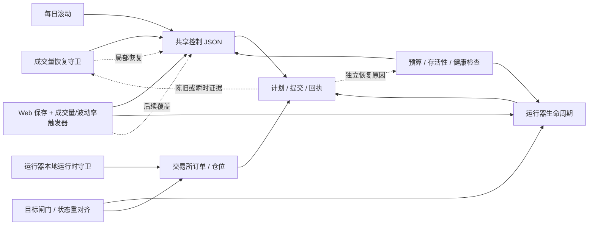
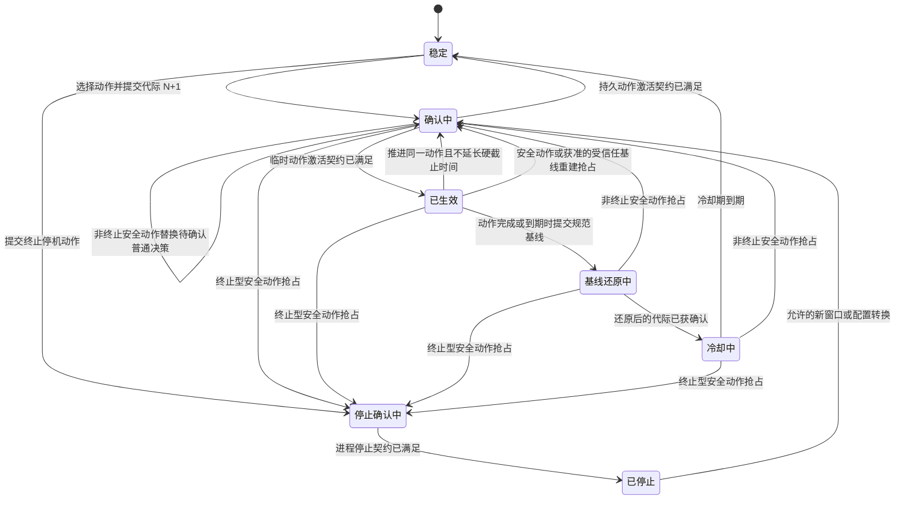

# 合约恢复单动作协调器设计

状态：会话中的设计已获确认；待审阅书面规范。

## 术语约定

- `symbol`：正文通常称“交易对”；代码、字段、枚举和需要指明原始字段的语境中保留 `symbol`。
- `generation`：正文通常称“代际”；字段名、代码和需要指明原始字段的语境中保留 `generation`。
- `document_revision`：正文称“文档修订号”。
- `baseline`：正文称“规范基线”；`desired_profile` 称“目标配置”；`desired_runner_state` 称“运行器目标状态”。“目标状态”表示目标配置与运行器目标状态的组合。
- `effect_stage`：正文称“执行阶段”；`effect_epoch` 称“执行纪元”；effect fence 称“执行栅栏”。
- `decision_id`：正文称“决策 ID”；`round_id`：正文称“轮次 ID”。
- runner：正文通常称“运行器”；类名、函数名、字段名和需要指明原始组件的语境中保留 runner。

## 目标

用一个通用恢复模块替换当前分散的合约恢复分支和直接写入方。对于每个交易对（`symbol`）的每个协调轮次，该模块：

- 评估一个不可变快照；
- 最多选择一个动作；
- 物化一份完整的受管目标状态；
- 最多执行一次控制提交，并最多推进一个持久化执行阶段（`effect_stage`）；
- 在允许下一个普通动作前，等待与当前代际（`generation`）匹配的证据。

ARX 事件暴露了这个问题，但该模块并非 ARX 专用。它适用于显式注册并由恢复模块管理的合约交易对。现货运行器、人工操作和 AI 调度器不属于本设计范围。

## 问题陈述

现有恢复流程包含多条相互独立的动作路径：

- `bq_volume_recovery_guard.check_symbol()` 在一条大型分支链中选择并执行控制变更；
- 运行器不活跃、运行器错误、有效控制漂移和交易所订单漂移路径，可能在普通动作完成验证前触发重启；
- 预算、存活性和健康检查进程包含各自的执行逻辑，尽管其中一部分目前对恢复托管的交易对已改为仅观察；
- Web 成交量和波动率触发线程可以独立启动、停止、减仓或清仓；
- 目标闸门、状态重对齐和运行器本地运行时守卫路径各自包含多阶段外部操作；
- 每日滚动分别重写控制文件并清除守卫状态；
- Web 保存通过共享文件锁写入同一份控制文档，但没有恢复代际或基线协议。

一次函数调用内只会选择一个分支，但系统没有可持久化、跨轮次的单动作状态机。一次控制写入后，重启探针可能读取旧的 `plan`，随后交易所漂移探针又读取 GTX 撤换单期间的瞬时空单簿，之后另一条分支再写入相反的控制值。现有所有权标记只能串行化遵守它的写入方；它没有定义租约、代际、完整基线、完整目标状态或激活确认。

因此会反复出现同一类故障：

- 某分支将同一字段设为 `true`，后续轮次的另一分支又将其复原；
- 更新前的 `plan` 或 `submit` 报告被用来确认或否定更新后的动作；
- 不同重启原因消费同一个陈旧事件，形成重启级联；
- GTX 撤换单或快速成交期间的交易所空单间隙被误判为漂移；
- 临时控制值被采集为还原基线；
- 控制配置、守卫状态、每日滚动和重启不共享同一个代际边界；
- 重启失败被上报时，原先已经提交的决策却没有被保留。

根因不是某一个错误的 `if` 语句，而是所有权被拆散：多个组件在没有统一、持久的决策/代际边界时，各自完成检测、选择恢复值、修改局部控制配置并驱动同一个交易对。



协调器移除这些相互竞争的箭头：每个组件都退化为纯观察或意图适配器；每个交易对由唯一决策持有规范基线、完整目标状态、执行阶段和确认状态。

## 范围

### 范围内

- 当前由 `bq_volume_recovery_guard` 承载的合约成交量和库存恢复。
- 运行器不活跃、错误循环、有效控制漂移，以及交易所/本地订单漂移恢复。
- 面向恢复托管合约交易对的预算、磨损与存活性决策。
- 面向恢复托管合约交易对的 Web 成交量触发与波动率触发后台循环。
- 面向恢复托管合约交易对的竞赛目标闸门与状态重对齐自动路径。
- 运行器本地运行时守卫的安全中断，以及其向协调器的交接。
- 每日竞赛窗口/配置基线重建。
- Web 对恢复托管合约控制文档的写入。
- 运行器代际传播和动作后确认。
- 控制所有权、基线/目标状态持久化、临时授权，以及重启/停止幂等性。

### 范围外

- 现货策略运行器和现货竞赛控制。
- 人工交易和人工服务器操作。
- AI 调度器动作。
- 分布式共识或跨主机主节点选举。
- 重写无关的运行器规划或订单执行逻辑。
- 人工强平或主观平仓流程。自动恢复和 `TERMINAL_STOP` 仍然严格使用 GTX 仅挂单（maker-only），不得使用 MARKET、IOC 或吃单方（taker）清仓。
- 自动托管所有交易对。交易对必须显式注册，并具备有效策略和完整的受管字段模式。

## 核心决策

1. 协调单元是单个交易对，而不是整个守卫进程。同一次定时器调用中，不同交易对可以各自执行一个动作。
2. 检测必须是纯函数。动作定义不得写文件、调用 Binance，或重启/停止运行器。
3. 每个动作拥有其完整生命周期：进入、保持、推进、退出、存活时间（TTL）、冷却，以及完整的受管目标配置。
4. 检测器和动作定义不得返回原始控制补丁、Shell 命令或由调用方指定的优先级。
5. 唯一的确定性仲裁器持有唯一的动作全序。
6. 协调器执行器是唯一有权修改控制配置、进程状态和交易所状态的边界。运行器本地紧急中断只能使运行器进入持久化的故障关闭式暂停状态并写入回执；它不得接触控制配置、进程生命周期、订单或仓位。协调器将该回执接管为当前安全决策。
7. 对正确性关键的恢复元数据与物化后的扁平运行器配置存放在同一份控制文档中，并原子提交。
8. 普通动作的转换必须经过基线还原和冷却。安全动作可以抢占任何普通阶段。`TERMINAL_STOP` 一旦锁定即为单调状态：非终止安全动作只能进一步收紧其安全停止配置。受信任的每日滚动可以替换一个已确认、仅修改控制配置的临时覆盖，但不能抢占冻结账本修复或正在执行的生命周期操作；普通 Web 变更永不抢占。
9. 尚未得到确认的代际会抑制所有新普通动作和独立重启。
10. 恢复执行继续严格使用 GTX 仅挂单（maker-only），波动率入场暂停继续保持启用，临时 `allow_loss` 是有限租约，而不是基线配置。
11. 生命周期操作受已提交代际和决策的栅栏约束。旧决策延迟到达的重启，不得在更新的安全或停止决策之后执行。
12. 多阶段恢复跨轮次仍然属于同一个动作和同一个决策。每个交易对每轮最多推进一个持久化执行阶段。
13. 恢复托管的运行器单元使用 `Restart=no`。进程崩溃只生成供 `RUNNER_RECOVER` 使用的观测；systemd 不得通过无栅栏的自动重启绕过协调器所有权。

## 外部接口

该协调器模块对外提供三个入口：

```python
class FuturesRecoveryCoordinator:
    def inspect(self, symbol: str) -> SymbolView:
        """返回 `revision`、`generation`、`phase`、`baseline`、目标状态和激活状态。"""

    def reconcile_symbol(
        self,
        symbol: str,
        *,
        now: datetime,
        round_id: str,
    ) -> RoundOutcome:
        """评估单个 `symbol` 的一轮协调，并且最多执行一次动作。"""

    def change_baseline(
        self,
        request: BaselineChange,
        *,
        now: datetime,
    ) -> RoundOutcome:
        """通过同一个执行器，以 CAS 更新完整的受管基线。"""
```

`bq_volume_recovery_guard.main()` 变为定时器适配器，对每个已注册的受管交易对调用一次 `reconcile_symbol()`。Web 通过 `inspect()` 读取，并使用 `change_baseline()` 提交完整的受管基线。每日滚动通过 `change_baseline()` 提交受信任的配置基线重建，而不是分别写入控制配置和状态。

调用方不再加载 `plan`/`submit` 文件、不选择恢复优先级、不计算恢复值，也不调用运行器包装器。

`change_baseline()` 不是特权直写路径。它采集同样的不可变快照，将请求转换为 `BASELINE_REBASE` 候选，并经过同一套安全优先仲裁和执行器。`BaselineChange.operation_id` 在一次业务变更期间保持稳定；每次基于新视图的重试都有唯一的 `attempt_id`，且 `attempt_id` 会成为 `RoundOutcome.round_id`。因此，安全候选仍然优先于同时到来的 Web 或每日滚动请求。`RoundOutcome.status` 描述选中的交易对动作；`request_status` 另行告知基线变更调用方其请求状态是 `accepted`、`deferred` 还是 `rejected`。

## 核心类型

```python
@dataclass(frozen=True)
class ManagedValue:
    present: bool
    value: JsonValue | None


@dataclass(frozen=True)
class ManagedProfile:
    schema_version: int
    policy_id: str
    fields: Mapping[str, ManagedValue]
    profile_digest: str


@dataclass(frozen=True)
class SymbolSnapshot:
    symbol: str
    document_revision: int
    generation: int
    captured_at: datetime
    control: Mapping[str, JsonValue]
    plan: PlanObservation
    submit: SubmitObservation
    runner: RunnerObservation
    exchange: ExchangeObservation
    volume: VolumeObservation
    inventory: InventoryObservation
    wear: WearObservation
    frozen_ledger: FrozenLedgerObservation
    web_triggers: WebTriggerObservation
    competition: CompetitionObservation
    runtime_safety: RuntimeSafetyObservation


@dataclass(frozen=True)
class BaselineChange:
    symbol: str
    expected_revision: int
    expected_generation: int
    source: Literal["web", "daily_roll"]
    profile: ManagedProfile
    unmanaged_updates: Mapping[str, JsonValue | DeleteValue]
    operation_id: str
    attempt_id: str
    actor_id: str
    reason: str


@dataclass(frozen=True)
class RoundOutcome:
    symbol: str
    round_id: str
    previous_revision: int
    revision: int
    previous_generation: int
    generation: int
    phase: RecoveryPhase
    action_id: ActionId
    status: Literal["noop", "hold", "deferred", "committed", "failed"]
    request_status: Literal["accepted", "deferred", "rejected"] | None
    changed_fields: tuple[str, ...]
    effect_stage: EffectStageKind
    suppressed_actions: tuple[SuppressedAction, ...]
    reasons: tuple[str, ...]
    error: str | None


@dataclass(frozen=True)
class MaterializedDecision:
    next_baseline: ManagedProfile
    desired_profile: ManagedProfile
    desired_runner_state: Literal["running", "stopped"]
    next_effect_stage: EffectStage
    activation_contract: ActivationContract
    lease: HardLease | None
```

在检测、仲裁和物化之间传递的所有类型都是不可变值。`ManagedValue` 保留字段缺失与 JSON `null` 之间的差异。配置摘要使用文档中明确规定的规范化 JSON 编码：按 UTF-8 键排序、规范化 JSON 标量编码，并显式包含 `present` 位。

每次元数据或控制文档发生原子变更时，`document_revision` 都递增。只有完整的受管目标配置或目标运行器状态发生变化时，`generation` 才递增。内部比较并交换（CAS）同时检查两者，避免仅更新确认状态的操作被误算为新的运行器代际。Web 和每日滚动请求提交 `inspect()` 返回的这两个值。

`unmanaged_updates` 只能包含受管字段注册表和 `_futures_recovery` 之外的键。执行器先暂存这些更新；只有当 `BASELINE_REBASE` 请求赢得仲裁时，才将其应用到持锁后重新读取的文档，否则将其丢弃。执行器绝不能基于较旧的快照重建非受管字段。

`EffectStageKind` 是闭合集合：`none`、`runner_stop`、`runner_start`、`runner_restart`、`managed_gtx_cancel` 和 `local_state_repair`。执行阶段是选中动作的一个步骤，不是第二个动作。任何恢复操作都不得提交 MARKET、IOC 或吃单方（taker）订单。`TERMINAL_STOP` 只使用 `runner_stop`；它从不隐含撤单、平仓、清仓或保护单下单。

## 动作定义

动作定义是一个内部边界。其实现包含一个语义动作的完整生命周期：

```python
class ActionDefinition(Protocol):
    action_id: ActionId
    rank: int
    safety_class: SafetyClass
    effect_kind: EffectKind
    trusted_rebase_preemptible: bool

    def evaluate(
        self,
        snapshot: SymbolSnapshot,
        active: ActiveAction | None,
    ) -> ActionIntent | None:
        """无副作用地返回进入（ENTER）、保持（HOLD）、推进（ADVANCE）或退出（EXIT）意图。"""

    def materialize(
        self,
        intent: ActionIntent,
        baseline: ManagedProfile,
    ) -> MaterializedDecision:
        """返回规范基线、目标状态、租约、执行阶段和激活契约。"""
```

每个实现都必须在同一个位置定义：

- 进入条件；
- 保持条件和同动作推进条件；
- 完成、超时和退出条件；
- 最短保持时间和冷却期；
- 完整的受管目标值；
- 规范基线保持不变还是被持久替换；
- 允许的执行阶段；
- 动作特定的激活证据；
- 结构化原因和证据字段。

注册表验证 `action_id` 和 `rank` 唯一。`rank=1` 为最高优先级。动作不能自行选择动态优先级。每个已注册交易对的策略还必须提供下列有界参数并通过校验：观察数据最长有效期、漂移证据最大间隔、激活超时、冷却期、硬租约上限、重试退避、最大执行尝试次数、请求重试时限，以及幂等记录的保留期限和容量。若某交易对的策略不完整或无效，协调器拒绝为其启动。

`trusted_rebase_preemptible` 在每个动作中显式定义，默认值为 `false`。只有同时满足以下条件的临时控制覆盖才能设为 `true`：已获确认；定义中不包含账本或状态修复阶段；没有正在执行的阶段。`FROZEN_LEDGER_REPAIR`、`RUNNER_RECOVER` 的状态重对齐、恢复阶段和停止阶段永远不可被基线重建抢占。

### 标准动作及其全序优先级

新模型有意将许多旧分支名称收敛为一小组语义动作：

1. `TERMINAL_STOP`（终止停机）
   - 竞赛目标已完成、状态不可恢复地损坏，或无法建立安全状态。
   - 唯一外部操作是停止。它不会自动撤单、平仓、清仓或挂保护单。受管交易对的目标闸门提交该意图，不得运行旧的市价清仓路径。
2. `SAFETY_CONVERGE`（安全收敛）
   - 波动率触发/暂停、高磨损、临时授权到期、运行器本地安全回执，或违反受保护不变量。
   - 清除临时风险字段，并物化完整的安全配置。
3. `FROZEN_LEDGER_REPAIR`（冻结账本修复）
   - 只有存在已识别的冻结账本条目，并验证了预期对冲差量时才允许执行。
   - 普通库存或底仓恢复不得使用合约敞口做平衡。
4. `BASELINE_REBASE`（基线重建）
   - 每日运行时配置基线重建，或稳定状态下的 Web 受管配置变更。
   - 受信任的每日滚动可以撤销已获确认、仅修改控制配置的临时覆盖。当冻结账本修复、基线还原、停止确认或生命周期操作正在进行时，返回 `deferred`，调用方基于新的修订号重试。普通 Web 编辑在任何非 `Stable` 阶段都会收到 `RecoveryBusy`。
5. `RUNNER_RECOVER`（运行器恢复）
   - 运行器不活跃、已确认的错误循环、有效控制漂移，或已确认的交易所/本地订单漂移。
   - 多个重启原因合并为一个动作，并带多个原因码。
   - 状态重对齐是一个持久化的多阶段决策：停止请求、停止确认、可选的受管 GTX 撤单、本地状态修复、启动请求，以及与代际匹配的激活。每个交易对每轮只推进一个阶段。
6. `INVENTORY_RECOVER`（库存恢复）
   - 只使用挂单方订单恢复库存或净名义敞口，不启用临时亏损放宽。
7. `TEMPORARY_LOSS_RELIEF`（临时亏损放宽）
   - 仅在已确认安全的库存恢复尝试无效后使用。
   - 必须设置有限存活时间（TTL），并保持净亏损/硬亏损强制减仓器禁用。
8. `MAKER_FLOW_RECOVER`（挂单方流量恢复）
   - 成交量进度、Web 成交量触发意图、报价距离、容量或挂单方流量恢复。
9. `BASELINE_TUNE`（基线调优）
   - 低优先级、持久化的预算层级或磨损调节器调整。
   - 通过 `next_baseline` 替换规范基线；它不是之后会恢复旧基线的临时目标状态覆盖。
10. `NOOP`（不执行动作）
   - 不执行动作。结果仍可报告保持状态和被抑制的候选。

每个标准动作中的交易对特定阈值和允许的配置参数都来自已注册交易对策略。交易对策略不得改变全局动作顺序或受保护不变量。

## 状态机



### 转换规则

- `Stable` 表示当前没有活动的临时覆盖层，且物化后的受管字段与规范基线一致。
- `Settling` 表示代际已提交，但该动作的激活契约尚未满足。此时不得选择普通动作或独立重启。
- `Active` 仅用于已确认的临时动作。持久基线转换获得确认后返回 `Stable`。
- `Restoring` 将完整规范基线写入新代际。在获得确认前，不得清除所有权元数据。
- `Cooldown` 阻止立即重新进入，但不修改控制文档。
- `StopPending` 已将运行器目标状态设为 `stopped`，并抑制存活性重启；但在进程已停止的激活契约满足前，不得宣告成功。
- `Stopped` 抑制存活性重启。只有获准的新窗口或配置转换，或显式生命周期请求，才能将运行器目标状态重新设为 `running`。
- 普通动作不能直接替换另一个普通动作，必须经过 `Restoring` 和 `Cooldown` 退出。
- 安全动作可以抢占任何普通阶段。它会用一个新动作替换完整目标配置，而不是在活动配置上叠加补丁。
- `StopPending` 和 `Stopped` 会锁定 `TERMINAL_STOP`。非终止安全条件可以在同一个终止动作和已停止目标状态下，重新物化更严格的完整安全配置，但不能更换动作或恢复运行器。
- 受信任的每日滚动是唯一的非安全例外。它可以在完成安全仲裁后，且没有生命周期执行阶段被认领时，替换一个已获确认、仅修改控制文档的临时覆盖层。它不能中断 `FROZEN_LEDGER_REPAIR`；该请求会标记为 `deferred`。Web 基线变更要求系统处于 `Stable`。
- 动作执行失败不会让仲裁器在同一轮尝试第二优先级候选。

`pending_restart`、`failed_settling`、重试次数和激活错误是持久化的执行/激活子状态，不是额外的恢复阶段。不改变目标控制配置的阶段变更只递增 `document_revision`。

## 执行阶段与激活契约

一个动作可以是单阶段或多阶段，但在推进过程中，其 `action_id` 和 `decision_id` 不变。动作定义持有有序的阶段转换表、超时、重试策略和终止结果。同一交易对的同一轮次内，不得从一个阶段继续推进到下一个阶段。

每个阶段都必须声明完成该阶段所需的证据：

- 仅应用控制配置时，需要当前代际的计划，并且计划带有预期配置摘要；
- 重启需要受栅栏约束的执行器回执、新的进程标识/启动纪元，以及当前代际的计划；
- 涉及订单变更的恢复阶段，需要当前代际的计划、完整的动作后回执和提交证据；
- 停止需要观察到目标运行器标识对应的进程不存在；
- 取消受管 GTX 订单需要完整的交易所响应，以及列出精确受管订单 ID 的回执；
- 本地状态修复需要带有修复前后状态摘要的原子修复回执。

所有必要证据都必须同时满足：匹配交易对、代际、决策和阶段，在适用时还要匹配摘要；其时间戳不得早于阶段发出时间。仅凭计划或提交报告，永远不能确认生命周期阶段或会改变订单的阶段。

运行器生命周期区段持久化目标状态、当前阶段、`effect_generation`、决策 ID、认领方及其到期时间、尝试次数、下次重试时间、最近错误和激活截止时间。普通执行阶段用尽重试次数后，在后续轮次转换为完整安全基线并执行终止停机；安全阶段失败后仍保持停止优先，不恢复交易。两条路径都不会尝试优先级更低的普通动作。

## 完整目标状态模型

受管字段在带版本的注册表中声明。有效的基线和目标配置必须包含每个已注册字段；当字段省略与 JSON `null` 含义不同时，还必须包含字段是否存在的信息。

有效控制配置始终为：

```text
最新的非受管字段
+ 规范受管基线
+ 恰好一个活动的完整受管配置（如有）
+ 受保护不变量
```

它绝不是此前稀疏补丁的累积结果。

切换或恢复配置时会重新物化每一个受管字段。因此，前一个动作留下的 `true`、预算、上限、偏移量或粘滞值不会泄漏到下一个动作。

### 受保护不变量

对于恢复托管的合约交易对：

- `volatility_entry_pause_enabled` 缺失时物化为 `true`，任何自动动作都不能将其设为 `false`。
- 策略要求的波动率暂停阈值必须存在且为正数。
- `best_quote_maker_volume_net_loss_reduce_enabled` 保持为 `false`。
- `hard_loss_forced_reduce_enabled` 保持为 `false`。
- 恢复执行策略为 `gtx_maker_only`。
- 普通恢复不得请求 `aggressive`、`IOC`、`market` 或吃单方（`taker`）执行。
- `best_quote_maker_volume_allow_loss_reduce_only=true` 不是合法规范基线值。
- 本文中的 `allow_loss` 是 `best_quote_maker_volume_allow_loss_reduce_only` 的简称。
- 只有带有有效绝对硬截止时间，且该时间不晚于注册策略最大值的 `TEMPORARY_LOSS_RELIEF`，才允许 `allow_loss=true`。
- 普通恢复不得使用合约敞口修复库存。合约变更必须属于 `FROZEN_LEDGER_REPAIR`，并具备冻结账本证据。

## 持久化与所有权

扁平的顶层控制配置继续与 `run_saved_runner` 兼容。对正确性关键的元数据嵌入同一文档：

```json
{
  "symbol": "ARXUSDT",
  "volatility_entry_pause_enabled": true,
  "best_quote_maker_volume_allow_loss_reduce_only": false,
  "_futures_recovery": {
    "schema_version": 1,
    "policy_id": "best-quote-futures-v1",
    "owned_fields_version": "bq-owned-v1",
    "document_revision": 57,
    "generation": 42,
    "baseline_generation": 9,
    "phase": "settling",
    "action_id": "maker_flow_recover",
    "decision_id": "uuid",
    "baseline": {
      "...全部受管字段...": {"present": true, "value": false}
    },
    "desired": {
      "...全部受管字段...": {"present": true, "value": true}
    },
    "issued_at": "2026-07-14T05:00:00Z",
    "expires_at": null,
    "execution_policy": "gtx_maker_only",
    "input": {
      "source": "scheduler",
      "operation_id": "scheduler-operation-or-baseline-request-uuid",
      "attempt_id": "round-uuid",
      "recent_inputs": [
        {
          "operation_id": "scheduler-operation-or-baseline-request-uuid",
          "attempt_id": "round-uuid",
          "status": "committed",
          "request_status": null,
          "operation_final": true,
          "generation": 42
        }
      ]
    },
    "runner_lifecycle": {
      "desired_state": "running",
      "effect": "restart",
      "effect_stage": "runner_restart",
      "effect_generation": 42,
      "effect_epoch": 18,
      "effect_decision_id": "uuid",
      "status": "pending",
      "claim_owner_id": null,
      "claim_attempt_id": null,
      "claim_expires_at": null,
      "attempt_count": 0,
      "next_retry_at": "2026-07-14T05:00:00Z",
      "last_error": null
    },
    "activation": {
      "required_generation": 42,
      "applied_generation": 41,
      "status": "pending"
    }
  }
}
```

控制文档是文档修订号、代际、规范基线、目标状态、活动动作、阶段、硬租约、生命周期操作、激活契约和近期幂等键的唯一事实来源。辅助防护状态可以存储漂移计数器和诊断证据，但丢失这些信息最多只能延迟动作；不得改变恢复目标或重新激活临时授权。

现有所有权辅助组件纳入协调器的存储与执行边界。所有范围内写入方使用同一个按交易对划分的锁，以及基于 `revision`/`generation` 的比较并交换。元数据保存一组容量受策略限制的近期调度轮次和基线请求尝试，同时保存操作 ID、尝试 ID、结果摘要，以及操作是否已结束。保留时长必须超过已注册的最大请求重试时限与最大动作生命周期之和。重复尝试返回已记录结果；已完成的操作不得产生新的代际。

可重试基线请求的 `request_status=deferred` 只结束其 `attempt_id`，不结束其 `operation_id`，即使同一次调用中另一个安全动作已经提交。每日滚动重新读取 `inspect()`，保留同一个操作 ID，并提交新的尝试 ID。只有基线重建被接受或请求因无效被拒绝时，操作才结束。调度轮次使用其 `round_id` 同时作为操作 ID 和尝试 ID，且 `request_status=None`。

这里的所有权是协议所有权，不是永久守护进程租约：只有协调器执行器可以修改受管文档，但任何本地适配器都可以向其提交请求。一次生命周期尝试具有一项短期持久化认领，其中包含所有者 ID、尝试 ID 和认领到期时间。过期认领方可通过 CAS 替换；未过期的认领不得被替换或重复创建。每次认领尝试都会单调递增执行纪元（`effect_epoch`），即使它重试的是同一个代际和阶段。生产执行器必须以 `(symbol, effect_generation, effect_decision_id, effect_epoch)` 为幂等键。

生命周期提交受代际栅栏约束，而不只是具备幂等性。每次改变代际的提交，先获取按交易对划分的执行栅栏，再获取控制文档锁；仅修改 `revision` 元数据的提交只使用控制锁。执行器可以在不持有任何一个锁的情况下启动包装器。包装器随后自行获取同一个执行栅栏，在控制锁下重新读取文档，验证运行器目标状态、`effect_generation`、决策 ID、阶段、有效认领和单调执行纪元（`effect_epoch`），然后仅释放控制锁。在仍持有执行栅栏时，包装器同步变更进程并记录执行回执；只有进程命令返回后才释放执行栅栏。稍后在无锁情况下执行激活观测。低于当前值或已被取代的执行纪元会在修改前被拒绝。若旧包装器已持有栅栏，较新的停止提交会等待，随后提交并在旧修改完成后执行。因此，旧重启不可能在更新的终止停机提交之后生效。

该锁设计假设所有写入方位于同一主机，或使用所有写入方共享、具备建议锁与原子替换语义的文件系统。跨主机协调需要使用不同的存储实现，不属于本设计范围。

## 不可变快照与时效性

快照工厂在每个交易对的每个轮次中对每个来源只读取一次。动作定义不得自行读取。

每项观测包含：

- `captured_at`；
- 来源请求 ID 或循环 ID；
- 交易对；
- 适用时的控制代际；
- 适用时的配置摘要。

每个动作声明其所需观测。所需证据陈旧或缺失时，协调器会拒绝该动作或将其置于等待；不相关来源缺失，不会阻止控制文档不变量、绝对租约到期或终止停机。协调器不会把失败的 Binance 请求解释为空订单簿或零仓位。

运行器将已应用的恢复代际和配置摘要传播到：

- 最新计划；
- 最新提交结果；
- 运行器错误事件；
- 仅在撤单或下单处理完成后写入的动作后回执。

只有当观测的代际与当前所需代际一致，且时间戳不早于决策的 `issued_at` 时，它才能确认该决策。

### 运行器本地紧急安全通道

只有已注册的紧急安全条件，才允许运行器立即中断自身普通规划。运行器可以原子地进入持久本地暂停状态，并停止生成或提交新的计划与订单。它不得撤单、提交风险降低订单、改变合约敞口、启用 `allow_loss`、放宽波动率暂停条件、自行重启、修改进程状态，或修改规范控制配置/基线。

进入暂停前，运行器原子写入安全回执，内容包括交易对、当前代际/配置摘要、安全动作 ID、安全决策 ID、阶段和时间戳；启动时先于普通规划读取该回执。只要回执处于非终止状态，运行器就保持不可交易。下一个协调器轮次将该回执接管为当前 `SAFETY_CONVERGE` 或 `TERMINAL_STOP` 决策；后续所需的受管 GTX 撤单或冻结账本修复，均通过受栅栏约束的协调器执行器完成。此时不得运行普通动作、重启或基线重建。回执格式错误、缺失或与代际不匹配时，系统以故障关闭方式进入暂停，而不是触发恢复。

该例外仍保持语义上的单一所有权：紧急中断成为该交易对当前唯一的安全动作；协调器继续执行同一个决策，而不是创建竞争动作。

### 交易所/本地订单漂移

不能仅根据一次本地活动订单计数和一次交易所空单响应推断订单漂移。`RUNNER_RECOVER` 漂移意图需要：

- 两次成功观测，且运行器循环序列号严格递增；
- 两次成功的交易所请求，请求 ID 不同，采集时间戳递增；
- 当前代际的动作后回执；
- 观测时间晚于当前决策；
- 两次观测都处于已注册的时效限制和证据最大间隔内；
- 根据最新且完整的当前代际回执推导出的预期订单集合一致；
- 没有新的受管 GTX 下单、部分成交或完全成交；
- 按交易对和受管客户端 ID 过滤；
- 当交易所数据提供相关信息时，精确识别受管 LIMIT/GTX 订单。

GTX 订单快速成交后，未结订单簿为空属于执行进展，而不是漂移。无关交易对或人工账户事件既不能确认，也不能抑制受管交易对的恢复。

### 订单身份契约

新的受管合约订单使用带版本的客户端订单 ID 生成器，其中包含紧凑的三十六进制恢复代际和决策令牌，同时保留交易对/角色标识。生成器会在提交前验证 Binance 的 36 字符限制。运行器还会原子写入带校验和的动作后清单，内容包含代际、决策 ID、循环序列号、请求 ID、已下单 ID、已撤单 ID、已成交 ID 和 `completed_at`。

交易所订单分类会将解析出的客户端订单 ID 令牌与完整清单关联。清单缺失、截断、校验和无效或与代际不匹配时，结果为 `hold`，绝不能解释为空的受管订单集合。旧格式 ID 标记为 `legacy_unattributed`；它们不能确认当前代际的健康状态或漂移。未来切换交易对前，必须先将运行器置于静止状态；所有旧格式受管订单必须执行完毕，或通过有记录的挂单方订单清理阶段显式撤销。迁移过程中不允许以市价方式清空任何仓位。

## 每个交易对的轮次算法

```text
在不持有控制锁或执行栅栏时采集一个不可变快照
当代际可能变化时，获取按交易对划分的执行栅栏
获取按交易对划分的控制锁
重新读取文档修订号和代际
如果任一值与快照不同：返回 deferred
如果尝试 ID 已处理：返回已记录结果
如果操作 ID 已结束：返回其最终结果
暂存请求中的非受管更新；仲裁前不得应用
验证受管文档、已注册策略和受保护不变量
先评估终止意图和安全意图
如果 phase 是 StopPending 或 Stopped：
    保持 TERMINAL_STOP 锁定
    如果终止型或非终止型安全观测要求更严格的配置：
        继续终止决策，只收紧其已停止安全配置
    否则，如果 phase 是 Stopped，且请求为受信任的每日新窗口/配置基线重建，
         并且已注册策略允许恢复运行：
        选择 BASELINE_REBASE，并将运行器目标状态设为 running
    否则，如果存在基线请求：
        不选择动作，将结果设为请求级 deferred；
            Web 适配器将其映射为 RecoveryBusy
    否则：
        验证停止，或在终止决策下将结果设为 hold
否则，如果终止动作或安全动作抢占：
    只选择其中优先级最高的意图
否则，如果请求是受信任的每日基线重建，phase 是 Active，
     活动动作定义的 trusted_rebase_preemptible 为 true，且没有执行阶段被认领：
    选择 BASELINE_REBASE
否则，如果存在基线请求，且 phase 不是 Stable：
    不选择动作，将结果设为请求级 deferred；
        Web 适配器将其映射为 RecoveryBusy
        本次请求中不推进现有动作
否则，如果有待处理的执行阶段或激活：
    验证、退避，或认领现有决策的一个重试阶段
否则，如果 phase 是 Active：
    只评估活动动作定义的 HOLD、ADVANCE 或 EXIT
    将所有其他普通候选记录为已抑制
否则，如果 phase 是 Restoring：
    只验证恢复激活契约
否则，如果 phase 是 Cooldown：
    如果冷却期已到则结束 Cooldown，否则将结果设为 hold；不选择普通候选
否则，phase 为 Stable：
    评估适用的纯函数式动作定义和可选基线请求
    选择唯一的最高优先级意图
如果存在基线请求：
    仅当选中 BASELINE_REBASE 时，设置 request_status=accepted
    否则，除非校验已拒绝请求，设置 request_status=deferred
    仅对 accepted 或 rejected 请求设置 operation_final=true
如果结果是 noop、hold 或请求级 deferred：
    通过仅修改修订号的提交，原子记录尝试 ID 和结果；
        可重试 deferred 保持 operation_final=false
    释放锁，追加审计结果并返回
否则：
    物化完整的下一规范基线、目标配置和一个执行阶段
    仅当选中 BASELINE_REBASE 时应用暂存的非受管更新；
        否则保持持锁时读取的非受管文档不变
    原子提交文档修订号 N+1、需要时提交代际、
        操作/尝试幂等记录、待处理激活
        和执行栅栏令牌
释放控制锁和执行栅栏
如果一个执行阶段已被认领：通过受栅栏约束的幂等执行器调用它
追加审计结果
在后续交易对轮次验证阶段激活
```

当另一个普通动作处于活动状态时，协调器绝不评估第二个普通动作定义。`EXIT` 只提交完整恢复配置；它不能在同一轮选择下一个普通动作。仅确认阶段或首次产生 `noop`/`hold` 结果时，只递增 `document_revision`，不递增 `generation`。重复相同尝试 ID 时，直接返回已记录结果，不产生另一次提交；重试尚未结束的基线操作时，需要新的尝试 ID，以及新的预期 `revision`/`generation`。

持锁期间不执行网络请求，也不等待激活或健康状态。为了消除栅栏竞争，包装器在有界的同步进程修改期间只持有执行栅栏，不持有控制锁；计划、提交结果和健康状态完成证据在后续轮次观测。

## 故障语义

### 观察数据缺失或陈旧

对需要该缺失证据的动作返回 `hold`；只写入修订号/幂等结果，不改变代际、配置或执行状态，也不重启。交易所请求失败不是交易所状态为空的证据。受保护不变量修复、硬租约到期、运行器本地安全接管和终止停机，只依赖受信任的控制文档、本地时钟及各自必需的证据，因此不相关的交易所故障不能阻止它们。

### 重复定时器或代际冲突

返回 `deferred`。调用方在后续轮次使用新快照重试。陈旧的 Web 请求通过 Web 适配器返回 HTTP 冲突。

### 控制提交失败

不存在新的代际，也不尝试运行器生命周期操作。

### 控制提交后的运行器生命周期操作失败

保持同一个决策及其执行阶段处于待处理状态。持久化 `attempt_count`、`next_retry_at` 和 `last_error`；只有经过已注册的退避时间，且未超过已注册的尝试次数上限时才重试。下一轮可以幂等重试该阶段，或允许更高优先级的安全动作；不能选择其他普通候选。尝试次数用尽后，在后续轮次安排完整安全配置并执行终止停机。

### 激活超时

将已提交的目标代际保持在激活子状态 `failed_settling`。不回滚到前一个代际，也不执行后备动作。在已注册限制内重试，或允许安全收敛；用尽重试后安排终止停机，而不是另一个普通动作。

### 受管文档损坏

如果能从已注册的运行时配置重建完整基线，则提交安全基线并创建新代际；否则只执行终止停机。绝不能从可能包含覆盖层的实时控制配置推断规范基线。

### 审计失败

报告审计降级状态，但不回滚已成功提交的代际。下一轮可以从控制文档重建正确状态。

### Web 受管配置冲突

Web 必须提供 `expected_revision` 和 `expected_generation`。Web 适配器映射基线的 `request_status`，而不是无关的选中动作状态：普通 Web 编辑在任何非 `Stable` 阶段返回 `RecoveryBusy`；它不会静默改变动作的恢复目标。每日滚动是受信任的基线重建请求，只能通过一个 `BASELINE_REBASE` 动作撤销已获确认、仅修改控制配置的覆盖层；否则它会收到可重试的 `request_status=deferred`，保留操作 ID，并基于新视图使用新的尝试 ID 重试。

## 临时 `allow_loss` 回收

`TEMPORARY_LOSS_RELIEF` 在受管文档中保存 `lease_started_at` 和绝对 `hard_expires_at`。同一动作的 `ADVANCE` 不能移动 `hard_expires_at`；只有经过恢复和冷却后才能创建新租约。发生以下任一情况时，协调器恢复完整的非亏损基线：

- TTL 到期；
- 库存恢复成功；
- 波动率暂停变为活动状态；
- 磨损达到安全阈值；
- 动作未通过有效性验证；
- 受信任的基线重建撤销覆盖层。

租约到期判断使用受信任的控制文档和本地 UTC 时钟；不会被缺失的交易所观测、计划观测或提交观测阻塞。当动作 ID、开始时间或硬截止时间缺失、格式错误、不匹配或已过期时，运行器在启动时、每个计划循环中，以及紧接在每次生成或提交订单之前，都按 `allow_loss=false` 处理。这样即使协调器宕机，也不会无限期启用临时授权。协调器恢复后再持久化完整安全配置。

## 依赖与适配器

### 进程内组件

- 动作定义；
- 仲裁器；
- 配置物化器与校验器；
- `generation` 校验器；
- 快照规范化器。

这些都是纯内部实现，无需作为外部接口暴露。

### 可在本地替换的组件

- `ManagedControlStoreAdapter`：生产环境使用按交易对划分的执行栅栏和控制锁、临时文件、文件级 `fsync`、`os.replace` 和目录级 `fsync`；测试使用内存实现或临时目录。
- `RunnerObservationAdapter`：生产环境读取 `process`、`plan`、`submit`、`event` 和 `receipt` 数据；测试使用不可变测试夹具。
- `EffectExecutorAdapter`：生产环境将封闭的执行阶段集合分派到受代际栅栏保护的 saved-runner 包装器/systemd、精确的受管 GTX 撤单或原子化本地状态修复；测试使用可记录调用的测试替身，并具备单调递增的执行纪元（`effect_epoch`）和幂等决策 ID（`decision_id`）。
- `RuntimeProfileRepositoryAdapter`：生产环境读取已注册的运行时配置；测试使用内存注册表。
- `AuditJournalAdapter`：生产环境追加 JSONL；测试使用内存。

### 真实外部依赖

- `ExchangeObservationPort`：生产环境以只读方式获取 Binance 合约仓位、挂单和用户成交；测试使用返回确定性结果的测试替身。精确的受管 GTX 撤单只能通过 `EffectExecutorAdapter` 对外暴露。

## 现有写入方的集成

### `bq_volume_recovery_guard`

- 保留可复用的纯评估计算。
- 用动作定义和 `reconcile_symbol()` 取代分支内写入、原始 `control` 快照、恢复补丁和直接重启。
- 主循环缩减为轻量的定时适配器。

### 非活跃、错误、有效控制与订单漂移恢复

- 全部转换为 `RUNNER_RECOVER` 下的纯证据收集或意图判断逻辑。
- 移除各自独立的冷却逻辑和重启操作。
- 为每个受管 symbol 安装 systemd 单元，并设置 `Restart=no`；非活跃或已崩溃的进程只能通过受栅栏保护的动作恢复。

### 预算控制器

- 复用纯预算分层计算作为 `BASELINE_TUNE` 的输入。
- 对受管 symbol，不再独立写入 `control` 或执行重启。

### 存活性与健康监控器

- 提供观测与纯意图。
- 对受管 symbol，不允许直接重启、修改偏移量或直接提交任何用于自愈的交易订单。
- 任何合约侧修复都必须在有账本证据时重新表达为 `FROZEN_LEDGER_REPAIR`；否则只做观察。

### Web 成交量与波动率触发器

- 对受管 symbol，`_run_volume_trigger_loop()` 和 `_run_volatility_trigger_loop()` 变为观测/意图适配器。
- 它们不能直接调用 runner 启停、名义金额压缩、全量平仓、撤单或 `control` 写入辅助函数。
- 成交量触发意图映射到 `MAKER_FLOW_RECOVER` 或 `TERMINAL_STOP`；波动率触发意图按全局优先级表映射到 `SAFETY_CONVERGE` 或 `TERMINAL_STOP`。
- 它们的候选动作共享同一个 symbol 快照，在一个轮次中绝不能与守卫候选动作并行形成第二个动作。

### 目标闸门与状态重对齐

- 竞赛目标闸门为受管 symbol 提交 `TERMINAL_STOP`。禁用其旧的撤单、MARKET 平仓和保护单操作；停止确认是该动作的激活契约。
- 竞赛状态重对齐改为上文所述的分阶段 `RUNNER_RECOVER` 决策。停止、精确清理受管订单、重写/归档状态、启动和确认分别在不同轮次执行，并共用同一个决策 ID（`decision_id`）和执行纪元（`effect_epoch`）序列。
- 两个模块都不再为受管 symbol 保留独立 runner 或交易所变更执行器。

### 运行器本地运行时保护机制

- 对受管 symbol，`_maybe_handle_runtime_guard()` 收窄为文档所述的紧急安全通道。
- 它写入当前代际的安全回执并阻止正常规划；不得撤单或提交订单、改变风险敞口、自行解除停止或冷却状态并恢复运行，也不得启动平仓流程。
- 协调器接管并完成同一个安全决策。对受管 symbol 禁用任何旧的 MARKET/IOC 亏损恢复分支。

### 每日滚动

- 通过 `BASELINE_REBASE` 提交完整的已注册运行时配置。
- 在一次原子提交中更新规范基线、清除覆盖层、回收临时授权、递增代际并物化扁平化 `control`。
- 不再单独清除会影响正确性的保护状态。

### Web 集成

- 通过 `inspect()` 读取当前文档修订号和 `generation`。
- 提交带有预期修订号与 `generation` 的完整受管配置。
- 对受管 symbol，将整个 `control` 保存流程路由到协调器，避免管理元数据被擦除。
- 对未受管 symbol 继续现有行为。

### 外部运维执行器

- 未来任何所有权切换前，都要盘点仓库内外所有可能写 symbol `control`、调用运行器生命周期命令、撤单或提交交易的 cron 任务、systemd unit 和脚本。
- 已知由部署系统管理的示例包括 `output/ops/*_ledger_drift_monitor.py`、每日窗口滚动、目标闸门和恢复安装器配置链路。
- 在清单中的每个执行器都被明确归类前，不得启用受管 symbol。允许的归类值为：`coordinator adapter`（协调器适配器）、`runner-local safety lane`（运行器本地安全通道）、`observe-only`（仅观察）、`disabled`（禁用），或有证据证明不会接触该 symbol 的 `out of scope`（范围外）。

## 测试策略

实现遵循测试优先开发。测试主要使用内存适配器验证协调器接口。

### 动作契约测试

- 动作 ID 和优先级序号唯一。
- 每个动作都物化全部受管字段。
- 任何自动动作都不能禁用波动率暂停。
- 任何动作都不能启用净亏损或硬亏损强制减仓。
- 只有 `TEMPORARY_LOSS_RELIEF` 可以请求 `allow_loss=true`，且必须提供不超过已注册硬上限的绝对到期时间。
- 同一动作的阶段推进不得延长 `allow_loss` 的绝对硬到期时间。
- 普通动作不得请求改变合约敞口。
- 冻结账本修复必须具备账本条目、预期对冲变化量和容差证据。

### 仲裁与状态机测试

- 同时出现多个候选动作时，只生成一个已选动作和一份有序的被抑制动作列表。
- 同一次调度器调用中，不同 symbol 可以各自执行一个动作。
- 待确认的 `generation` 抑制所有普通候选动作和独立重启。
- 安全动作可以抢占待处理或活动状态，但仍然只提交一次，并推进一个执行阶段。
- `TERMINAL_STOP` 在 `StopPending`/`Stopped` 中保持锁定；非终止安全动作只能进一步收紧已停止配置。
- 只有获授权、受信任的每日新窗口/配置转换才能使 `Stopped` 向 `running` 转换；Web 不可以。
- 普通动作进入下一个普通动作前，必须先经过恢复和冷却阶段退出。
- 同一个动作独立控制自身的进入、保持、推进和退出行为。
- 切换动作时从基线重新物化，不保留上一个配置中的任何值。

### 代际与重启测试

- 陈旧的 `plan`、`submit`、`error` 和交易所快照不能确认或重新触发动作。
- 一轮中出现两个重启原因时，只产生一个 `RUNNER_RECOVER` 决策和一次重启。
- 重启失败时，保留原动作以及 `control` 已提交这一事实。
- 同一轮的重复协调器调用不能提交第二个 `generation`。
- 首次出现 `noop` 或 `hold` 时，持久化一条仅修订号变化的幂等结果；重复调用返回该结果，不再提交或执行后续动作。
- 可重试的每日滚动 `deferred` 会结束本次尝试，但不结束整个操作；后续的新尝试最多成功提交一次。
- 安全动作在基线变更调用中获胜时，动作状态记录安全提交，而同一操作下的请求状态保持为可重试的 `deferred`。
- 进程在提交前、提交后、重启后或确认前崩溃，都能幂等恢复。
- 仅阶段确认只递增文档修订号，不创建新的 runner `generation`。
- 较新的 `TERMINAL_STOP` `generation` 提交后，旧的延迟重启会被拒绝。
- 包装器在令牌校验与同步进程变更期间持有共享执行栅栏，以消除检查与使用时差（TOCTOU）竞态。
- 执行重试遵守已持久化的退避规则和尝试次数上限，且永远不会转而尝试另一个普通动作。

### 订单漂移测试

- 当前代际已经产生新的 GTX 挂单或成交记录时，即使交易所订单簿为空，也不视为漂移。
- 单次交易所空订单观测不足以确认漂移。
- 重复读取同一个交易所请求或 runner 循环不足以确认漂移。
- 忽略无关 symbol 或人工账户活动。
- 只有当前 `generation` 的受管 LIMIT/GTX 订单才计入受管未成交订单。
- 跨 `generation` 的残留订单不能满足当前 `generation` 的健康条件。
- 动作后清单缺失、被截断或校验和无效时产生 `hold`。
- 生成的客户端订单 ID 携带代际令牌，且长度永不超过 36 个字符。

### 安全集成测试

- 恢复计划和最终请求始终保持 LIMIT、GTX 和仅挂单（post-only）。
- 波动率暂停配置缺失时物化为 `true`。
- 即使协调器不可用，临时 `allow_loss` 也会在 runner 内到期失效。
- 交易所观测缺失或失败不能阻止硬到期回收。
- 租约元数据缺失或格式错误时，runner 在启动、规划和提交前阶段的有效值均为 `allow_loss=false`。
- 随后的协调器对账会持久化 `allow_loss=false` 和 `net_loss_reduce=false`。
- 每日滚动与 Web 的陈旧 `generation` 不能覆盖较新的恢复 `generation`。
- 符合条件的受信任每日滚动只能抢占已确认且标记为 `rebase-preemptible` 的动作；冻结修复或正在执行的阶段会使其进入 `deferred`。
- 未选中的 Web 非受管更新不能泄漏到同时发生的安全提交中。
- 普通库存恢复不能改变合约敞口。
- 运行器本地安全动作被接管为唯一当前动作，并抑制重启和基线重建。
- runner 本地安全动作只能持久化暂停/回执状态；不能撤单、提交订单或改变合约敞口。
- 受管终止动作永远不撤单、平仓、全量平仓或下保护单。
- 状态重对齐在同一个决策 ID（`decision_id`）下，跨不同轮次推进停止、修复和启动。
- Web 触发器与守卫候选动作同时出现时，仍然只产生一个 symbol 动作。

### 架构测试

- 只有协调器执行器可以写入恢复模块托管的控制文档，或调用 runner 的自动重启/停止。
- 动作模块不得导入文件系统、子进程或 Binance 适配器。
- 范围内的旧模块不得保留直接修改受管字段的路径。
- 受管 Web 保存操作必须委托给协调器。
- 受管 Web 成交量/波动率触发循环、目标闸门、状态重对齐、预算、存活性和健康模块不得保留直接的生命周期或交易路径。
- 严格白名单限制的 runner 本地安全通道只能暂停本地规划并发出必需回执；它不能修改 `control`、进程、交易所订单或仓位，且不允许任何执行器例外。
- 所有权切换前的执行器清单检查会扫描仓库脚本，以及已声明的 cron/systemd/`output/ops` 来源；遇到未分类的写入方或执行器时检查失败。
- 如果恢复受管 runner unit 的 systemd 自动重启策略不是 `Restart=no`，同一项检查也会失败。

只覆盖已移除浅层直接写入路径的旧测试，将由接口级行为测试替换。可复用的评估和检测器测试继续保留。

## 迁移计划

实现只在隔离分支上开发和提交，本任务不执行部署。

1. 实现前将隔离分支 `rebase` 到最新 `origin/main`。
2. 添加协调器类型、内存适配器、受管字段 schema、配置校验器和状态机测试。
3. 添加文档修订号、`generation`/配置摘要传播、受栅栏保护的执行纪元、带版本的客户端订单 ID，以及原子化的动作后/安全回执。
4. 实现协调器持久化和执行器，但不启用任何生产调用方。
5. 将旧行为迁移到标准动作定义中，包括分阶段状态重对齐；顺序为安全和基线还原，然后是重启、库存、临时亏损放宽、挂单方流量恢复和基线调优。
6. 添加影子适配器，只报告新的规范决策，不实际执行。将其与旧结果和定向历史测试夹具比较。
7. 将守卫、非活跃/重启、预算、存活性/健康、Web 成交量/波动率触发器、目标闸门、状态重对齐、每日滚动和受管 Web 写入全部路由到协调器；将运行时保护机制收窄为安全通道。
8. 盘点仓库与运维 cron/systemd/`output/ops` 执行器，为受管 runner unit 设置 `Restart=no`，然后移除、禁用或适配所有范围内的直接写入方，或将其改为仅观察，并启用架构检查。
9. 运行专项测试、模块测试、运行器测试、Web 测试、滚动测试、部署清单测试和完整回归测试集。
10. 提交实现分支，不执行 `push` 或部署。

未来的生产发布必须按 symbol 原子化切换所有权。不得同时运行旧执行器和新协调器。ARX 可作为首个灰度 symbol，因为它暴露了冲突；但实现和测试都是通用的，所有权切换需要显式注册的 symbol 策略。

## 基线迁移

初始规范基线来自已注册的运行时配置，而不是可能含有临时恢复值的实时 `control`。

- 每个必需受管字段都必须存在，或具有受保护的策略默认值。
- `allow_loss`、净亏损减仓和硬亏损强制减仓均强制为 `false`。
- 波动率暂停强制为 `true`。
- 如果无法解析必需字段，迁移将失败并按安全关闭原则处理，不为该 symbol 启用协调器。
- 在按 symbol 划分的锁下，从最新 `control` 中保留非受管字段。
- 启用当前代际的漂移约束前，旧的受管订单必须自然成交或结束，或通过有记录的 GTX 清理阶段撤销。

## 回滚

由于本任务不部署，源码层面通过回退本分支的提交进行回滚。

对于未来的生产回滚：

1. 停止向该交易对提交新的调度请求，同时保持协调器回滚执行器与所有权处于活动状态。
2. 从 `_futures_recovery` 读取规范基线。
3. 在保留协调器所有权、栅栏元数据并创建新回滚代际的同时，物化扁平化 `control`，其中 `allow_loss=false`、净亏损减仓为 `false`、硬亏损强制减仓为 `false`，波动率暂停为 `true`。
4. 执行受栅栏保护的运行器生命周期操作，并验证其动作专属契约：当前回滚代际/摘要、预期进程状态，以及新的 `plan`/`submit` 或已停止进程证据。
5. 只有验证成功后，才原子化转移所有权并移除临时/待处理元数据。
6. 仅当回滚确有需要时，才重新启用一个已归类的旧写入方；其他自动写入方继续保持 `disabled` 或 `observe-only`。

任意备份都不是有效的回滚源，因为其中可能包含活动覆盖层。

## 验收标准

1. 每个交易对每轮最多执行一个非 `noop` 动作、提交一次控制文档并推进一个持久化执行阶段。
2. 同一语义动作的多个原因合并为一个动作，并携带多个原因码。
3. 所有动作使用同一个不可变 symbol 快照。
4. 另一个 `generation` 未获确认时，普通动作不得执行。
5. 范围内的旧模块不得直接写入恢复受管字段，也不得自动重启/停止受管 runner。
6. 每个动作的进入、保持、推进、退出、TTL、冷却时间和目标值都位于同一个动作定义中。
7. 每个目标配置都覆盖受管字段注册表中的全部字段，并从规范基线重新物化。
8. 陈旧或重复的 `plan`、`submit`、`error` 和交易所观测不能引发重启循环；生命周期操作受栅栏保护，不会在更新的代际提交后继续生效。
9. 恢复订单执行继续保持 LIMIT/GTX/仅挂单（post-only）。
10. 波动率入场暂停保持启用。
11. 临时 `allow_loss` 有明确边界，到期时由 runner 强制使其失效，并持久化回收。
12. 普通库存恢复永远不使用合约敞口；冻结账本修复明确受账本约束。
13. 每日滚动、受管 Web 写入、Web 触发循环、目标闸门、状态重对齐、预算、存活性和健康路径全部遵循同一套 `generation`/所有权协议。
14. runner 本地紧急通道只能进入持久暂停并写入回执；所有 `control`、进程、订单、仓位和修复变更继续由协调器持有。
15. 当前代际的订单身份可通过受长度限制的客户端订单 ID 和完整的原子清单验证；旧的或损坏的订单标识证据不能确认漂移。
16. 文档修订号、运行器代际、轮次/请求幂等性和执行重试状态在进程崩溃后仍会保留，且不会产生第二个动作。
17. 任何未分类的仓库或运维自动执行器都会阻止未来的 symbol 所有权切换。
18. 受管 runner unit 不能绕过协调器自动重启；其 systemd 策略为 `Restart=no`。
19. 终止动作保持锁定，直到获授权、受信任的新窗口/配置操作恢复它；非终止安全动作永远不会重启它。
20. 可重试的基线尝试可以使用稳定的操作 ID，既不会重复执行，也不会因曾返回 `deferred` 而永久无法完成。
21. 分支交付前，专项测试和完整回归测试集均必须通过。
