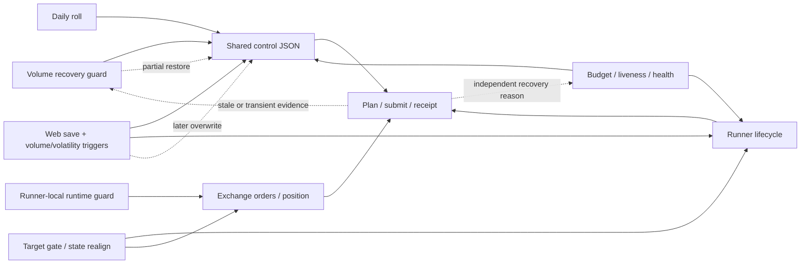
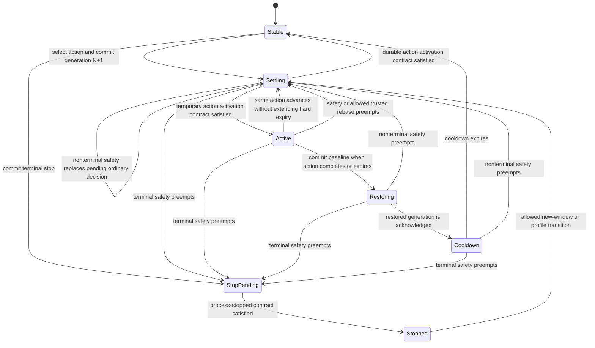

# Futures Recovery Single-Action Coordinator Design

Status: design approved in conversation; pending written-spec review.

## Goal

Replace the current collection of futures recovery branches and direct writers with one general recovery module that, for each symbol and reconciliation round:

- evaluates one immutable snapshot;
- selects at most one action;
- materializes one complete managed desired state;
- performs at most one control commit and advances at most one persisted effect stage;
- waits for generation-matched evidence before allowing another ordinary action.

ARX is the incident that exposed the problem, but the module is not ARX-specific. It applies to explicitly registered, recovery-managed futures symbols. Spot runners, manual operations, and the AI scheduler are outside this design.

## Problem statement

The existing recovery flow has several independent action paths:

- `bq_volume_recovery_guard.check_symbol()` selects and executes control changes inside a large branch chain;
- inactive-runner, runner-error, effective-control-drift, and exchange-order-drift paths can restart before normal action verification;
- budget, liveness, and health processes contain their own actuation logic, although some currently become observe-only for recovery-managed symbols;
- Web volume and volatility trigger threads can start, stop, reduce, or flatten independently;
- target-gate, state-realignment, and runner-local runtime-guard paths have their own multi-step side effects;
- daily roll rewrites control and clears guard state separately;
- Web saves can write the same control document through a shared file lock but without a recovery generation or baseline protocol.

One branch is chosen within a single function invocation, but there is no durable, cross-round single-action state machine. A control write may be followed by a restart probe consuming an old plan, then an exchange-drift probe consuming a transient empty book, then another branch writing an opposing control value. The current ownership marker serializes only writers that honor it; it does not define a lease, generation, complete baseline, complete desired state, or activation acknowledgement.

The result is a recurring class of failures:

- the same field is set to `true` by one branch and reset by another branch in a later round;
- a pre-update plan or submit report confirms or rejects a post-update action;
- separate restart reasons consume the same stale event and create restart cascades;
- an exchange-empty gap during GTX cancel/replace or a fast fill is treated as drift;
- a temporary control value is captured as the restore baseline;
- control, guard state, daily roll, and restart do not share one generation boundary;
- restart failure is reported without retaining the original committed decision.

The root cause is not one bad `if` statement. It is split ownership: several components independently perform detection, choose restore values, mutate partial control, and actuate the same symbol without one durable decision/generation boundary.



The coordinator removes the competing arrows: each component becomes a pure observation or intent adapter; one per-symbol decision owns baseline, complete desired state, effect stages, and acknowledgement.

## Scope

### In scope

- Futures volume and inventory recovery currently hosted in `bq_volume_recovery_guard`.
- Inactive runner, error-loop, effective-control-drift, and exchange/local-order-drift recovery.
- Budget and wear/liveness decisions for recovery-managed futures symbols.
- Web volume-trigger and volatility-trigger background loops for recovery-managed futures symbols.
- Competition target-gate and competition state-realignment automatic paths for recovery-managed futures symbols.
- Runner-local runtime-guard safety interrupts and their handoff to the coordinator.
- Daily competition-window/profile rebase.
- Web writes to recovery-managed futures control documents.
- Runner generation propagation and post-action acknowledgement.
- Control ownership, baseline/desired-state persistence, temporary grants, and restart/stop idempotency.

### Out of scope

- Spot strategy runners and spot competition control.
- Manual trading and manual server operations.
- AI scheduler actions.
- Distributed consensus or cross-host leader election.
- Rewriting unrelated runner planning or order execution logic.
- Manual liquidation or discretionary position-closing workflows. Automatic recovery and terminal stop remain maker-only and never use MARKET/IOC/taker flattening.
- Automatically managing every symbol. A symbol must be explicitly registered with a valid policy and complete managed-field schema.

## Core decisions

1. The coordination unit is one symbol, not the whole guard process. Different symbols may each perform one action in the same timer invocation.
2. Detection is pure. Action definitions cannot write files, call Binance, or restart/stop a runner.
3. Each action owns its full lifecycle: enter, hold, advance, exit, TTL, cooldown, and complete managed desired profile.
4. Detectors and action definitions cannot return raw control patches, shell commands, or caller-chosen priorities.
5. One deterministic arbiter owns a unique total action order.
6. The coordinator executor is the only control, process, and exchange mutating seam. A runner-local emergency interrupt may only enter a durable fail-closed pause and write a receipt; it cannot touch control, process lifecycle, orders, or positions. The coordinator adopts that receipt as the current safety decision.
7. Correctness-critical recovery metadata lives in the same control document as the materialized flat runner config and is committed atomically.
8. Ordinary action transitions must return through baseline restoration and cooldown. Safety actions may preempt any ordinary phase. `TERMINAL_STOP` is monotonic once latched: nonterminal safety may only strengthen its safe stopped profile. A trusted daily roll may replace an acknowledged, control-only temporary overlay, but it cannot preempt frozen-ledger repair or an in-flight lifecycle effect; ordinary Web changes never preempt.
9. A generation that has not been acknowledged suppresses all new ordinary actions and independent restarts.
10. Recovery execution remains GTX maker-only, volatility entry pause remains enabled, and temporary `allow_loss` is a finite lease rather than a baseline setting.
11. Lifecycle effects are fenced by the committed generation and decision. A delayed restart from an older decision cannot run after a newer safety or stop decision.
12. A multi-stage recovery remains one action and one decision across rounds. Each symbol round may advance at most one persisted effect stage.
13. Recovery-managed runner units use `Restart=no`. Process crashes become `RUNNER_RECOVER` observations; systemd cannot bypass coordinator ownership with an unfenced auto-restart.

## External interface

The deep module exposes three entry points:

```python
class FuturesRecoveryCoordinator:
    def inspect(self, symbol: str) -> SymbolView:
        """Return revision, generation, phase, baseline, desired state, and activation."""

    def reconcile_symbol(
        self,
        symbol: str,
        *,
        now: datetime,
        round_id: str,
    ) -> RoundOutcome:
        """Evaluate and, at most once, actuate one symbol for one round."""

    def change_baseline(
        self,
        request: BaselineChange,
        *,
        now: datetime,
    ) -> RoundOutcome:
        """CAS-update a complete managed baseline through the same executor."""
```

`bq_volume_recovery_guard.main()` becomes a timer adapter that calls `reconcile_symbol()` once for each configured symbol. Web reads through `inspect()` and submits a full managed baseline with `change_baseline()`. Daily roll submits a trusted profile rebase through `change_baseline()` rather than writing control and state independently.

Callers do not load plan/submit files, choose a recovery priority, calculate restore values, or call the runner wrapper.

`change_baseline()` is not a privileged direct-write path. It captures the same immutable snapshot, turns the request into a `BASELINE_REBASE` candidate, and runs the same safety-first arbitration and executor. `BaselineChange.operation_id` remains stable for the business change, while each fresh-view retry has a unique `attempt_id`; `attempt_id` becomes `RoundOutcome.round_id`. A safety candidate therefore still outranks a simultaneous Web or daily-roll request. `RoundOutcome.status` describes the selected symbol action; `request_status` separately tells the baseline caller whether its request was accepted, deferred, or rejected.

## Core types

```python
@dataclass(frozen=True)
class ManagedValue:
    present: bool
    value: JsonValue | None


@dataclass(frozen=True)
class ManagedProfile:
    schema_version: int
    policy_id: str
    fields: Mapping[str, ManagedValue]
    profile_digest: str


@dataclass(frozen=True)
class SymbolSnapshot:
    symbol: str
    document_revision: int
    generation: int
    captured_at: datetime
    control: Mapping[str, JsonValue]
    plan: PlanObservation
    submit: SubmitObservation
    runner: RunnerObservation
    exchange: ExchangeObservation
    volume: VolumeObservation
    inventory: InventoryObservation
    wear: WearObservation
    frozen_ledger: FrozenLedgerObservation
    web_triggers: WebTriggerObservation
    competition: CompetitionObservation
    runtime_safety: RuntimeSafetyObservation


@dataclass(frozen=True)
class BaselineChange:
    symbol: str
    expected_revision: int
    expected_generation: int
    source: Literal["web", "daily_roll"]
    profile: ManagedProfile
    unmanaged_updates: Mapping[str, JsonValue | DeleteValue]
    operation_id: str
    attempt_id: str
    actor_id: str
    reason: str


@dataclass(frozen=True)
class RoundOutcome:
    symbol: str
    round_id: str
    previous_revision: int
    revision: int
    previous_generation: int
    generation: int
    phase: RecoveryPhase
    action_id: ActionId
    status: Literal["noop", "hold", "deferred", "committed", "failed"]
    request_status: Literal["accepted", "deferred", "rejected"] | None
    changed_fields: tuple[str, ...]
    effect_stage: EffectStageKind
    suppressed_actions: tuple[SuppressedAction, ...]
    reasons: tuple[str, ...]
    error: str | None


@dataclass(frozen=True)
class MaterializedDecision:
    next_baseline: ManagedProfile
    desired_profile: ManagedProfile
    desired_runner_state: Literal["running", "stopped"]
    next_effect_stage: EffectStage
    activation_contract: ActivationContract
    lease: HardLease | None
```

All types passed between detection, arbitration, and materialization are immutable values. `ManagedValue` preserves the difference between a missing field and a JSON `null`. Profile digests use one documented canonical JSON encoding: sorted UTF-8 keys, normalized JSON scalar encoding, and the explicit `present` bit.

`document_revision` increments on every atomic metadata or control-document mutation. `generation` increments only when the complete desired managed profile or desired runner state changes. Internal compare-and-swap checks both; this avoids turning a phase-only acknowledgement into a new runner generation. Web and daily-roll requests submit both values returned by `inspect()`.

`unmanaged_updates` is allowed only on keys outside the managed registry and `_futures_recovery`. The executor stages them, applies them to the document re-read under lock only when that `BASELINE_REBASE` request wins arbitration, and otherwise discards them; it never rebuilds unmanaged fields from the older snapshot.

`EffectStageKind` is a closed set: `none`, `runner_stop`, `runner_start`, `runner_restart`, `managed_gtx_cancel`, and `local_state_repair`. A stage is a step of the selected action, not a second action. No recovery effect may place MARKET, IOC, or taker orders. Terminal stop uses `runner_stop` only; it never implies cancel, close, flatten, or protective-order placement.

## Action definitions

An action definition is an internal seam. Its implementation contains the entire lifecycle for one semantic action:

```python
class ActionDefinition(Protocol):
    action_id: ActionId
    rank: int
    safety_class: SafetyClass
    effect_kind: EffectKind
    trusted_rebase_preemptible: bool

    def evaluate(
        self,
        snapshot: SymbolSnapshot,
        active: ActiveAction | None,
    ) -> ActionIntent | None:
        """Return ENTER, HOLD, ADVANCE, or EXIT intent without side effects."""

    def materialize(
        self,
        intent: ActionIntent,
        baseline: ManagedProfile,
    ) -> MaterializedDecision:
        """Return baseline, desired state, lease, effect, and activation contract."""
```

Every implementation must define in one place:

- entry conditions;
- hold and same-action advancement conditions;
- completion, timeout, and exit conditions;
- minimum hold and cooldown;
- complete managed desired values;
- whether the canonical baseline stays unchanged or is durably replaced;
- permitted effect stages;
- action-specific activation evidence;
- structured reason and evidence fields.

The registry validates that action IDs and ranks are unique. Rank `1` is the highest priority. An action cannot choose its own dynamic priority. Every registered symbol policy must also supply and validate finite values for observation max age, drift evidence max gap, activation timeout, cooldown, hard lease maximum, retry backoff, maximum effect attempts, request-retry horizon, and idempotency retention/capacity. The coordinator refuses to start for a symbol with an incomplete or invalid policy.

`trusted_rebase_preemptible` is explicit per action and defaults to `false`. It can be `true` only for an acknowledged temporary control overlay whose definition has no ledger/state-repair stage and no in-flight effect. `FROZEN_LEDGER_REPAIR`, `RUNNER_RECOVER` state realignment, restore, and stop phases are never rebase-preemptible.

### Canonical actions and total priority

The new model deliberately collapses many legacy branch names into a small semantic action set:

1. `TERMINAL_STOP`
   - Target completed, unrecoverable corrupt state, or safety cannot be established.
   - Effect is stop-only. It does not automatically cancel orders, close positions, flatten, or place a protective order. The managed-symbol target gate submits this intent and cannot run its legacy market-flatten path.
2. `SAFETY_CONVERGE`
   - Volatility trigger/pause, high wear, expired temporary grants, runner-local safety receipt, or a protected invariant violation.
   - Clears temporary risk fields and materializes a complete safe profile.
3. `FROZEN_LEDGER_REPAIR`
   - Allowed only with an identified frozen-ledger entry and a validated expected hedge delta.
   - Ordinary inventory or bottom-position recovery cannot use contract exposure for balancing.
4. `BASELINE_REBASE`
   - Daily runtime-profile rebase or a Web managed-profile change while stable.
   - A trusted daily roll may revoke an acknowledged control-only temporary overlay. It returns `deferred` while frozen-ledger repair, restoration, stop confirmation, or a lifecycle effect is in flight, and the caller retries with a fresh revision. An ordinary Web edit receives `RecoveryBusy` in every non-`Stable` phase.
5. `RUNNER_RECOVER`
   - Inactive runner, confirmed error loop, effective-control drift, or confirmed exchange/local order drift.
   - Multiple restart reasons collapse into one action with multiple reason codes.
   - State realignment is one persisted multi-stage decision: stop request, stop confirmation, optional managed-GTX cancellation, local-state repair, start request, and generation-matched activation. Only one stage advances per symbol round.
6. `INVENTORY_RECOVER`
   - Maker-only inventory or net-notional recovery without enabling temporary loss relief.
7. `TEMPORARY_LOSS_RELIEF`
   - Used only after a confirmed safe inventory-recovery attempt is ineffective.
   - Requires a finite TTL and keeps net-loss/hard-loss forced reducers disabled.
8. `MAKER_FLOW_RECOVER`
   - Volume pace, Web volume-trigger intent, quote distance, capacity, or maker-flow recovery.
9. `BASELINE_TUNE`
   - Low-priority durable budget-tier or wear-governor adjustment.
   - Replaces the canonical baseline through `next_baseline`; it is not a temporary desired-state overlay that later restores to the old baseline.
10. `NOOP`
   - No actuation. The outcome may still report holds and suppressed candidates.

Within each canonical action, symbol-specific thresholds and allowed profile parameters come from a registered symbol policy. Symbol policy cannot change the global action order or the protected invariants.

## State machine



### Transition rules

- `Stable` means no temporary overlay is active and the materialized managed fields match the canonical baseline.
- `Settling` means a generation is committed but its action-specific activation contract is not yet satisfied. No ordinary action or independent restart may be selected.
- `Active` is used only for a confirmed temporary action. A durable baseline transition returns to `Stable` after acknowledgement.
- `Restoring` writes the complete baseline as a new generation. It does not clear ownership metadata before acknowledgement.
- `Cooldown` blocks immediate re-entry but performs no control mutation.
- `StopPending` already sets desired runner state to stopped and suppresses liveness restart, but does not claim success before the process-stopped activation contract is satisfied.
- `Stopped` suppresses liveness restart. Only an allowed new-window/profile transition or explicit lifecycle request can make the desired runner state running again.
- An ordinary action cannot directly replace a different ordinary action. It must exit through `Restoring` and `Cooldown`.
- A safety action can preempt any ordinary phase. It replaces the full desired profile as one new action; it does not layer a patch on the active profile.
- `StopPending` and `Stopped` latch `TERMINAL_STOP`. A nonterminal safety condition may rematerialize a stricter complete safe profile under the same terminal action and stopped desired state, but it cannot change the action or resume the runner.
- A trusted daily roll is the only nonsafety exception. It may replace an acknowledged control-only temporary overlay, after safety arbitration and only when no lifecycle effect is claimed. It cannot interrupt `FROZEN_LEDGER_REPAIR`; that request is deferred. Web baseline changes require `Stable`.
- Action execution failure never causes the arbiter to try the second-ranked candidate in the same round.

`pending_restart`, `failed_settling`, retry counts, and activation errors are persisted effect/activation substates, not additional recovery phases. Phase changes that do not alter desired control increment only `document_revision`.

## Effect stages and activation contracts

An action may be single-stage or multi-stage, but its `action_id` and `decision_id` do not change while it advances. The action definition owns the ordered stage transition table, timeout, retry policy, and terminal outcome. A stage cannot enqueue the next stage in the same symbol round.

Each stage declares the evidence that proves completion:

- control-only profile application requires a current-generation plan with the expected profile digest;
- restart requires a fenced actuator receipt, a new process identity/start epoch, and a current-generation plan;
- order-changing recovery requires the current-generation plan plus a complete post-action receipt and submit evidence;
- stop requires observed process absence for the intended runner identity;
- managed-GTX cancellation requires a complete exchange response and receipt listing the exact managed order IDs;
- local-state repair requires an atomic repair receipt with before/after state digests.

All required evidence must match symbol, generation, decision, stage, digest where applicable, and a timestamp at or after stage issuance. Evidence requirements are conjunctive; a plan *or* submit report alone never acknowledges a lifecycle or order-changing stage.

The runner lifecycle section persists desired state, current stage, effect generation, decision ID, claim owner/expiry, attempt count, next retry time, last error, and activation deadline. Normal effect exhaustion transitions on a later round to a complete safe baseline plus terminal stop; a safety-effect failure also remains stop-biased. Neither path tries a lower-priority ordinary action.

## Complete desired-state model

Managed fields are declared in a versioned registry. A valid baseline and desired profile contains every registered field, including presence information when omission differs from JSON `null`.

The effective control is always:

```text
latest unowned fields
+ canonical managed baseline
+ exactly one active complete managed profile, if any
+ protected invariants
```

It is never the accumulation of prior sparse patches.

Switching or restoring a profile rematerializes every managed field. A prior action's `true`, budget, cap, offset, or sticky value therefore cannot leak into the next action.

### Protected invariants

For recovery-managed futures symbols:

- `volatility_entry_pause_enabled` is materialized as `true` when absent and automatic actions cannot set it to `false`.
- The policy's required volatility pause thresholds must be present and positive.
- `best_quote_maker_volume_net_loss_reduce_enabled` remains `false`.
- `hard_loss_forced_reduce_enabled` remains `false`.
- Recovery execution policy is `gtx_maker_only`.
- Normal recovery cannot request aggressive, IOC, market, or taker execution.
- `best_quote_maker_volume_allow_loss_reduce_only=true` is not a legal baseline value.
- In this document, `allow_loss` is shorthand for `best_quote_maker_volume_allow_loss_reduce_only`.
- `allow_loss=true` is legal only for `TEMPORARY_LOSS_RELIEF` with a valid, absolute hard expiry no later than the registered policy maximum.
- Ordinary recovery cannot use contract exposure to repair inventory. Contract changes require `FROZEN_LEDGER_REPAIR` and frozen-ledger evidence.

## Persistence and ownership

The flat top-level control remains compatible with `run_saved_runner`. Correctness-critical metadata is embedded in the same document:

```json
{
  "symbol": "ARXUSDT",
  "volatility_entry_pause_enabled": true,
  "best_quote_maker_volume_allow_loss_reduce_only": false,
  "_futures_recovery": {
    "schema_version": 1,
    "policy_id": "best-quote-futures-v1",
    "owned_fields_version": "bq-owned-v1",
    "document_revision": 57,
    "generation": 42,
    "baseline_generation": 9,
    "phase": "settling",
    "action_id": "maker_flow_recover",
    "decision_id": "uuid",
    "baseline": {
      "...every managed field...": {"present": true, "value": false}
    },
    "desired": {
      "...every managed field...": {"present": true, "value": true}
    },
    "issued_at": "2026-07-14T05:00:00Z",
    "expires_at": null,
    "execution_policy": "gtx_maker_only",
    "input": {
      "source": "scheduler",
      "operation_id": "scheduler-operation-or-baseline-request-uuid",
      "attempt_id": "round-uuid",
      "recent_inputs": [
        {
          "operation_id": "scheduler-operation-or-baseline-request-uuid",
          "attempt_id": "round-uuid",
          "status": "committed",
          "request_status": null,
          "operation_final": true,
          "generation": 42
        }
      ]
    },
    "runner_lifecycle": {
      "desired_state": "running",
      "effect": "restart",
      "effect_stage": "runner_restart",
      "effect_generation": 42,
      "effect_epoch": 18,
      "effect_decision_id": "uuid",
      "status": "pending",
      "claim_owner_id": null,
      "claim_attempt_id": null,
      "claim_expires_at": null,
      "attempt_count": 0,
      "next_retry_at": "2026-07-14T05:00:00Z",
      "last_error": null
    },
    "activation": {
      "required_generation": 42,
      "applied_generation": 41,
      "status": "pending"
    }
  }
}
```

The control document is the sole truth for document revision, generation, baseline, desired state, active action, phase, hard lease, lifecycle effect, activation contract, and recent idempotency keys. Auxiliary guard state may store drift counters and diagnostic evidence, but losing it may only delay an action; it cannot change the restore target or reactivate a temporary grant.

The existing ownership helper becomes part of the coordinator store/executor. All in-scope writers use the same per-symbol lock and revision/generation compare-and-swap. The metadata stores a bounded policy-sized set of recent scheduler rounds and baseline request attempts together with operation ID, attempt ID, outcome summary, and whether the operation is final. Retention must exceed the registered maximum request-retry horizon plus maximum action lifetime. A duplicate attempt returns its recorded outcome; a completed operation cannot create another generation.

A retryable baseline `request_status=deferred` finalizes only its `attempt_id`, not its `operation_id`, even when another safety action commits in the same call. Daily roll re-reads `inspect()`, keeps the same operation ID, and submits a new attempt ID. An accepted rebase, rejected-invalid request, or explicitly canceled operation is final. Scheduler rounds use their `round_id` as both operation and attempt ID and have `request_status=None`.

Ownership is protocol ownership, not a permanent daemon lease: only the coordinator executor may mutate a managed document, while any local adapter may submit a request to it. A lifecycle attempt has a short persisted claim containing owner ID, attempt ID, and claim expiry. An expired claimant may be replaced through CAS; a live claimant cannot be duplicated. Each claimed attempt increments the monotonic `effect_epoch`, even when it retries the same generation and stage. The production actuator must be idempotent by `(symbol, effect_generation, effect_decision_id, effect_epoch)`.

Lifecycle submission is generation-fenced, not merely idempotent. Every generation-changing commit acquires the per-symbol effect fence first and the control-document lock second; revision-only metadata commits use only the control lock. The executor may launch the wrapper without holding either lock. The wrapper itself then acquires the same per-symbol effect fence, re-reads the document under the control lock, verifies desired runner state, effect generation, decision ID, stage, live claim, and monotonic effect epoch, and releases only the control lock. While still holding the effect fence, it performs the synchronous process mutation and records the effect receipt; it releases the effect fence only after the process command returns. Activation observation happens later without locks. A lower or superseded epoch is rejected before mutation. If an old wrapper already owns the fence, a newer stop commit waits, then commits and applies after the old mutation. Therefore an old restart cannot apply after a newer terminal-stop commit.

This locking design assumes one host or a filesystem whose advisory locks and atomic replace semantics are shared by every writer. Cross-host coordination requires a different store and is outside this design.

## Immutable snapshot and freshness

The snapshot factory reads each source once per symbol round. Action definitions cannot perform their own reads.

Every observation includes:

- `captured_at`;
- source request or cycle ID;
- symbol;
- control generation where applicable;
- profile digest where applicable.

Each action declares its required observations. The coordinator rejects or holds that action on stale or missing required evidence; an unrelated missing source does not block control-document invariants, absolute lease expiry, or terminal stop. It does not convert a failed Binance request into an empty book or zero position.

The runner propagates the applied recovery generation and profile digest into:

- latest plan;
- latest submit;
- runner error events;
- a post-action receipt written after cancel/place processing, not before it.

An observation can acknowledge a decision only when its generation matches the current required generation and its timestamp is at or after the decision's `issued_at`.

### Runner-local emergency safety lane

The runner may immediately interrupt its own normal planning only for a registered emergency safety condition. It may atomically enter a durable local pause and stop generating or submitting new work. It cannot cancel orders, submit risk reduction, change contract exposure, enable `allow_loss`, relax volatility pause, restart itself, mutate process state, or mutate the canonical control/baseline.

Before entering the pause, the runner atomically records a safety receipt containing symbol, current generation/profile digest, safety action ID, safety decision ID, stage, and timestamps; startup reads the receipt before normal planning. While the receipt is nonterminal, the runner remains nontradable. On the next coordinator round, that receipt is adopted as the current `SAFETY_CONVERGE` or `TERMINAL_STOP` decision; any required managed-GTX cancellation or frozen-ledger repair then runs through the fenced coordinator executor. No ordinary action, restart, or rebase may run. A malformed, missing, or generation-mismatched receipt fails closed to pause rather than triggering recovery.

This exception preserves semantic single ownership: the emergency interrupt becomes the one current safety action for the symbol; the coordinator continues the same decision instead of creating a competing action.

### Exchange/local order drift

Order drift is not inferred from one local active count and one exchange-empty response. A `RUNNER_RECOVER` drift intent requires:

- two successful observations with strictly increasing runner cycle sequence numbers;
- two successful exchange requests with distinct request IDs and increasing capture timestamps;
- current-generation post-action receipts;
- observations newer than the current decision;
- both observations within the registered freshness limit and evidence max-gap;
- the same expected-order set derived from the latest complete current-generation receipt;
- no fresh managed GTX placement, partial fill, or fill;
- symbol- and managed-client-ID filtering;
- exact managed LIMIT/GTX order classification where exchange data provides it.

A fast GTX fill followed by an empty open-order book is execution progress, not drift. Unrelated symbol or manual-account events neither confirm nor suppress the managed symbol's recovery.

### Order identity contract

New managed futures orders use a versioned client-order-ID renderer that includes a compact base-36 recovery generation and decision token while retaining symbol/role identity. The renderer validates Binance's 36-character limit before submission. The runner also atomically writes a checksummed post-action manifest containing generation, decision ID, cycle sequence, request ID, placed IDs, canceled IDs, filled IDs, and `completed_at`.

Exchange classification joins the parsed client-order-ID token with the complete manifest. A missing, truncated, checksum-invalid, or generation-mismatched manifest yields `hold`, never an empty managed order set. IDs from the legacy format are `legacy_unattributed`; they cannot confirm current-generation health or drift. Before a future symbol cutover, the runner must be quiesced and every legacy managed order must either finish or be explicitly canceled as a recorded maker-order cleanup stage. No position is market-flattened during this migration.

## Per-symbol round algorithm

```text
capture one immutable snapshot without holding an actuator lock
acquire the per-symbol effect fence when a generation may change
acquire the per-symbol control lock
re-read document revision and generation
if either differs from the snapshot: return deferred
if attempt ID was already processed: return its recorded outcome
if operation ID is already final: return its final outcome
stage any requested unmanaged updates; do not apply them before arbitration
validate the managed document, registered policy, and protected invariants
evaluate terminal and safety intents first
if phase is StopPending or Stopped:
    keep TERMINAL_STOP latched
    if a terminal or nonterminal safety observation requires a stricter profile:
        continue the terminal decision and only strengthen its stopped safe profile
    elif phase is Stopped and request is a trusted daily new-window/profile rebase
         and registered policy permits resume:
        select BASELINE_REBASE with desired runner state running
    elif a baseline request exists:
        select no action and set result to request-level DEFERRED;
            Web adapter maps it to RecoveryBusy
    else:
        verify stop or set result to HOLD under the terminal decision
elif terminal or safety preempts:
    select only that highest-ranked intent
elif request is a trusted daily rebase and phase is Active and
     active definition is trusted-rebase-preemptible and no effect is claimed:
    select BASELINE_REBASE
elif a baseline request exists and phase is not Stable:
    select no action and set result to request-level DEFERRED;
        Web adapter maps it to RecoveryBusy
        do not advance the existing action in this request
elif an effect or activation is pending:
    verify, back off, or claim one retry stage of the existing decision
elif phase is Active:
    evaluate only the active definition's HOLD, ADVANCE, or EXIT
    record every other ordinary candidate as suppressed
elif phase is Restoring:
    verify only the restore activation contract
elif phase is Cooldown:
    expire cooldown or set result to HOLD; select no ordinary candidate
else Stable:
    evaluate applicable pure definitions and an optional baseline request
    select the single highest-ranked intent
if a baseline request exists:
    set request_status=accepted only when BASELINE_REBASE was selected
    otherwise set request_status=deferred unless validation rejected it
    set operation_final=true only for accepted, rejected, or canceled requests
if result is NOOP, HOLD, or request-level DEFERRED:
    atomically record the attempt ID and outcome as a revision-only commit;
        retryable DEFERRED leaves operation final=false
    release locks, append audit outcome, and return
else:
    materialize complete next baseline, desired profile, and one effect stage
    apply staged unmanaged updates only if BASELINE_REBASE was selected;
        otherwise preserve the lock-time unmanaged document unchanged
    atomically commit document revision N+1, generation when required,
        the operation/attempt idempotency record, pending activation,
        and effect fence token
release the control lock and effect fence
if one effect stage was claimed: invoke it through fenced, idempotent executor
append the audit outcome
verify stage activation in a later symbol round
```

The coordinator never evaluates a second ordinary definition while another ordinary action is active. `EXIT` commits only the complete restore profile; it cannot select the next ordinary action in the same round. A phase-only acknowledgement or first-time `noop`/`hold` outcome increments `document_revision` but not `generation`. Repeating the same attempt ID returns the recorded outcome without another commit; retrying a nonfinal baseline operation requires a new attempt ID and fresh expected revision/generation.

Network requests and activation/health waits do not occur while locks are held. The wrapper holds only the effect fence, not the control lock, across the bounded synchronous process mutation required to close the fencing race; plan, submit, and health completion are observed in later rounds.

## Failure semantics

### Missing or stale observations

Return `hold` for the action that requires the missing evidence; write only the revision/idempotency outcome, without changing generation, profile, or effect state, and do not restart. Exchange request failure is not evidence of an empty exchange state. Protected-invariant repair, hard lease expiry, runner-local safety adoption, and terminal stop depend only on the trusted control document, local clock, and their own required evidence, so unrelated exchange failure cannot block them.

### Duplicate timer or generation conflict

Return `deferred`. The caller retries in a later round with a new snapshot. A stale Web request returns an HTTP conflict through the Web adapter.

### Control commit failure

No new generation exists and no runner effect is attempted.

### Runner effect failure after commit

Keep the same decision and effect stage pending. Persist `attempt_count`, `next_retry_at`, and `last_error`; retry only after the registered backoff and only while below the registered attempt limit. The next round may idempotently retry that stage or allow a higher-priority safety action. It cannot select a different ordinary candidate. Attempt exhaustion schedules a complete safe profile plus terminal stop on a later round.

### Activation timeout

Keep the committed desired generation in the activation substate `failed_settling`. Do not roll back to the previous generation and do not execute a fallback action. Retry within the registered limit or allow safety convergence; exhaustion schedules terminal stop rather than another ordinary action.

### Corrupt managed document

If a complete baseline can be reconstructed from the registered runtime profile, commit a safe baseline generation. Otherwise use terminal stop-only. Never infer a canonical baseline from a live control that may contain an overlay.

### Audit failure

Report degraded audit state but do not roll back a successfully committed generation. The next round can reconstruct correctness from the control document.

### Web managed-profile conflict

Web must provide `expected_revision` and `expected_generation`. The Web adapter maps baseline `request_status`, not the unrelated selected action status: a normal Web edit in any non-`Stable` phase returns `RecoveryBusy`; it does not silently alter an action's restore target. Daily roll is a trusted rebase request and may revoke only an acknowledged control-only overlay as one `BASELINE_REBASE` action; otherwise it receives retryable `request_status=deferred`, keeps its operation ID, and retries from a fresh view with a new attempt ID.

## Temporary `allow_loss` reclaim

`TEMPORARY_LOSS_RELIEF` stores `lease_started_at` and an absolute `hard_expires_at` in the managed document. Same-action `ADVANCE` cannot move `hard_expires_at`; a new lease is possible only after restore and cooldown. The coordinator restores a complete non-loss baseline when any of these occur:

- TTL expires;
- inventory recovery succeeds;
- volatility pause becomes active;
- wear reaches the safety threshold;
- the action fails its effectiveness verification;
- a trusted baseline rebase revokes the overlay.

Lease expiry uses the trusted control document and local UTC clock; it is not blocked by missing exchange, plan, or submit observations. The runner treats `allow_loss=false` at startup, on every plan cycle, and immediately before generating or submitting each order when the action ID, start time, or hard expiry is absent, malformed, mismatched, or expired. This prevents an indefinitely enabled temporary grant if the coordinator is down. Coordinator recovery later persists the complete safe profile.

## Dependencies and adapters

### In-process

- action definitions;
- arbiter;
- profile materializer and validator;
- generation verifier;
- snapshot normalization.

These are pure implementations and do not need public ports.

### Local-substitutable

- `ManagedControlStoreAdapter`: production uses the per-symbol effect/control locks, temp file, file fsync, `os.replace`, and directory fsync; tests use memory or a temporary directory.
- `RunnerObservationAdapter`: production reads process, plan, submit, event, and receipt data; tests use immutable fixtures.
- `EffectExecutorAdapter`: production dispatches the closed effect-stage set to the generation-fenced saved-runner wrapper/systemd, exact managed-GTX cancellation, or atomic local-state repair; tests use a recording fake with monotonic fence epochs and idempotent decision IDs.
- `RuntimeProfileRepositoryAdapter`: production reads registered runtime profiles; tests use an in-memory registry.
- `AuditJournalAdapter`: production appends JSONL; tests use memory.

### True external

- `ExchangeObservationPort`: production uses read-only Binance futures positions, open orders, and user trades; tests use deterministic fake responses. Exact managed-GTX cancellation is exposed only through `EffectExecutorAdapter`.

## Integration of existing writers

### `bq_volume_recovery_guard`

- Retain reusable pure assessment calculations.
- Replace branch-local writes, original-control snapshots, restore patches, and direct restarts with action definitions and `reconcile_symbol()`.
- The main loop becomes a thin timer adapter.

### Inactive, error, effective-control, and order-drift recovery

- Convert each to pure evidence collection or intent logic under `RUNNER_RECOVER`.
- Remove their independent cooldown and restart side effects.
- Install managed per-symbol systemd units with `Restart=no`; inactive or crashed processes are recovered only through the fenced action.

### Budget controller

- Reuse pure budget-tier calculation as `BASELINE_TUNE` input.
- For managed symbols it no longer writes control or restarts independently.

### Liveness and health monitors

- Provide observations and pure intents.
- Direct restart, offset mutation, or deadlock trading is not allowed for managed symbols.
- Any contract-side repair must be re-expressed as `FROZEN_LEDGER_REPAIR` with ledger proof; otherwise it remains observe-only.

### Web volume and volatility triggers

- For managed symbols, `_run_volume_trigger_loop()` and `_run_volatility_trigger_loop()` become observation/intent adapters.
- They cannot call runner start/stop, reduce-to-notional, full-flatten, cancel, or control-write helpers directly.
- Volume trigger intents map to `MAKER_FLOW_RECOVER` or `TERMINAL_STOP`; volatility trigger intents map to `SAFETY_CONVERGE` or `TERMINAL_STOP` under the global priority table.
- Their candidates share the same symbol snapshot and can never create a second action beside the guard candidate in one round.

### Target gate and state realignment

- The managed-symbol competition target gate submits `TERMINAL_STOP`. Its legacy cancel, MARKET flatten, and protective-order side effects are disabled; stop confirmation is its activation contract.
- Competition state realignment becomes the staged `RUNNER_RECOVER` decision described above. Its stop, exact managed-order cleanup, state rewrite/archive, start, and acknowledgement occur across separate rounds under one decision and fence epoch sequence.
- Neither module retains an independent runner or exchange mutator for managed symbols.

### Runner-local runtime guard

- `_maybe_handle_runtime_guard()` is reduced to the documented emergency safety lane for managed symbols.
- It writes a current-generation safety receipt and blocks normal planning; it cannot cancel or submit orders, change exposure, independently transition from stop to cooldown/running, start a flatten workflow, or resume trading.
- The coordinator adopts and completes that same safety decision. Any legacy MARKET/IOC loss-recovery branch is disabled for managed symbols.

### Daily roll

- Submit a complete registered runtime profile through `BASELINE_REBASE`.
- Update baseline, clear the overlay, reclaim temporary grants, increment generation, and materialize flat control in one atomic commit.
- Do not separately clear correctness-critical guard state.

### Web

- Read current document revision and generation through `inspect()`.
- Submit the complete managed profile with expected revision and generation.
- Route the entire control save through the coordinator for managed symbols so management metadata cannot be erased.
- Continue existing behavior for unmanaged symbols.

### External operational actuators

- Before any future cutover, inventory cron jobs, systemd units, and scripts inside and outside the repository that can write the symbol control, invoke runner lifecycle commands, cancel orders, or submit trades.
- Known deployment-managed examples include `output/ops/*_ledger_drift_monitor.py`, daily-window rollover, target gates, and recovery installer wiring.
- A managed symbol cannot be enabled until this inventory has an explicit disposition for every actuator: coordinator adapter, runner-local safety lane, observe-only, disabled, or out of scope with proof that it cannot touch the symbol.

## Testing strategy

Implementation follows test-first development. Tests primarily exercise the coordinator interface with in-memory adapters.

### Action contract tests

- Action IDs and ranks are unique.
- Every action materializes all managed fields.
- No automatic action disables volatility pause.
- No action enables net-loss or hard-loss forced reduction.
- Only `TEMPORARY_LOSS_RELIEF` may request `allow_loss=true`, and it must supply an absolute expiry within the registered hard maximum.
- Same-action advancement cannot extend the absolute `allow_loss` hard expiry.
- Ordinary actions cannot request contract exposure changes.
- Frozen-ledger repair requires a ledger entry, expected hedge delta, and tolerance proof.

### Arbitration and state-machine tests

- Many simultaneous candidates produce one selected action and one ordered suppressed list.
- Different symbols can each perform one action in the same scheduler invocation.
- Pending generation suppresses every ordinary candidate and independent restart.
- Safety action may preempt pending or active state but still performs only one commit and one effect stage.
- `TERMINAL_STOP` remains latched in `StopPending`/`Stopped`; nonterminal safety can only strengthen the stopped profile.
- Only an authorized trusted daily new-window/profile transition can move `Stopped` toward running; Web cannot.
- An ordinary action exits through restore and cooldown before another ordinary action enters.
- The same action alone controls its enter, hold, advance, and exit behavior.
- Switching actions rematerializes from baseline and leaves no prior profile values behind.

### Generation and restart tests

- Stale plan, submit, error, and exchange snapshots cannot acknowledge or re-trigger an action.
- Two restart reasons in one round produce one `RUNNER_RECOVER` decision and one restart.
- Restart failure retains the original action and committed-control fact.
- A duplicate coordinator invocation cannot commit a second generation for the same round.
- First-time `noop` and `hold` persist one revision-only idempotency outcome; a duplicate returns it without another commit or later action.
- Retryable daily-roll `deferred` finalizes the attempt but not the operation; a fresh attempt can later commit exactly once.
- When safety wins a baseline call, action status records the safety commit while request status remains retryable `deferred` under the same operation.
- A crash before commit, after commit, after restart, or before acknowledgement resumes idempotently.
- A phase-only acknowledgement increments document revision without creating a new runner generation.
- An old delayed restart is rejected after a newer terminal-stop generation commits.
- The wrapper holds the shared effect fence across token validation and synchronous process mutation, closing the validate/start TOCTOU race.
- Effect retries obey persisted backoff and attempt limits and never fall through to another ordinary action.

### Order-drift tests

- A fresh executed GTX placement or fill followed by an empty exchange book is not drift.
- One exchange-empty observation is insufficient.
- Re-reading the same exchange request or runner cycle is insufficient.
- Unrelated symbol or manual account activity is ignored.
- Only current-generation managed LIMIT/GTX orders count as managed open orders.
- Cross-generation residual orders cannot satisfy current-generation health.
- Missing, truncated, or checksum-invalid manifests produce `hold`.
- The generated client order ID carries the generation token and never exceeds 36 characters.

### Safety integration tests

- Recovery plans and final requests remain LIMIT, GTX, and post-only.
- Missing volatility pause config materializes `true`.
- Temporary `allow_loss` expires in the runner even when the coordinator is unavailable.
- Missing or failed exchange observations cannot block hard-expiry reclaim.
- Missing or malformed lease metadata makes runner-effective `allow_loss=false` at startup, planning, and pre-submit.
- Coordinator reconciliation then persists `allow_loss=false` and `net_loss_reduce=false`.
- Daily roll and Web stale generations cannot overwrite a newer recovery generation.
- An eligible trusted daily roll can preempt only an acknowledged action marked rebase-preemptible; frozen repair and in-flight effects defer it.
- Unselected Web unmanaged updates cannot leak into a simultaneous safety commit.
- Ordinary inventory recovery cannot change contract exposure.
- Runner-local safety is adopted as the one current action and suppresses restart/rebase.
- Runner-local safety can only persist pause/receipt state; it cannot cancel, submit, or change contract exposure.
- Managed terminal stop never cancels, closes, flattens, or places a protective order.
- State realignment advances stop, repair, and start across separate rounds under one decision.
- A simultaneous Web trigger and guard candidate still produce exactly one symbol action.

### Architecture tests

- Only the coordinator executor may write a recovery-managed control document or call automatic runner restart/stop.
- Action modules cannot import filesystem, subprocess, or Binance adapters.
- In-scope legacy modules cannot retain direct managed-field mutation paths.
- Managed Web saves must delegate to the coordinator.
- Managed Web volume/volatility trigger loops, target gate, state realignment, budget, liveness, and health modules cannot retain direct lifecycle or trading paths.
- The narrowly allowlisted runner-local safety lane can only pause local planning and emit the required receipt; it cannot mutate control, process, exchange orders, or positions, and no executor exception is permitted.
- A pre-cutover actuator-inventory check scans repository scripts plus declared cron/systemd/`output/ops` sources and fails on an unclassified writer or actuator.
- The same check fails if a recovery-managed runner unit has any systemd automatic restart policy other than `Restart=no`.

Obsolete tests that only exercise removed shallow direct-writer paths are replaced by interface-level behavior tests. Reusable assessment and detector tests remain.

## Migration plan

The implementation is developed and committed only on the isolated branch. It is not deployed by this task.

1. Rebase the isolated branch onto the latest `origin/main` before implementation.
2. Add coordinator types, in-memory adapters, managed schema, profile validator, and state-machine tests.
3. Add document revision, generation/profile-digest propagation, fenced wrapper epochs, versioned client-order IDs, and atomic post-action/safety receipts.
4. Implement coordinator persistence and executor with no production caller enabled.
5. Port legacy behavior into canonical action definitions, including staged state realignment, starting with safety and restore, then restart, inventory, temporary loss relief, maker flow, and baseline tuning.
6. Add a shadow adapter that reports the new canonical decision without executing it. Compare it with legacy outcomes and targeted historical fixtures.
7. Route guard, inactive/restart, budget, liveness/health, Web volume/volatility triggers, target gate, state realignment, daily roll, and managed Web writes through the coordinator; narrow runtime guard to the safety lane.
8. Inventory repository and operational cron/systemd/`output/ops` actuators, install `Restart=no` for managed runner units, then remove, disable, adapt, or make observe-only every in-scope direct writer and enable architecture checks.
9. Run focused, module, runner, Web, roll, deployment-inventory, and full regression suites.
10. Commit the implementation branch without push or deployment.

A future production rollout must switch ownership atomically per symbol. It cannot run the legacy executor and new coordinator concurrently. ARX may be used as the first canary because it exposed the conflict, but the implementation and tests are general and the cutover requires an explicitly registered symbol policy.

## Baseline migration

The initial canonical baseline comes from the registered runtime profile, not from a live control that may contain temporary recovery values.

- Every required managed field must be present or have a protected policy default.
- `allow_loss`, net-loss reduction, and hard-loss forced reduction are forced false.
- volatility pause is forced true.
- If a required field cannot be resolved, migration fails closed and does not enable the coordinator for that symbol.
- Unmanaged fields are preserved from the latest control under the per-symbol lock.
- Legacy managed order IDs must be drained or canceled through a recorded GTX-cleanup stage before current-generation drift enforcement is enabled.

## Rollback

Source rollback is a branch revert because this task does not deploy.

For a later production rollback:

1. Stop new scheduler intake for the symbol while keeping the coordinator's rollback executor and ownership active.
2. Read the canonical baseline from `_futures_recovery`.
3. While retaining coordinator ownership, fencing metadata, and a new rollback generation, materialize a flat control with `allow_loss=false`, net-loss reduction false, hard-loss forced reduction false, and volatility pause true.
4. Apply the fenced runner effect and verify its action-specific contract: current rollback generation/digest, intended process state, and fresh plan/submit or stopped-process evidence.
5. Atomically transfer ownership and remove temporary/pending metadata only after that verification succeeds.
6. Only then re-enable exactly one classified legacy writer, if rollback requires it; all other automatic writers remain disabled or observe-only.

An arbitrary backup is not a valid rollback source because it may contain an active overlay.

## Acceptance criteria

1. A symbol reconciliation round performs at most one non-noop action, one control commit, and one persisted effect stage.
2. Multiple reasons for the same semantic action collapse into one action with multiple evidence codes.
3. All actions use the same immutable symbol snapshot.
4. No ordinary action can execute while another generation is unacknowledged.
5. No legacy in-scope module directly writes recovery-managed fields or automatically restarts/stops a managed runner.
6. Each action's entry, hold, advance, exit, TTL, cooldown, and desired values reside in one action definition.
7. Every desired profile is complete over the managed-field registry and is rematerialized from the canonical baseline.
8. Stale or repeated plan, submit, error, and exchange observations cannot cause restart loops; lifecycle effects are fenced against newer generations.
9. Recovery order execution remains LIMIT/GTX/post-only.
10. Volatility entry pause remains enabled.
11. Temporary `allow_loss` is bounded, runner-enforced at expiry, and persistently reclaimed.
12. Ordinary inventory recovery never uses contract exposure; frozen-ledger repair remains explicitly ledger-bound.
13. Daily roll, managed Web writes, Web trigger loops, target gate, state realignment, budget, liveness, and health paths participate in the same generation/ownership protocol.
14. The runner-local emergency lane only enters a durable pause and writes a receipt; all control, process, order, position, and repair mutations remain coordinator-owned.
15. Current-generation order identity is verifiable from bounded client IDs and complete atomic manifests; legacy or corrupt identity evidence cannot confirm drift.
16. Document revision, runner generation, round/request idempotency, and effect retry state survive process crashes without creating a second action.
17. A future symbol cutover is blocked by any unclassified repository or operational automatic actuator.
18. Managed runner units cannot auto-restart outside the coordinator; their systemd policy is `Restart=no`.
19. Terminal stop remains latched until an authorized trusted new-window/profile operation resumes it; nonterminal safety never restarts it.
20. Retryable baseline attempts can use a stable operation ID without either duplicate execution or permanent `deferred` poisoning.
21. Focused and full regression suites pass before the branch is handed off.
